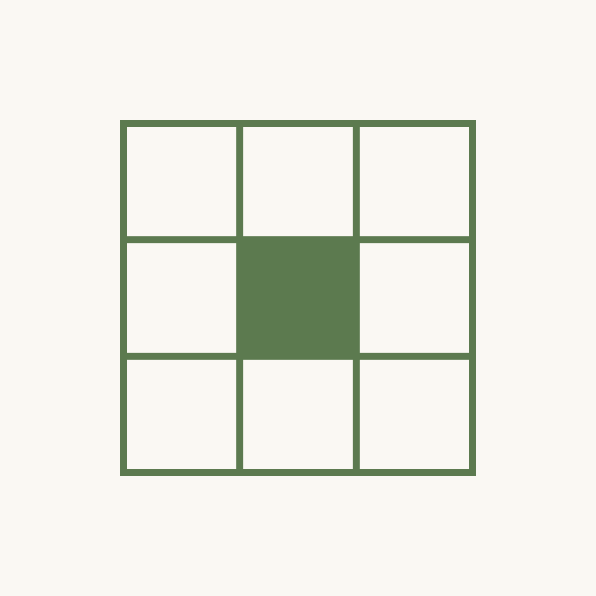
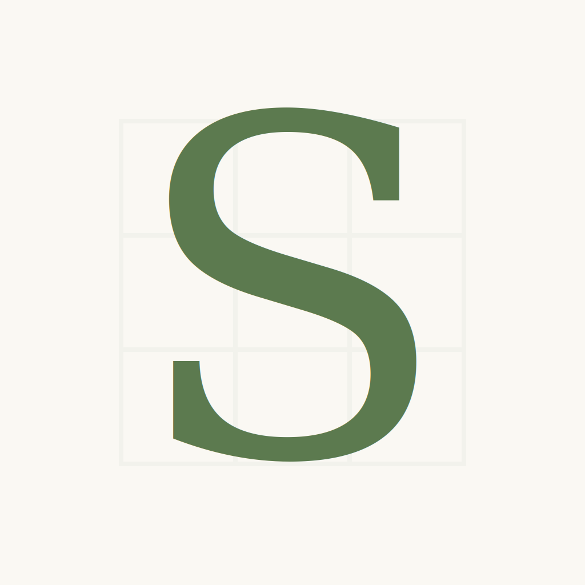

# App Icon Concepts — 5 candidates

Five candidate app icons for Sudoku v1/v2 at 1024×1024. Brand essence: **calm focus**, **sage on warm paper**, no text, distinct silhouette at 60×60.

All SVGs share:
- `viewBox="0 0 1024 1024"`
- Solid warm paper background `#FAF8F3` (no transparency)
- Sage accent `#5C7A4F`
- No pre-rounded corners (system applies the mask)
- File size < 2KB each

---

## Previews

| 01 — Grid Single Dot | 02 — Nine as Dots | 03 — Paper Pencil |
|---|---|---|
|  |  |  |

| 04 — Monogram S | 05 — Solved Check |
|---|---|
|  |  |

---

## Comparison

| # | Concept | Strength | Risk | HIG compliant |
|---|---|---|---|---|
| 01 | Grid Single Dot | Most literal "sudoku" signal; single sage cell = focus; instantly recognizable at 60×60 | May feel too plain / utilitarian; reads as "minimap" not "puzzle" | ✓ |
| 02 | Nine as Dots | Playful numeric pun (9 dots → "9" → sudoku); calm pattern; dots forgiving at small size | Loses sudoku-specific meaning; could read as generic "apps grid" or braille | ✓ |
| 03 | Paper Pencil | Strongest narrative (handwritten thinking); warmest emotional tone | Two elements compete; pencil at 60×60 becomes thin sliver, faint grid disappears | ✓ (busier than ideal) |
| 04 | Monogram S | Brand-defining, elegant, scales perfectly | Apple HIG discourages text; depends on serif rendering across platforms; less "sudoku" | ⚠ (see §未決) |
| 05 | Solved Check | Emotional payoff (satisfaction of completion); checkmark is universal | "Checkmark on grid" reads as todo-list / task-completed, not sudoku-specific | ✓ |

---

## Apple HIG audit per icon

| Check | 01 | 02 | 03 | 04 | 05 |
|---|---|---|---|---|---|
| No text | ✓ | ✓ | ✓ | ⚠ monogram | ✓ |
| No transparency (full bg) | ✓ | ✓ | ✓ | ✓ | ✓ |
| Distinct silhouette at 60×60 | ✓ strong | ✓ strong | ⚠ pencil thins | ✓ strong | ✓ strong |
| ~15% padding from edge | ✓ ~21% | ✓ ~21% | ✓ ~15% | ✓ ~10% | ✓ ~15% |
| No gradients beyond subtle | ✓ | ✓ | ✓ | ✓ | ✓ |
| Single dominant element | ✓ | ✓ | ⚠ two | ✓ | ✓ + faint grid |

---

## Visual self-check (200×200 recognizability)

- **01 Grid Single Dot** — Highest recognizability. Even at 60×60 the 3×3 cell pattern with one filled square reads instantly. The sage block becomes a clear focal point on cream. **Best small-size legibility.**
- **02 Nine as Dots** — Very strong at small sizes; the 3×3 dot grid is forgiving of downscaling. Loses sudoku-specificity but gains pattern clarity.
- **03 Paper Pencil** — Pencil reads clearly as a diagonal sage stroke; the faint grid disappears below 200×200, leaving only "a pencil". Risk of reading as a generic notes app.
- **04 Monogram S** — Scales beautifully; the serif S remains crisp. But system-rendered text varies by platform; should be converted to outlined path before production.
- **05 Solved Check** — Checkmark reads at any size; faint 9×9 grid disappears below 300×300, leaving only a checkmark (reads as todo / done, not sudoku).

---

## Designer's recommendation

**Pick: 01 — Grid Single Dot.**

Why:
1. **Most on-brand**: directly embodies the design system's "calm focus" + "single point of attention" language from `docs/design.md §What`.
2. **Most sudoku-specific**: a 3×3 grid is the unambiguous semantic primitive of sudoku — no other puzzle uses it.
3. **Best small-size behavior**: the silhouette holds at 60×60 because the sage cell-on-cream contrast is high and the grid lines remain countable.
4. **No HIG concerns**: no text, no gradients, no transparency, ample padding.
5. **Scalable to v2**: future variants can swap the filled cell position, color (theme), or add a second cell — the design language survives evolution.

Secondary pick: **05 Solved Check** if marketing wants an emotional / completion angle over an analytical one.

---

## Next steps

After Leader picks one:
- Convert text elements (04 only) to outlined `<path>` so rendering is font-independent.
- Export to PNG 1024×1024 (and any intermediate sizes Apple still requires post-Xcode-14 single-size workflow).
- Create `App/Assets.xcassets/AppIcon.appiconset/` with `Contents.json` declaring the 1024×1024 marketing icon (single-size, universal).
- Generate iOS / macOS variants per Apple's current size matrix (macOS still needs multiple sizes; iOS uses single 1024).
- Add a `dark` / `tinted` variant to `Contents.json` if v2 supports iOS 18 tinted icons — sage on `#1F2A19` deep paper would be the natural dark counterpart.
- Verify Apple HIG compliance using Xcode's icon preview at small sizes.

---

## §未決

- **Concept 04 monogram — does a single letter count as "text" under Apple HIG?** HIG says "avoid using words" — a single letter logo (think Slack "S", Pinterest "P", Telegram paper plane has no letter) sits in a gray area. Most "letter-only" icons in the App Store are brand-driven (Spotify, Slack); Sudoku has no such brand recognition yet, so the letter has no anchor in user memory. **Leaving to Leader to decide whether to keep 04 in the running.**
- **Concept 03 pencil — is the diagonal angle (45°) too dynamic for a "calm" brand?** A shallower angle (e.g. 30°) might feel more restful. Not iterated here; flag if 03 is selected.
- **Color depth on dark mode** — none of the 5 concepts were designed for iOS 18 tinted / dark variants. If v2 ships dark icon, we need an inverse pass (sage paper background with cream foreground? or deep paper `#2A2620` with brighter sage `#7E9E70`?).
