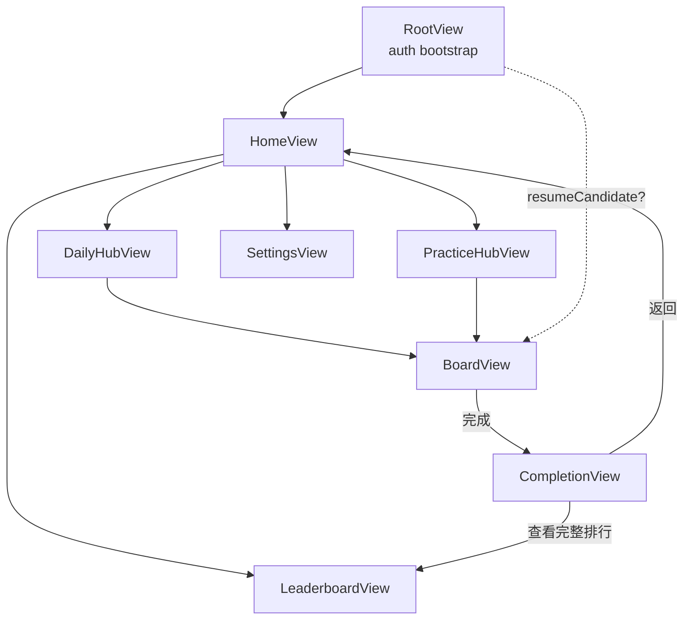

# Sudoku v1 — Design

狀態：**DRAFT** — 逐節審核中。
最後更新：2026-05-15

本文件合併產品規格（§What）與技術設計（§How）。重大決策直接寫進 §Decisions；原始討論放在 `meetings/`。

---

## §What — 產品

### 產品定位

iPhone (iOS 26+) 與 Mac (macOS 26+) 雙平台 Sudoku App，以 Swift 6 + SwiftUI 單一 multiplatform target 建構（詳見 `foundations.md`）。雙重交付：**(1)** 精緻可玩的 Sudoku 體驗；**(2)** Claude agent 應用在實際 iOS 專案的可重現案例。

### 受眾

- 主要：希望在 iPhone 與 Mac 上有乾淨體驗、跨裝置接續進度的 solo 玩家。
- 次要：研讀本 repo 以理解 Claude-agent 協作流程的讀者。

### v1 功能集

1. **Daily Mode（每日 3 題）** — 每天 Easy / Medium / Hard 各 1 題，**全球玩家同題**；每題 `puzzleId = YYYY-MM-DD-{easy|medium|hard}`。**每位玩家每題只有一次計分機會**（同 puzzleId 第二次完成不更新分數）。
2. **Practice Mode（自由模式）** — 隨意抽題、不計入排行、無 GC 提交。題池為「**Starter Pack**（v1 隨 App bundle 內附每難度 30 題、共 90 題）」+「**退役 Daily 題**（昨日以前的所有 daily 題自動進入）」。
3. **輸入品質** — 鉛筆筆記（每格候選數字）、Undo / Redo（上限 20 步）、與題目儲存解答比對的錯誤即時高亮。
4. **存檔與個人紀錄** — 離開 App 不會丟失進度；個人紀錄分軌：Daily（每難度最佳時間、完成題數）、Practice（每難度完成題數、平均時間）。
5. **跨裝置同步** — 同一 iCloud 帳號下，iPhone 與 Mac 的存檔與個人紀錄互通（CloudKit 私人 DB）。
6. **Game Center 整合** — 3 條 **recurring daily leaderboards**（Easy / Medium / Hard 各一），每日 **UTC 00:00** 自動翻新；當日 occurrence 即代表「今天那一題」的世界與朋友圈排名。成就跨模式設計（如「完成 100 題 Practice」、「Daily 連續 7 天 streak」等，細項在 §How.3）。
7. **題目投放管線** — 不需 App 改版即可加入新題：**Xcode Cloud 每月排程**預發佈下個月 30 天份的 Daily 題到 CloudKit Public DB；CI 故障緩衝至少一個月。
8. **多語介面** — 支援 7 個 locale：繁體中文（zh-TW）、英文（en）、日文（ja）、簡體中文（zh-CN）、西班牙文（es）、泰文（th）、韓文（ko）。翻譯交由 AI agent 流程處理（細節在 `plan.md`），同一份流程涵蓋 App 字串、Game Center 成就名稱、App Store metadata、Privacy Manifest 描述。

### v1 商業模式

**免費、無 IAP、無廣告**。廣告策略保留在 backlog（見下方）等 v2 評估。

### v1 成功標準

- 玩家可下載、開始今日 Daily 題、完成它，並在當日 Daily Leaderboard 看到自己的時間 — 在 iPhone 與 Mac 同一 iCloud 帳號下表現一致。
- 玩家可進入 Practice Mode、抽到 Starter Pack 或退役 Daily 題、自由練習而不影響排行。
- Xcode Cloud Puzzle Delivery 每月排程跑成功一次，預發佈下個月 30 天份 Daily 題至 CloudKit Public DB，**完全不需動到已上架的 App 二進位**。
- 除了 CloudKit + Game Center + Xcode Cloud + App Store Connect Analytics + MetricKit 之外，**我方不維運任何後端服務、不引第三方 SDK**。
- 7 個 locale 的 App 字串、metadata、Game Center 名稱齊備並通過 App Store 審核。

---

## §How — 架構

### §How.1 模組與資料流

#### 靜態依賴（依 `foundations.md §2`）

```
SudokuEngine  ←  GameState
                 ↑
                PuzzleStore, Persistence, GameCenterClient, Telemetry
                 ↑
                SudokuUI
                 ↑
                App target (DI composition root)
```

依賴只向上、不能向下。`SudokuEngine` 純 Swift；上層注入 protocol，runtime 才由 App target 接具體實作。

#### 動態資料流（四個典型場景）

**A — 玩家進入一道新題**

```
App launch
  → App composition root 注入具體實作 → SudokuUI
  → HomeView 顯示難度選擇 → 玩家選 Easy
  → SudokuUI 經 PuzzleStoreProtocol 請一題
  → PuzzleStore 查 CloudKit Public DB → 回傳 Puzzle
  → SudokuUI 建 GameState → 進入 BoardView
  → GameState 經 PersistenceProtocol 寫入「進行中局面」→ CloudKit Private DB
```

**B — 玩家填一格 / Undo / Redo**

```
BoardView 發 Intent: .placeDigit(row, col, digit)
  → GameState
       ├─ SudokuEngine.validate 比對解答
       ├─ 更新內部局面、push 進 undo stack
       ├─ 發 TelemetryEvent.digitPlaced
       └─ Persistence.save（debounce 500ms）
  → BoardView 訂閱 GameState 變化 → 自動 redraw（含錯誤高亮）

玩家按 Undo
  → GameState pop undo stack → Persistence.save
```

**C — 玩家完成一題**

```
GameState 偵測「全格填滿且全部正確」
  → 發 TelemetryEvent.puzzleCompleted(puzzleId, difficulty, seconds)
       ├─ OSLogSink → os.Logger
       ├─ TrackingSink NoOp（v1）
       ├─ MetricKitSink（不關心此事件）
       └─ GameCenterSink（新增；接收完成事件）
            ├─ submitScore → 該題單題 leaderboard (id = puzzleId)
            ├─ submitScore → 該難度總 leaderboard
            └─ 檢查並解鎖相關 Achievement
  → Persistence 把局面從「進行中」移到「已完成」紀錄
  → SudokuUI 切換到 CompletionView，顯示世界 / 朋友圈排名
       → 從 GameCenterClient 即時拉該題 leaderboard
```

注意：`GameState` **不直接呼叫** `GameCenterClient`；完成事件透過 `Telemetry` 發散，`GameCenterSink` 是其中一個訂閱者。保持單一出口、低耦合。

**D — 跨裝置接續**

```
玩家在 iPhone 玩到一半 → Persistence.save → CloudKit Private DB 自動同步
玩家換到 Mac 打開 App
  → Persistence 拉出最新「進行中」局面
  → SudokuUI 顯示「上次玩到一半的局面，要繼續嗎？」
```

#### 持久化節流

`Persistence.save` 採 **debounce 500ms**；以下時機強制立即寫入（無 debounce）：
- View 切到背景（`scenePhase` 轉 `.background`）
- 離開 BoardView
- 完成題目（在標記為「已完成」之前）

#### DI Composition Root

App target 內：

```swift
@main
struct SudokuApp: App {
    private let composition = AppComposition.live()
    var body: some Scene {
        WindowGroup {
            SudokuUI.RootView(composition: composition)
        }
    }
}

struct AppComposition: Sendable {
    let puzzleStore: any PuzzleStoreProtocol
    let persistence: any PersistenceProtocol
    let gameCenter: any GameCenterProtocol
    let telemetry: Telemetry

    static func live() -> AppComposition { /* CloudKit / GameKit / OSLog 具體實作 */ }
    static func preview() -> AppComposition { /* SwiftUI Preview 用 fakes */ }
    static func tests() -> AppComposition { /* snapshot / unit test 用 fakes */ }
}
```

三入口（`live` / `preview` / `tests`）對應三種跑得起來的環境。

### §How.2 CloudKit Schema

兩個 DB，職責不同。**跨 DB 不能用 CKReference**，所以 `SavedGame` 中對 `Puzzle` 的關聯只能存 `puzzleId` 字串。

#### Public DB — 題庫

**Record type：`Puzzle`**

CloudKit 對每個 field 區分三種 index：`Q` = Queryable、`S` = Sortable、`Search` = Searchable（全文）。下表 Index 欄列實際需要的組合。`recordName` 隱含 Q-only（不可 Sortable 用於 custom query 排序）。

| Field | Type | Index | 說明 |
|---|---|---|---|
| `recordName` | String | Q（隱含）| `puzzleId`，兩種命名規則：Daily 題 `YYYY-MM-DD-{easy\|medium\|hard}`（如 `2026-06-01-easy`）；Starter Pack `starter-{difficulty}-{index}`（如 `starter-easy-001`）|
| `difficulty` | String | Q | `"easy"` / `"medium"` / `"hard"` |
| `clues` | String | — | 81 字元棋盤編碼，空格 `"."` |
| `solution` | String | — | 81 字元完整解答 |
| `publishDate` | Date | Q + S | Daily 題的當日 UTC 00:00；**Starter Pack 此欄為 `nil`**；Q 用於 `< today` 範圍查詢、S 用於排序 |
| `isStarterPack` | Int(64) | Q | `1` = starter pack；`0` = daily（含已退役）|
| `createdAt` | Date | — | 系統自動 |
| `schemaVersion` | Int(64) | — | v1 = `1` |

**Record type：`PuzzleDeliveryLedger`** — 記錄 Daily / Starter Pack 已派發的 puzzleId 命名空間（取代原本要寫回 git 的 `consumed.json`，避免 CI 自動 push main 的 race condition）。

| Field | Type | Index | 說明 |
|---|---|---|---|
| `recordName` | String | Q（隱含）| 固定為 `daily` 或 `starter`，兩筆 record 各代表一個 namespace |
| `consumedPuzzleIds` | [String]（CloudKit `LIST` of String）| — | 已派發 puzzleId 列表（追加 append-only）|
| `lastUpdatedAt` | Date | — | 系統自動 |
| `schemaVersion` | Int(64) | — | v1 = `1` |

Plan 階段先 fetch `PuzzleDeliveryLedger/daily`、看哪些 puzzleId 已用；upload 完成後在同一筆 record append 新派發 ID。`PuzzleDeliveryLedger/starter` 由 App release 流程的 starter pack 生成步驟維護（見 §How.4.7）。

**取題查詢**：

| 模式 | 查詢條件 |
|---|---|
| 今日 Daily（給定難度 D） | `difficulty == D AND publishDate == today (UTC)` |
| Practice — Starter Pack | `isStarterPack == 1 AND difficulty == D` |
| Practice — 退役 Daily | `isStarterPack == 0 AND publishDate < today (UTC) AND difficulty == D` |
| Practice — 混合（推薦） | 上述兩條 UNION，隨機抽 |

#### Private DB — 個人資料

**Custom zone**：Private DB 預設 zone（`_defaultZone`）**不支援** `CKFetchRecordZoneChangesOperation` 與細粒度 query subscription；本 App 在首次啟動時建立單一 custom zone **`com.wei18.sudoku.userZone`** 用於下列兩個 record type。Persistence 層所有讀寫綁定此 zone。

**Record type：`SavedGame`** — 進行中或已完成的局面（位於 `com.wei18.sudoku.userZone`）

| Field | Type | Index | 說明 |
|---|---|---|---|
| `recordName` | String | Q（隱含）| UUID |
| `puzzleId` | String | Q | 對應 Public DB `Puzzle.recordName` |
| `mode` | String | Q | `"daily"` / `"practice"` |
| `difficulty` | String | Q | 冗餘儲存 |
| `boardState` | String | — | 81 字元當下局面 |
| `notesState` | Data | — | 81 格候選數字 bitmask |
| `undoStack` | Data | — | 序列化 Move 陣列；**上限 20 步** |
| `startedAt` | Date | — | |
| `lastModifiedAt` | Date | Q + S | 用於排序「最近玩的」 |
| `elapsedSeconds` | Int(64) | — | 累積遊玩秒數（pause 不算）|
| `status` | String | Q | `"inProgress"` / `"completed"` |
| `schemaVersion` | Int(64) | — | v1 = `1` |

**Record type：`PersonalRecord`** — 各模式 × 難度個人紀錄（位於 `com.wei18.sudoku.userZone`）

| Field | Type | Index | 說明 |
|---|---|---|---|
| `recordName` | String | Q（隱含）| 固定為 `{mode}-{difficulty}`（如 `"daily-easy"`、`"practice-hard"`），確保每組合唯一 |
| `mode` | String | Q | `"daily"` / `"practice"` |
| `difficulty` | String | Q | |
| `bestTimeSeconds` | Int(64) | — | 該模式 + 難度最佳時間 |
| `totalTimeSeconds` | Int(64) | — | 累積秒數，用於算 average |
| `completedCount` | Int(64) | — | 完成題數 |
| `averageTimeSeconds` (computed) | — | — | UI 計算、不存 |
| `lastUpdatedAt` | Date | — | |
| `schemaVersion` | Int(64) | — | v1 = `1` |

每位玩家最多 **6 筆** `PersonalRecord`：`{daily, practice} × {easy, medium, hard}`。

#### Subscriptions

| 對象 | 類型 | 用途 |
|---|---|---|
| Private DB (整個 zone) | 單一 **`CKDatabaseSubscription`** | 接收 `com.wei18.sudoku.userZone` 內任何變更（SavedGame / PersonalRecord）；推播到達後執行 `CKFetchRecordZoneChangesOperation` 拉變更集 |
| Public DB → 新增 `Puzzle` | — | **v1 不訂閱**（避免推播打擾）；v2 再評估 |

不採用 `CKQuerySubscription` — Apple 文件明示 Private DB 預設 zone 不支援 query subscription；改採 database + zone changes operation，是 Apple 文件對 Private DB 跨裝置同步的標準路徑。`PuzzleDeliveryLedger`（Public DB）由 puzzle delivery CLI 主動讀，不需 subscription。

#### Schema 演進策略

- 每筆 record 帶 `schemaVersion`。
- Reader 永遠**向後相容**：讀到較新版本的 record 時用 conservative migration（補預設值）。
- Writer 寫入時用當前版本號。
- 重大改變（如改 field type）→ 新 record type + 雙寫過渡期 + 棄用舊 type。

#### 「同 puzzleId 不重計分」規則的落地

GameCenterSink 收到 `puzzleCompleted` 事件後：

```
1. 如果 event.mode == "practice" → 不提交 GC，僅更新 PersonalRecord
2. 如果 event.mode == "daily":
     a. 查 Private DB：是否存在 status=completed AND puzzleId=X AND mode=daily 的 SavedGame？
        （查詢前先看本機快取的 completedDailyPuzzleIds: Set<String>）
     b. 存在 → 跳過 GC submission（規則：第二次不更新分數）
     c. 不存在 → submit 至對應的 daily recurring leaderboard、更新 PersonalRecord、加入快取集合
```

本機快取的 `completedDailyPuzzleIds` 在 App 啟動時從 Private DB 拉一次、之後增量維護。

### §How.3 Game Center 設定

本節定義 Game Center（GC）整合的三個面向：**leaderboards**、**achievements**、**GameCenterClient API**。設計遵循「Practice mode 不提交 GC」「同 puzzleId 不重計分」兩條既有規則。

#### §How.3.1 Leaderboards

**v1 只設 3 條 recurring daily leaderboards**，不設 all-time。

| Leaderboard ID | Score Type | Sort | Recurrence | Format | Score Range |
|---|---|---|---|---|---|
| `com.wei18.sudoku.leaderboard.easy.daily` | Time（毫秒）| Low to High（**ascending = better**）| Daily, **UTC 00:00 reset** | `mm:ss.SSS` | `1` ~ `7_200_000`（2 小時上限，**v1 暫定**）|
| `com.wei18.sudoku.leaderboard.medium.daily` | 同上 | 同上 | 同上 | 同上 | 同上 |
| `com.wei18.sudoku.leaderboard.hard.daily` | 同上 | 同上 | 同上 | 同上 | 同上 |

**Recurrence 設定**（App Store Connect → Game Center → Leaderboard → Recurring）：Start Date = 發版當日 UTC 00:00；Duration = 1 day；Reset Time = 每日 UTC 00:00（與 `puzzleId = YYYY-MM-DD-*` 對齊）。

**Score 提交**：`GameState.elapsedSeconds × 1000` → Int64 ms。

**Locale Title**（每條 leaderboard 在 App Store Connect 需各 locale 一組）：

| Locale | Daily Easy | Daily Medium | Daily Hard |
|---|---|---|---|
| `zh-TW` | 今日簡單 | 今日中等 | 今日困難 |
| `en` | Daily Easy | Daily Medium | Daily Hard |
| `ja / zh-CN / es / th / ko` | `<TRANSLATE>` | `<TRANSLATE>` | `<TRANSLATE>` |

**Reset 邊緣案例**：

| 情境 | 行為 |
|---|---|
| 玩家 23:59 UTC 開始、00:01 UTC 完成今日題（跨日完成）| **Skip GC submission**：Apple GameKit `submitScore` 永遠寫入 *當前* active occurrence、無法 retarget 已關閉 occurrence。若提交會誤排到「今天」的 leaderboard、混淆排行。Sink 偵測完成時間之 UTC 日期 ≠ `puzzleId` UTC 日期 → 跳過 GC 提交，UI 一次性 toast「此局跨日完成，未列入今日排行」。**`PersonalRecord` 仍更新**（個人最佳不分日）。|
| Reset 瞬間 GC 暫無回應 | `GameCenterClient` 內部 retry 一次（exponential backoff 250ms / 1s）；仍失敗記 log，UI 顯示「成績已記錄於本機，稍後同步」|
| 未認證 GC 但完成 daily 題 | 仍寫 `PersonalRecord` 與 `SavedGame.status = completed`；GC submission 跳過、**v1 不入離線佇列**（見 §How.3.4）|
| 玩家完成時間 > 7200 秒（2 小時上限）| 視為 **abandon**：不提交 GC、不更新 `PersonalRecord.bestTimeSeconds`；`SavedGame.status` 保持 `inProgress`（讓玩家還能繼續）；UI 顯示「此局時間已超過 2 小時上限，未列入排行」|

#### §How.3.2 Achievements

**v1 設 8 個 achievements，總點數 = 550**（GC 上限 1000；保留 **450 點** 給 v2 增量，避免「全用滿 = v2 無餘裕」反 pattern）。觸發條件必須能從 `TelemetryEvent.puzzleCompleted` 串流 + Private DB 查詢觀測得到。

| ID | Points | Trigger |
|---|---|---|
| `first_puzzle` | 10 | 任何模式首次 `puzzleCompleted` |
| `daily.complete_one` | 20 | 首次 `mode == .daily` 完成 |
| `daily.streak_3` | 50 | 連續 3 個 UTC 日各至少完成 1 道 daily（任難度）|
| `daily.streak_7` | 100 | 連續 7 天 |
| `practice.complete_10` | 30 | `mode == .practice` 累積 10 題 |
| `practice.complete_100` | 100 | 100 題 |
| `hard.master` | 150 | `difficulty == .hard` 累積 25 題（不分模式）|
| `daily.sweep` | 90 | 同一 UTC 日完成當日 3 難度全收 |

所有 ID 加前綴 `com.wei18.sudoku.achievement.`。**v2 候選**（保留點數）：`daily.streak_30` (200)、`practice.complete_500` (250)，合計 450 點。

**Progress 回報**：量化型（complete_10/100/500、hard.master）以 percent 累進回報，GC 端取 max + dedupe。Streak 與 sweep 為二值（達成即 100、否則不 submit），計算由 `GameCenterSink.receive` 內一次 `CKQuery` 完成（過去 30 天視窗、`mode == .daily` 過濾）。

**所有 achievement v1 皆 visible**；Easter-egg / hidden 留 v2。

**Locale 文案 source-of-truth 為 App Store Connect 設定頁**；en + zh-TW 在 `plan.md` 翻譯步驟以 source 形式產生；其餘 5 locale 由翻譯 agent 流程處理。

#### §How.3.3 GameCenterClient Protocol

**設計原則**：所有方法 `async throws`、所有值型別 `Sendable`、protocol `: Sendable`；不暴露 `GameKit` 型別（只有 live 實作 import GameKit）；失敗模式顯式可 throw `GameCenterError`。

```swift
public protocol GameCenterClient: Sendable {
    func authenticate() async -> AuthState

    /// 最近已知的 auth state，非同步快取讀取（由 `@Observable` VM 同步使用）。
    nonisolated var currentAuthState: AuthState { get }

    /// 連續 auth state 變更流。VM `.task` 持續 await。
    func authStateUpdates() -> AsyncStream<AuthState>

    /// 朋友列表授權狀態（iOS 14.5+）。fetchLeaderboardSlice(.friendsOnly) 前置檢查。
    func friendsAuthorizationStatus() async -> FriendsAuthStatus

    /// 啟動 GameKit 系統朋友授權 prompt（一個 session 內只請求一次）。
    func requestFriendsAuthorization() async throws

    func submitScore(
        leaderboardID: String,
        elapsedMilliseconds: Int64,
        context: UInt64
    ) async throws

    func reportAchievement(
        achievementID: String,
        percentComplete: Double,
        showsCompletionBanner: Bool
    ) async throws

    func fetchLeaderboardSlice(
        leaderboardID: String,
        scope: LeaderboardScope,
        topCount: Int                  // v1 預設 10
    ) async throws -> LeaderboardSlice
}

public enum FriendsAuthStatus: Sendable, Equatable {
    case notDetermined
    case denied
    case restricted
    case authorized
}

public enum AuthState: Sendable, Equatable {
    case unknown
    case authenticated(Player)
    case unauthenticated
    case restricted
    case failed(GameCenterError)
}

public struct Player: Sendable, Equatable {
    public let gamePlayerID: String
    public let displayName: String
    public let alias: String
}

public enum LeaderboardScope: Sendable, Equatable {
    case globalTop
    case aroundPlayer            // 自己 ±topCount/2
    case friendsOnly
}

public struct LeaderboardSlice: Sendable, Equatable {
    public let leaderboardID: String
    public let scope: LeaderboardScope
    public let entries: [LeaderboardEntry]
    public let localPlayerEntry: LeaderboardEntry?    // 玩家當前 occurrence 尚未 submit 時為 nil
    public let totalPlayerCount: Int
    public let fetchedAt: Date
}

public struct LeaderboardEntry: Sendable, Equatable, Identifiable {
    public var id: String { player.gamePlayerID + "#" + String(rank) }
    public let player: Player
    public let rank: Int                        // 1-based
    public let formattedScore: String           // "mm:ss.SSS"
    public let rawScore: Int64                  // 毫秒
}

public enum GameCenterError: Error, Sendable, Equatable {
    case notAuthenticated
    case authenticationCancelled
    case authenticationFailed(reason: String)
    case unavailableInRegion
    case friendsAccessDenied
    case scoreOutOfRange
    case networkUnavailable
    case rateLimited
    case underlying(code: Int, description: String)   // GKError.Code.rawValue + 訊息，不 import GameKit
}
```

**Sink 使用模式**：

```
case .puzzleCompleted(puzzleId, mode, difficulty, seconds):
  // (1) Achievement evaluation 永遠執行，與 mode / Daily-only score 規則正交。
  //     evaluateAndReportAchievements 從 Persistence 計數（completedCount 等）出發，
  //     避免「離線時錯過事件」— 連線時呼叫即重新計算當前進度。
  if currentAuthState.isAuthenticated {
      try? await evaluateAndReportAchievements()
  }
  // (2) Score submission 僅 Daily 模式 + 同 puzzleId 首次完成。
  guard mode == .daily,
        !completedDailyPuzzleIds.contains(puzzleId) else { return }
  // 跨日完成檢查（§How.3.1 reset 邊緣案例）：完成時間之 UTC 日 ≠ puzzleId UTC 日 → 跳過。
  guard isSameUTCDate(completedAt: Date(), puzzleId: puzzleId) else {
      // toast「此局跨日完成，未列入今日排行」；仍寫 PersonalRecord
      return
  }
  try await client.submitScore(
      leaderboardID: leaderboardID(for: difficulty),
      elapsedMilliseconds: Int64(seconds * 1000),
      context: 0
  )
  completedDailyPuzzleIds.insert(puzzleId)
```

#### §How.3.4 認證流程

**觸發時機**：`RootView` 的 `.task` modifier 內 `await client.authenticate()`（SwiftUI 標準 seam：first appear 後執行、disappear 自動取消）。不在 `init` 內做、不用 timer。

**各狀態行為**：

| AuthState | Daily Mode | Practice Mode | Leaderboard UI |
|---|---|---|---|
| `.authenticated` | 完整 | 完整 | 顯示 |
| `.unauthenticated` | 降級（可玩、可完成、寫 Private DB；CompletionView 顯示「登入 Game Center 以加入今日排行」CTA；不入離線佇列）| 不受影響 | 「需登入」空狀態 |
| `.restricted` / `.unavailableInRegion` | 同 unauthenticated，但 CTA 改為「此地區或裝置不支援 Game Center」、無「登入」按鈕 | 不受影響 | 隱藏 GC 入口 |
| `.failed` | 同 unauthenticated，CTA 顯示「重試」呼叫 `authenticate()` 一次 | 不受影響 | 錯誤摘要 |

**v1 不做離線提交佇列**：GC daily occurrence 跨日後可能關閉，佇列在隔日送會 silently 失敗或送錯 occurrence；資料完整性已由 CloudKit `PersonalRecord` + `SavedGame` 保證，GC 排行只是「炫耀面」非「資料面」。v2 評估。

**macOS 區域限制**：live 實作將 `GKError.Code` 在特定情境結合 `Locale.current.region` 啟發式判斷後映射為 `.unavailableInRegion`；具體 code 映射在 `plan.md` 落地時驗證。

#### §How.3.5 朋友圈排名

**v1 三種視圖**：

| 視圖 | scope | 顯示位置 | top N |
|---|---|---|---|
| 世界 Top 10 | `.globalTop` | CompletionView 主區塊、Leaderboard tab | 10 |
| 我的鄰近 ±10 | `.aroundPlayer` | CompletionView 玩家附近區塊、Leaderboard tab toggle | 10（自己上下各 5）|
| 朋友圈 | `.friendsOnly` | Leaderboard tab toggle；CompletionView 不顯示 | 10 |

**資料來源**：global / aroundPlayer 走 `GKLeaderboard.loadEntries(for: .global, ...)` + `entryRange`；friendsOnly 前**必**呼叫 `friendsAuthorizationStatus()` 預檢：`.authorized` → `loadEntries(for: .friendsOnly, ...)`；`.notDetermined` → `requestFriendsAuthorization()` 觸發系統 prompt；`.denied` / `.restricted` → 直接 throw `.friendsAccessDenied`、UI 顯示一次性 CTA（一個 session 內不重複請求）。**macOS friends API 平台支援以官方文件為準**（plan.md 落地時驗證）。

**快取**：CompletionView 進場拉一次、不即時刷新；手動下拉 refresh 才重拉。失敗時顯示「目前無法載入」+ 重試按鈕、不擋完成流程。

#### §How.3.6 與既有規則的對齊

| 規則來源 | 在本節的落地 |
|---|---|
| §What 同 puzzleId 不重計分 | §How.3.3 Sink `completedDailyPuzzleIds.contains` 短路；§How.2 本機快取為 source |
| §What Practice 不入 GC | §How.3.3 Sink `guard mode == .daily` |
| §How.1 GameState 不直呼 GC | 完成事件 → Telemetry → GameCenterSink |
| `foundations.md §2` 框架 import 限制 | §How.3.3 protocol 不暴露 GameKit |
| `[[swift6-concurrency]]` Sendable | 所有 protocol method `async throws`、所有 value type `Sendable` |

#### §How.3.7 GC Sandbox vs Production 切換

GC 在 Debug build / TestFlight build / App Store build 走不同 environment（Sandbox vs Production）；玩家 ID、leaderboard occurrence、achievement 進度**完全獨立**。

- 開發機跑 Debug build 與 TestFlight 都走 Sandbox；上架後走 Production。
- live `GameCenterClient` 不主動切換 — 由 GameKit framework 依 build provenance 自動判斷。
- `OSLogSink` 啟動時 log 一次 `gamePlayerID` 前 6 碼 + environment 標識（debug only），方便除錯。
- Snapshot / unit test 完全用 fake `GameCenterClient`，永不真實連線。
- 跨 environment 的成就 / 排行**不可遷移**；玩家若在 TestFlight 累積進度，正式版需重新開始 — 文案中需於 onboarding 提及（plan.md 落地）。

### §How.4 Xcode Cloud Puzzle Delivery

**Status: DRAFT — 含 3 條 prerequisite 須於 plan.md 第一階段驗證後升 FINAL**（見 §How.4.9）。

對齊 §What v1.7（不需 App 改版即可加入新題、CI 故障緩衝至少一個月）、§How.2（Puzzle schema、`puzzleId` 命名、`isStarterPack`、`publishDate`）、`foundations.md §4`（Xcode Cloud 單軌 + `ci_scripts/` + `mise`）。

#### §How.4.1 目標與不變式

| 項目 | 規格 |
|---|---|
| 投放目標 | CloudKit **Public DB**，Record type `Puzzle` |
| 單次投放範圍 | **下個月 1 號 UTC 00:00 起算連續 30 個 UTC 日**（跨月時繼續向後延伸，如 2026-02-01 → 2026-03-02）、每天 Easy / Medium / Hard 各 1 題 = **90 筆 record** |
| 排程 | **每月 1 號 UTC 02:00** 自動觸發 + 隨時可手動觸發 |
| 緩衝 | 任一單次 CI 失敗時，CloudKit 中仍有當天起算至少 30 天未消費 Daily 題；連續失敗整個月才會斷供 |
| Idempotency | 同一 `puzzleId` 二次寫入 = no-op |
| 不變式 | (a) 每 `(publishDate, difficulty)` 組合唯一；(b) 每筆通過唯一解驗證；(c) `schemaVersion = 1` |

#### §How.4.2 題庫來源 — Curated puzzle bank

**v1 採離線人工策劃的 puzzle bank**，純 JSON 存於 App repo：

```
Sudoku/
└── Puzzles/
    ├── bank/{easy,medium,hard}.json   # { clues, solution, humanLabel, clueCount, branchingFactor }
    └── starter-pack.json              # 90 題快照（§How.4.7）；puzzleId 列表副本進 CloudKit Public DB `PuzzleDeliveryLedger/starter`
```

已派發紀錄不再進 git；改存 CloudKit Public DB 的 `PuzzleDeliveryLedger` record（見 §How.2 與 §How.4.5 step 6）。

不採用 runtime generator / hybrid。理由：v1 容量需求小（半年僅 ~500 題/難度即夠用）、新增 generator 違反「最小新增工具」原則、JSON 進 git 讓 PR review 可見題目品質。Bank 餘量 < 30 天 buffer 時由開發者另開 PR 補充；本管線**不負責**生成題目。

#### §How.4.3 難度校準 — 簡化指標（v1 descope）

**降階決策**：v1 **不**實作 human-technique 解題器（xWing / swordfish / xyWing 等需 1500–3000 LOC、本身是子專案）；改採「**人工 curated label 為主、自動 verifier 為輔**」的策略。

每筆 puzzle 在進入 bank 前由 `PuzzleCalibrator`（純 `SudokuEngine` 相依）標註：

| 欄位 | 說明 |
|---|---|
| `humanLabel: Difficulty` | **人工** 標的難度（curator PR 時填）|
| `branchingFactor: Int` | DFS solver 不靠進階技巧時首次需猜測的次數 |
| `clueCount: Int` | 已知格數 |

**Solver 範圍**：v1 只實作 `nakedSingle` + `hiddenSingle` + `nakedPair` 三層 constraint propagation + DFS uniqueness check。其餘技巧（hiddenPair / pointingPair / boxLine / xWing / swordfish / xyWing）**全部延後 v2**。

**Verifier 規則**（拒收 mis-labeled）：

| 難度 humanLabel | 自動拒收條件 |
|---|---|
| **Easy** | `clueCount < 32` 或 `> 50`；或 propagation-only solver（nakedSingle + hiddenSingle）無法在不猜的情況下解出 |
| **Medium** | `clueCount < 28` 或 `> 38` |
| **Hard** | `clueCount < 22` 或 `> 32` |

`branchingFactor` 由 DFS 計算，**僅用於警示**（> 3 視為「可能需要進階技巧」，不阻擋）。**所有題目仍須通過 §How.4.4 唯一解驗證**。

技巧 tag 系統（Technique 階層）整體**延後到 v2**，連同完整的 technique-tier 解題器、進階難度校準一併納入「v2 difficulty engine」單一子專案。

**人工 curated label 怎麼來**：bank PR 提交時，curator 自行判斷（個人專案 curator = 開發者本人 + AI 協助）。`humanLabel` 為 source-of-truth；自動 verifier 只攔下明顯不合理的標註。

#### §How.4.4 唯一解驗證

每筆 puzzle 在 (a) 進入 bank、(b) 上傳前都過 `SudokuEngine.UniquenessValidator.validate(clues:) -> ValidationResult`：

```
ValidationResult ::= .unique(solution: String)
                   | .multiple(count: Int, examples: [String])
                   | .unsolvable
```

DFS + constraint propagation，**找到第二解立即 short-circuit**。Pipeline 內 90 筆順序驗證 < 30 秒。任一筆失敗 → 整批中止、CI fail、寫 `validation-failures.json`，**不上傳部分結果**。

#### §How.4.5 `ci_scripts/upload_puzzles.sh` 契約

##### Inputs

| 來源 | 名稱 | 內容 |
|---|---|---|
| Env var | `PUZZLE_DELIVERY_START_DATE` | 可選，覆寫起始日；預設 = 下個月 1 號 UTC |
| Env var | `PUZZLE_DELIVERY_DAYS` | 可選，預設 `30` |
| Env var | `CLOUDKIT_CONTAINER_ID` | 例 `iCloud.com.wei18.sudoku` |
| Env var | `CLOUDKIT_ENVIRONMENT` | `development` / `production` |
| Env var | `CLOUDKIT_KEY_ID` + `CLOUDKIT_PRIVATE_KEY_PEM` | Server-to-server token |
| Repo | `Puzzles/bank/{easy,medium,hard}.json` | 題庫（已用紀錄改存 CloudKit `PuzzleDeliveryLedger`）|

##### 執行步驟

1. `mise install` → 安裝 `jq`、`xcbeautify`（`swift` 由 Xcode 提供）
2. 解析起始日 / 區間
3. `swift run puzzle-delivery plan` → 為每 `(date, difficulty)` 從 bank 挑未 consumed 的 puzzle、產出 90 筆 assignment、寫 `build/plan.json`。Bank 餘量不足 → fail code `30`
4. `swift run puzzle-delivery validate` → 對每筆跑 `UniquenessValidator` + `PuzzleCalibrator` 一致性檢查。失敗 → fail code `40`
5. `swift run puzzle-delivery upload` → 用 CloudKit Web Services API 寫入，**operationType = `"create"`**（CKWS 的 string enum）；對 server 回 `RECORD_EXISTS` 的 record，fetch 既存 record、比對 `solution` + `clues`：一致則視為 success（idempotent insert）；不一致 → fail code `50`。**不可用 `forceReplace`**（會 silently 覆蓋人工 curated 資料）
6. 將本次 90 筆 puzzleId append 進 CloudKit Public DB 的 **`PuzzleDeliveryLedger/daily`** record（同樣以 `operationType = "update"` + 樂觀 lock 重試最多 3 次）。**不再 commit 任何檔案回 git**（消除 GitHub PAT 需求 + main branch race 風險）
7. 寫 `build/puzzle-delivery-report.json` 至 Xcode Cloud artifacts

##### Outputs / Artifacts

| 路徑 | 內容 |
|---|---|
| `build/plan.json` | 本次 assignment |
| `build/puzzle-delivery-report.json` | 每筆上傳結果、耗時、retry 次數 |
| `build/validation-failures.json` | 失敗紀錄 |
| CloudKit `PuzzleDeliveryLedger/daily` | 已派發 puzzleId 列表更新 |

##### Idempotency

雙重保證：(a) `PuzzleDeliveryLedger/daily` 排除已用、(b) CloudKit `recordName == puzzleId` 唯一鍵 + `RECORD_EXISTS` 容忍。同一日期手動重跑 → plan 階段發現所有 puzzleId 已 consumed → 走「re-verify only」路徑：fetch CloudKit record、比對 hash、**不寫任何新資料**。

##### 錯誤處理

| 失敗類型 | exit code | 行為 |
|---|---|---|
| Bank 餘量不足 | 30 | Xcode Cloud 寄信；補 bank PR 後重觸發 |
| 唯一解 / 校準失敗 | 40 | 保留 `validation-failures.json`；**不上傳任何資料** |
| CloudKit RECORD_EXISTS 且 solution 不一致 | 50 | 視為 schema/content drift，人工介入 |
| CloudKit 5xx / 網路 | retry 3 次 expo-backoff（1s/4s/16s）；仍失敗 → exit 60 | 不 rollback |
| CloudKit quota exhausted | 70 | 不預期觸發；寫 OSLog `quota` 標記 |
| Ledger 樂觀 lock 寫入 3 次失敗 | 80 | 視為 ledger 並發異常；puzzle 已成功 upload 但 ledger 未更新 → 下次重跑會偵測 RECORD_EXISTS 走 verify-only 路徑、再次嘗試 ledger append |

##### Auth — Secret 管理

| Secret | 來源 | 儲存 |
|---|---|---|
| `CLOUDKIT_KEY_ID` + `CLOUDKIT_PRIVATE_KEY_PEM` | CloudKit Dashboard → Server-to-Server Keys（per environment）| **Xcode Cloud Environment Variables → Secret** |

**Rotation**：每 90 天輪換 server-to-server key；Production / Development 兩組完全隔離。**不需 GitHub PAT**（ledger 移至 CloudKit 後消除 git push 路徑）。

#### §How.4.6 本機 rehearsal

開發者於開發機（macOS + Xcode 26.5 + `mise`）執行：

```
mise install
swift run puzzle-delivery plan --start 2026-07-01 --days 30 \
    --bank Puzzles/bank --ledger-env development --out build/plan.json
# 工具會從 CloudKit Public DB `PuzzleDeliveryLedger/daily` 拉已用 puzzleId 列表
swift run puzzle-delivery validate --plan build/plan.json
# 真實上傳到 development 環境
export CLOUDKIT_ENVIRONMENT=development
swift run puzzle-delivery upload --plan build/plan.json --dry-run
# 確認 plan 後拿掉 --dry-run
```

CI 與本機共用同一個 Swift CLI（`Sudoku/Tools/PuzzleDeliveryCLI/`，**注意：位於 `SudokuKit` Package 之外、作為 repo 根目錄的另一個 Swift Package 內的 executable target**，相依 `SudokuEngine` via local path），`ci_scripts/upload_puzzles.sh` 僅做 bootstrap 後呼叫此 CLI。

開發環境 PEM 存於 `~/.config/sudoku/` 且 .gitignore 排除；macOS Keychain 可選作進階保存。

#### §How.4.7 Starter Pack 生成

**定位**：App bundle 內附 90 題（Easy / Medium / Hard 各 30），不經 CloudKit、不需 App 改版更新（每次 App release 才會帶新版）。

流程：

1. 從同一 bank 抽 90 筆，複用 §How.4.3 §How.4.4 calibrator + validator
2. 每筆 `puzzleId = starter-{difficulty}-{NNN}`（zero-padded）
3. 輸出到 `Sudoku/App/Resources/StarterPack.json`，schema 同 `Puzzle`、`isStarterPack = 1`、`publishDate = nil`
4. App 啟動時 `PuzzleStore` 首次需 starter pack 題目時將 bundle JSON 一次性匯入本機快取，**不**寫入 CloudKit Public DB

何時 regenerate：App version bump 時開發者顯式執行 `swift run puzzle-delivery starter-pack`；Daily pipeline **絕不**自動觸發（避免 starter 與 daily 同題）。Starter 的 90 個 puzzleId 寫入 CloudKit `PuzzleDeliveryLedger/starter` record；daily plan 階段排除之（fetch 時取 `daily` + `starter` 兩個 namespace 聯集）。

#### §How.4.8 與既有規則對齊

| 規則來源 | 在本節落地 |
|---|---|
| §What v1.7 不需 App 改版加新題 | 所有新題寫 CloudKit Public DB |
| §What v1.7 故障緩衝 ≥ 1 個月 | 排程每月 1 號 + 預發 30 天 |
| §How.2 `puzzleId` 命名 | Plan 階段 deterministic 生成 |
| §How.2 `isStarterPack` / `publishDate` 互斥 | Validator 強制 |
| §How.2 schema 演進 | `EXPECTED_SCHEMA_VERSION` env 變數 + reader 向後相容 |
| `foundations.md §4` Xcode Cloud + `mise` | `ci_scripts/` 走 `mise activate`、Swift CLI 為唯一邏輯源 |
| `[[swiftpm-modularization]]` 框架 import 限制 | CLI 不 import CloudKit framework；走 CloudKit Web Services REST |
| Karpathy §2 Simplicity First | 不引入 generator、無第二份 shell 實作 |

#### §How.4.9 Open items（Prerequisite checklist — 落地 plan.md 第一階段驗證）

- [ ] Xcode Cloud `ci_scripts/` 環境是否預裝 `swift` toolchain 與可安裝 `mise` — **Unconfirmed**。Plan.md 第一步以最小 workflow 跑通 `swift --version` + `mise --version`。
- [x] ~~CloudKit Web Services 對 `forceReplace = false` 的精確語意~~ — **Resolved**（Code Review 2026-05-15）：CKWS `operationType` 為 string enum `{create, update, replace, forceReplace, forceUpdate, forceCreate}`，本管線採 `"create"` + RECORD_EXISTS verify-then-skip 路徑（見 §How.4.5 step 5）。
- [ ] Xcode Cloud 排程觸發時間是否真為 UTC — **Unconfirmed**。
- [x] ~~**Human-technique solver 實作量**~~ — **Resolved**（Code Review 2026-05-15）：v1 descope（見 §How.4.3）；只實作 `nakedSingle` + `hiddenSingle` + `nakedPair` 三層 + DFS uniqueness；難度由人工 curated label 主導，自動 verifier 僅檢 clueCount 與 propagation 可解性。完整 technique-tier solver 與進階校準延後 v2。

以上 4 條全部驗證 / 拆解後，§How.4 升級為 FINAL。

### §How.5 主要 View / state flow

對齊 §What v1（Daily 3 題 + Practice + 7 locale + GC 整合）、§How.1（DI composition、Telemetry fan-out）、§How.2（CloudKit schema、`SavedGame.status`）、§How.3（GameCenterClient API、AuthState 降級）、`foundations.md §2`（SudokuUI 不 import CloudKit / GameKit）、`foundations.md §3`（snapshot 由主畫面起步）。

#### §How.5.1 View map（v1 全螢幕清單）

**決策**：v1 共 8 個 top-level View；UI 層只持有 protocol，**不** import `CloudKit` / `GameKit`。

| View | 父層 | 觸發的 CloudKit / GC 操作 | 主要狀態 |
|---|---|---|---|
| `RootView` | — | 於 `.task` modifier 內呼叫 `GameCenterClient.authenticate()`（首次 appear 後執行、disappear 自動取消，無 timer）；訂閱 `Persistence` 拉「最近未完成局」 | `composition`、`authState`、`resumeCandidate` |
| `HomeView` | Root | 無 | 模式選擇（Daily / Practice / Leaderboard / Settings） |
| `DailyHubView` | Home | `PuzzleStore.fetchDailyTrio(date:)`、`Persistence.fetchCompletedDailyIds(date:)` | 今日 3 題卡片 + 完成狀態 |
| `PracticeHubView` | Home | `PuzzleStore.fetchPracticePool(difficulty:)`（mixed starter + retired daily） | 難度切換 + 抽題 |
| `BoardView` | DailyHub / PracticeHub | `Persistence.loadOrCreate`、`Persistence.save` (debounce 500ms)、scenePhase 強制 flush | 單局狀態機（§How.5.3） |
| `CompletionView` | BoardView（modal）| `GameCenterClient.fetchLeaderboardSlice(.globalTop)` + `.aroundPlayer`（僅 daily + `.authenticated`）；`Persistence` 狀態轉換 | 排行片段 + 個人紀錄 delta |
| `LeaderboardView` | Home / Completion（deep link）| `GameCenterClient.fetchLeaderboardSlice(scope:)`：global / aroundPlayer / friendsOnly | scope / 難度 toggle |
| `SettingsView` | Home | `GameCenterClient.currentAuthState`、`Persistence.totalCompletedCount`（只讀）| GC 狀態、locale、版本、清快取 |

**Liquid Glass 採用**：HomeView 模式卡片、DailyHubView 卡片、CompletionView hero 區用 `.glassEffect()`；BoardView 棋盤本體**不**用（強對比與錯誤高亮辨識考量）；Mac 視窗用系統預設 chrome。

#### §How.5.2 Navigation 結構

**決策**：
- iPhone（compact）：`NavigationStack` + CompletionView 用 `.fullScreenCover`
- Mac / iPad（regular）：`NavigationSplitView` 雙欄；sidebar 為模式清單；CompletionView 用 `.sheet`
- 平台差異以 `@Environment(\.horizontalSizeClass)` 切換**單一 `RootView` 內條件邏輯**



**Deep link**：CompletionView → Leaderboard 透過 `NavigationPath` + `AppRoute` enum：

```swift
public enum AppRoute: Hashable, Sendable {
    case daily(date: Date)
    case practice(difficulty: Difficulty)
    case board(puzzleId: String)
    case leaderboard(id: String, scope: LeaderboardScope)
}
```

#### §How.5.3 單局狀態機

**決策**：`GameSession.Status`（在 `GameState` target 內），封閉集合；UI 不平行維護。

```
idle ──start──▶ playing ──pause──▶ paused
                  ▲                   │
                  └────── resume ─────┘
                  │
                  ├── complete ──▶ completed (terminal)
                  └── abandon ───▶ abandoned (terminal)
```

| State | 觸發者 | 可呼叫 transition | `SavedGame.status` |
|---|---|---|---|
| `idle` | VM init | `start` | — |
| `playing` | `start()` | `pause`、`complete`、`abandon` | `"inProgress"` |
| `paused` | UI / scenePhase | `resume`、`abandon` | `"inProgress"` |
| `completed` | `GameSession` 偵測 | — | `"completed"` |
| `abandoned` | UI 明示 / 覆寫前 | — | record 刪除 |

`elapsedSeconds` 僅 `playing` 計時；`pause` / `complete` 強制 flush。

#### §How.5.4 ViewModel pattern

**決策**：所有 VM 採 Swift 6 `@Observable` + `@MainActor`；所有外部 protocol 顯式宣告 `: Sendable`（否則 existential `any P` 無法跨 actor 傳遞）；Protocol 方法 `nonisolated async`。

```swift
// 所有 protocol 顯式 Sendable
public protocol PuzzleStoreProtocol: Sendable { /* ... */ }
public protocol PersistenceProtocol: Sendable {
    func latestInProgress() async throws -> SavedGameSummary?
    func loadOrCreate(puzzleId: String, mode: GameMode, difficulty: Difficulty) async throws -> GameSessionSnapshot
    func save(_ snapshot: GameSessionSnapshot) async throws
    func markCompleted(_ summary: SavedGameSummary) async throws
    func deleteAbandoned(recordName: String) async throws
    func fetchCompletedDailyIds(for date: Date) async throws -> Set<String>
    func fetchPersonalRecord(mode: GameMode, difficulty: Difficulty) async throws -> PersonalRecord
}
public protocol GameCenterClient: Sendable { /* §How.3.3 */ }

public struct SavedGameSummary: Sendable, Equatable, Identifiable {
    public let id: String          // SavedGame.recordName
    public let puzzleId: String
    public let mode: GameMode
    public let difficulty: Difficulty
    public let lastModifiedAt: Date
    public let elapsedSeconds: Int
}

@MainActor
@Observable
public final class GameViewModel {
    public private(set) var session: GameSession
    public private(set) var status: GameSession.Status
    public private(set) var elapsed: Int = 0

    private let persistence: any PersistenceProtocol
    private let telemetry: Telemetry
    private var saveTask: Task<Void, Never>?
    private var tickTask: Task<Void, Never>?

    public func placeDigit(row: Int, col: Int, digit: Int) {
        session.placeDigit(row: row, col: col, digit: digit)
        scheduleSave()
        if case .completed = session.status { handleCompletion() }
    }

    public func pause() async { session.pause(); await flush() }
    public func resume() { session.resume(); startTicking() }
    public func abandon() async { session.abandon(); await flushAndDelete() }

    private func scheduleSave() {
        saveTask?.cancel()
        let snapshot = session.snapshot()             // Sendable value type
        saveTask = Task { [persistence] in
            try? await Task.sleep(for: .milliseconds(500))
            if Task.isCancelled { return }
            try? await persistence.save(snapshot)
        }
    }

    /// async：caller 必須 await，確保 View dismiss 前真正寫入完成。
    public func flush() async {
        saveTask?.cancel()
        let snapshot = session.snapshot()
        try? await persistence.save(snapshot)
    }
}
```

**VM 擁有關係**：

| VM | 擁有 | 委派 |
|---|---|---|
| `RootViewModel` | authState、resumeCandidate、path | `GameCenterClient`、`Persistence` |
| `DailyHubViewModel` | 今日 3 題卡片 model、完成旗標 | `PuzzleStore`、`Persistence` |
| `PracticeHubViewModel` | 難度選擇、上次抽到 puzzleId | `PuzzleStore` |
| `GameViewModel` | `GameSession`（真實局面） | `Persistence`、`Telemetry` |
| `CompletionViewModel` | 排行 slice 快取、紀錄 delta | `GameCenterClient`、`Persistence` |
| `LeaderboardViewModel` | scope toggle、entries 快取 | `GameCenterClient` |
| `SettingsViewModel` | 顯示用 snapshot | `GameCenterClient`、`Persistence`、`Bundle` |

#### §How.5.5 Debounce 500ms 落點

**決策**：debounce token 住 **VM 層**（`GameViewModel.saveTask`）。Persistence 為純 protocol，多實作不重複造輪子；View 消失中途由 VM 決定 flush 時機。

**View 消失中途**：
```swift
.task(id: scenePhase) {
    if scenePhase == .background { await vm.pause() }     // 內含 flush；只在 background 暫停
    // .inactive（Control Center pull-down、來電遮蔽等）不觸發 pause、不擾保進度
}
.task(id: shouldFlushOnDisappear) { await vm.flush() }    // 由 .onDisappear 切 flag
// 回到 .active 時 **不** auto-resume — 改顯示 "Tap to resume" 覆蓋層
// 避免從背景回來自動恢復計時、與玩家「我有意暫停」意圖衝突
```

`flush()` 現為 `async`，呼叫端 `await` 確保 View dismiss / 進背景前真正寫入完成。Persistence 內 actor 序列化 + `Task.isCancelled` 短路 pending debounce Task，避免並發競爭。狀態機 `paused → active` 只能由 UI 明示 Tap 觸發 `vm.resume()`。

#### §How.5.6 L10n hooks

**決策**：
1. `String(localized:)` + `Localizable.xcstrings`（Xcode 15+ 格式），不用 `.strings`
2. 格式化：`Duration.formatted(.time(pattern: .minuteSecond))`、`IntegerFormatStyle(locale:)`、`Date.FormatStyle`；由 SwiftUI `\.locale` 環境注入
3. 7 locale catalog build-time 由翻譯 agent 填入（`plan.md` L10n 步驟）；runtime 不從 CloudKit 拉字串
4. GC achievement / leaderboard 名稱存 App Store Connect 後台，不走 catalog

Snapshot 跨 locale 透過 `.environment(\.locale, ...)` 切換。

#### §How.5.7 Accessibility baseline

App Store 提交前最低門檻。

**VoiceOver**：
- 棋盤 cell：`.accessibilityLabel("第 R 列第 C 欄，\(stateDescription)")`
- 棋盤整體：`.accessibilityCustomActions` 提供「下一個錯誤格」「下一個空格」
- CompletionView 排行：每筆一個 element，label 含「名次、玩家名、時間」

**Dynamic Type**：semantic font (`.body` / `.title2`) + `@ScaledMetric` 同步 padding；棋盤格內數字綁 cell 尺寸縮放，**不**綁 Dynamic Type（避免爆界）

**色盲安全錯誤高亮**：紅色背景 + 左上角小三角圖示**雙重編碼**；題目格背景紋理 vs 既填格純色區分；`prefersIncreasedContrast` 加深邊框

**Mac 鍵盤導覽**：方向鍵切 cell；`1-9` 填入；`0`/`delete` 清空；`p` 切鉛筆；`⌘Z`/`⌘⇧Z` undo/redo；Full Keyboard Access 相容；iPad 外接鍵盤共用。

**實作 seam**：`BoardView` 透過 `.focusable()` + `@FocusState` 取得 focus；按鍵以 `.onKeyPress(phases: .down) { keyPress in ... return .handled / .ignored }`（iOS 17+ / macOS 14+ API）處理；`⌘Z` / `⌘⇧Z` 以 `Menu` commands + `.keyboardShortcut("z", modifiers: .command)` / `.keyboardShortcut("z", modifiers: [.command, .shift])` 註冊於 Mac App menu（iPad 外接鍵盤自動繼承）。

#### §How.5.8 v1 Snapshot 覆蓋集

**決策**：v1 起步 **18 張**。

| View | 變體軸 | 張數 |
|---|---|---|
| `BoardView` | {iPhone, Mac} × {light, dark} × {空棋盤, 進行中含錯誤, 完成前一刻} | 12 |
| `DailyHubView` | iPhone light × {未完成, 完成 Easy, 完成全部} | 3 |
| `CompletionView` | iPhone light × {authenticated 含排行, unauthenticated CTA, leaderboard fetch failed} | 3 |

L10n 軸：BoardView 12 張中至少 1 張 ja（寬字 / 字形）+ 1 張 ko（連字），其餘 en；CompletionView 3 張含 1 張 zh-TW（hero 長文案）。新 View 入 v1 前 PR 補對應 snapshot。

#### §How.5.9 與既有規則對齊

| 規則來源 | 在本節落地 |
|---|---|
| §What v1.4 離開不丟進度 | `pause` 與 `onDisappear` 強制 flush |
| §What v1.5 跨裝置同步 | `RootViewModel.bootstrap()` 拉 `latestInProgress` → resume bar |
| §How.1 GameState 不直呼 GC | CompletionView 透過 VM 直接呼 GC **讀取** API；**寫入**仍走 Telemetry → GameCenterSink |
| §How.2 SavedGame.status | 狀態機映射如 §How.5.3 |
| §How.3.4 AuthState 降級 | CompletionView / LeaderboardView 顯示對應 CTA |
| `foundations.md §2` SudokuUI import 限制 | VM 只持 protocol；不 import CloudKit / GameKit |
| `foundations.md §3` snapshot 由主畫面起步 | §How.5.8 明列 18 張 |
| `[[swift6-concurrency]]` Sendable | VM `@MainActor`、跨 actor 傳 Sendable value type |
| `[[ai-translated-localization]]` L10n | `String(localized:)` + xcstrings catalog；7 locale |

### §How.6 錯誤狀態與離線行為

對齊 §What v1.4（離開不丟進度）、§How.2（schemaVersion）、§How.3.4（v1 無離線提交佇列）、§How.4.5（puzzle delivery exit code）、§How.5.5（debounce flush）、`foundations.md §5/§6`。

#### §How.6.1 設計原則

1. **進度不可丟** — 任何錯誤都不得讓玩家失去當前局面。`SavedGame` 本機快取為 source-of-truth、CloudKit 為同步通道。
2. **錯誤分級而非錯誤代碼** — UI 一律呈現「下一步可採取行動」；錯誤碼僅進 `OSLog` 供工程診斷。
3. **無第三方 crash 通報** — 仰賴 MetricKit（`MXCrashDiagnostic` / `MXHangDiagnostic`）+ TestFlight 內建崩潰報告。
4. **v1 無重試佇列** — 與 §How.3.4 一致；失敗即失敗、寫 log、UI 顯示「稍後再試」。
5. **錯誤即遙測事件** — 所有 user-facing 錯誤經 `Telemetry.observe(.errorOccurred(...))` 走 §How.1 fan-out。

#### §How.6.2 Error taxonomy

6 個錯誤型別，全部 `Sendable + Equatable + Error`，住 `Telemetry` target。

```swift
public enum NetworkError: Error, Sendable, Equatable {
    case offline
    case timeout
    case intermittent(underlyingDescription: String)
}

public enum AccountError: Error, Sendable, Equatable {
    case iCloudNotSignedIn
    case iCloudSignedOutDuringSession
    case iCloudAccountChanged(previous: String, current: String)
    case iCloudRestricted
}

public enum CloudKitOpError: Error, Sendable, Equatable {
    case quotaExceeded
    case serverError(retriable: Bool)
    case throttled(retryAfterSeconds: Int)
    case syncConflict(recordName: String)
    case zoneNotFound
    case underlying(description: String)
}

public enum PersistenceError: Error, Sendable, Equatable {
    case localCacheCorrupt(recordName: String)
    case diskFull
    case schemaVersionTooNew(expected: Int, found: Int)
    case schemaVersionTooOld(expected: Int, found: Int)
}

public enum PuzzleDeliveryError: Error, Sendable, Equatable {
    case noDailyForToday(date: Date)
    case starterPackBundleCorrupt(reason: String)
    case puzzleSchemaUnknown(found: Int)
}

// GameCenterError 已於 §How.3.3 定義；本節引用。
```

#### §How.6.3 Per-source error matrix

| 錯誤源 | Case | Detection | UI | Telemetry | Recovery |
|---|---|---|---|---|---|
| Network | `.offline` | `NWPathMonitor` `.unsatisfied`；CK op throw | Banner（hub）；inline empty（leaderboard / completion）| `OSLog .info` | 自動：連線恢復後 view re-fetch |
| Network | `.timeout` | 10s 無回應 | Toast | `OSLog .info` | 使用者觸發：下拉刷新 |
| Network | `.intermittent` | 連續 2 次 retry 失敗 | 同 offline | `OSLog .notice` | 自動：背景下次 op 再試 |
| Account | `.iCloudNotSignedIn` | `CKContainer.accountStatus` | Full-screen empty state；Settings 內常駐提示 | `OSLog .info` | 使用者觸發：開系統設定 (`UIApplication.openSettingsURLString` / macOS `x-apple.systempreferences:com.apple.preferences.AppleIDPrefPane`) |
| Account | `.iCloudSignedOutDuringSession` | `CKAccountChanged` notification + `CKContainer.accountStatus == .noAccount` | Alert「iCloud 已登出。已將進度保留在本機，重新登入後會繼續同步」；**不**清本機 | `OSLog .notice` | 使用者觸發 |
| Account | `.iCloudAccountChanged` | `CKAccountChanged` notification + `CKContainer.fetchUserRecordID(...)` 與上次比對不同 | Alert（confirm）「將清除本機快取以隔離資料」 | `OSLog .notice` | 使用者觸發；確認後 wipe（見 §How.6.5） |
| Account | `.iCloudRestricted` | `accountStatus == .restricted` | 同 NotSignedIn，CTA 改純文字、無深連結 | `OSLog .info` | 無 |
| CloudKit | `.quotaExceeded` | `CKError.quotaExceeded` | Banner「同步暫停：iCloud 空間不足」；遊戲仍可玩 | `OSLog .error` | 使用者觸發：點 banner 開系統設定 |
| CloudKit | `.serverError(retriable: true)` | `CKError` 5xx | Toast；第二次起靜默 | `OSLog .error` | 自動：next op |
| CloudKit | `.serverError(retriable: false)` | 持續 4xx | Banner | `OSLog .fault` | 使用者觸發 |
| CloudKit | `.throttled` | `CKError.requestRateLimited` | 靜默 | `OSLog .notice` | 自動：等過 `retryAfterSeconds` |
| CloudKit | `.syncConflict` | `CKError.serverRecordChanged` | 靜默（policy 見 §How.6.7）| `OSLog .notice` | 自動：last-writer-wins per field |
| Game Center | 全部 | 見 §How.3.3 | 見 §How.3.4 表 | OSLog `.gameCenter` | 見 §How.3.4 |
| Persistence | `.localCacheCorrupt` | decode throw / 校驗和不符 | Alert「本機資料異常，將從 iCloud 重新同步」 | `OSLog .fault` | 自動：刪本機 cache、重拉 CloudKit |
| Persistence | `.diskFull` | `NSFileWriteOutOfSpaceError` | Alert | `OSLog .error` | 使用者觸發 |
| Persistence | `.schemaVersionTooNew` | 讀到 `schemaVersion > 1` | Banner「App 版本過舊，請更新」+ 跳 App Store | `OSLog .fault` | 使用者觸發 |
| Persistence | `.schemaVersionTooOld` | 讀到 `schemaVersion < 1` | 靜默 + 補預設 | `OSLog .info` | 自動：conservative migration |
| Puzzle delivery | `.noDailyForToday` | `fetchDailyTrio` 三難度皆空 | DailyHubView full-screen empty state（§How.6.6）| `OSLog .error` | 使用者觸發：「先去 Practice」CTA |
| Puzzle delivery | `.starterPackBundleCorrupt` | bundle parse fail / SHA 不符 | Alert「App 安裝可能損毀，請重新安裝」 | `OSLog .fault` | 使用者觸發 |
| Puzzle delivery | `.puzzleSchemaUnknown` | `Puzzle.schemaVersion` ≠ 1 | 同 schemaVersionTooNew | `OSLog .fault` | 使用者觸發 |

OSLog level 對應：`.info`（可觀察）/ `.notice`（值得注意）/ `.error`（操作失敗）/ `.fault`（資料完整性風險）。**MetricKit 採集邏輯為自動**（`MXCrashDiagnostic` / `MXHangDiagnostic` / `MXMetricPayload`）；我方不顯式 forward 任何錯誤到 MetricKit，僅在 `MetricKitSink.didReceive(_:)` 內把採到的 payload 落地為 OSLog（§How.1 C 場景）。

#### §How.6.4 離線模式定義

| 功能 | 離線可用 | 需曾連線一次 | 須連線中 |
|---|---|---|---|
| Practice — Starter Pack | ✓ |  |  |
| Practice — 退役 Daily | （需該題在本機 cache）| ✓（首次抽到該題後 cache）|  |
| Daily 模式（今日題）|  | ✓（當日打開過 App 一次後三題已 cache）| 首次打開當日 |
| 進行中存檔（讀）| ✓ |  |  |
| 進行中存檔（寫）| ✓（寫本機；CK op 失敗不擋遊玩）|  |  |
| Personal Records 讀 | ✓ |  |  |
| Personal Records 寫 CloudKit |  | 自動：連線恢復下次 op；無 explicit queue |  |
| Leaderboard 讀 |  | 5 分鐘快取內可顯示舊資料 + timestamp | ✓ |
| Leaderboard score submit |  |  | ✓（§How.3.4 不入離線佇列）|
| Achievement unlock |  |  | ✓（離線時觸發條件待連線後重新評估）|
| GC 認證 |  |  | ✓ |

**Leaderboard 5 分鐘快取**：`LeaderboardSlice.fetchedAt` > 5 分鐘且離線 → 顯示舊資料 + 灰色「資料於 HH:mm 取得，目前離線」；< 5 分鐘 → 無提示。

**「需曾連線一次」實作**：`PuzzleStore` 走「先查本機 cache → miss 才 CloudKit query → 成功則 cache」；`Puzzle` 為 immutable，cache 永不過期。

#### §How.6.5 iCloud 帳號邊緣案例

**Case A — 從未登入 iCloud**：Daily / 同步 / Leaderboard 全部降級；Practice Starter Pack 完全可用；HomeView 常駐 banner + 「開啟設定」按鈕；不擋啟動。

**Case B — Session 中登出 iCloud**：
1. 立即 flush `GameViewModel`（同 §How.5.5 `pause()` flush）至本機
2. 本機 `SavedGame` cache **保留**
3. Alert：「iCloud 已登出。進度已保留在本機，登入後將繼續同步。」
4. 進入「無帳號模式」（同 Case A UI）
5. CloudKit op 全部 throw `AccountError.iCloudSignedOutDuringSession`

**Case C — 換 iCloud 帳號**：
1. 偵測：`CKAccountChanged` notification 觸發後呼叫 `CKContainer.default().fetchUserRecordID(...)`，與本機保存的 last-known userRecordID hash 比對；不同 → 走 Case C；nil（登出）→ 走 Case B。**不再使用 `NSUbiquityIdentityDidChange`**（後者是 iCloud Drive identity，非 CloudKit account 信號；有用戶停用 Drive 但啟用 Sync 的 edge case 會誤判）。
2. Flush 當前局面，但**不**寫 CloudKit（已是新帳號）
3. Alert（confirm）：「偵測到不同 iCloud 帳號。將清除本機快取以隔離資料，繼續？」
4. 確認後**必須清** `SavedGame` / `PersonalRecord` / Leaderboard cache；保留 Puzzle / Starter Pack（無帳號相依）
5. 拒絕清除 → 強制進入「未登入」狀態直到換回原帳號或同意清除
6. 不允許跨帳號保留本機進度（會導致 GC submit / `PersonalRecord` 寫錯帳號、違反 CloudKit Private DB 帳號隔離）

#### §How.6.6 「今天沒有 Daily 題」情境

當 Xcode Cloud delivery 連續失敗 > 30 天（超過 §How.4.1 緩衝）。

**偵測**：`fetchDailyTrio` 三難度皆空 array、非 throw。

**UI（DailyHubView full-screen empty state）**：

```
[icon: 月曆 + 警示]
今天的每日挑戰還在路上
我們正在補上今日題目，請稍後再試。
與此同時，你可以：
  [按鈕] 進入 Practice 模式
  [按鈕] 看看昨天的題目（→ Practice 退役 Daily 池）
```

**Telemetry**：`OSLog .fault`，依賴 MetricKit + Console.app + TestFlight 自動採集 ops 訊號（不上傳外部）。

#### §How.6.7 CloudKit 同步衝突解決

**Policy — Per-field last-writer-wins by `lastModifiedAt`**：

| Field | 衝突解法 |
|---|---|
| `boardState` / `notesState` / `undoStack` | 取 `lastModifiedAt` 較新者**整組**（三欄綁，不分拆）|
| `elapsedSeconds` | `max(local, server)`（避免低估）|
| `status` | `"completed"` 永遠勝過 `"inProgress"`；皆 inProgress 走 `lastModifiedAt` |
| `lastModifiedAt` | 較新者 |

落地：`Persistence` 內 `CKModifyRecordsOperation` `.changedKeys` save policy；fetch `serverRecord` → actor 內合成新 record → 重發 modify。最多 retry 2 次，第 3 次仍衝突 → throw `CloudKitOpError.syncConflict`、UI 走靜默 + OSLog。

`PersonalRecord` 衝突：`bestTimeSeconds` → `min`；`totalTimeSeconds` / `completedCount` → 較大整組（保守 over-count 避免 under-count；衝突極罕見）。**初次 create race**（兩裝置首次完成同 `{mode}-{difficulty}` 而同時 create `PersonalRecord/daily-easy`）：採 `saveAndFetchPolicy: .ifServerRecordUnchanged` 並依 server tag 重發 modify；recordName 為 deterministic，第二裝置的 create 自動降級為 update。

#### §How.6.8 Schema version mismatch

| 情境 | Reader | Writer | UI |
|---|---|---|---|
| Read `schemaVersion == 1` | 正常 | 正常 | — |
| Read `> 1`（未來版本寫的）| **Read-only**：可顯示已知欄位、不解未知欄位 | **拒絕寫**（throw `schemaVersionTooNew`）| Banner「App 版本過舊」+ 跳 App Store |
| Read `< 1` | Conservative migration：補預設 | 寫 v1 | 靜默 |
| Read `Puzzle.schemaVersion > 1` | Skip 該題、回 `noDailyForToday` | n/a（Public DB 唯讀）| 同 noDailyForToday |

v1 預先定義 reader 行為使 v2 可安全升 schema：v1 App 自動退場、不誤寫壞 v2 資料。

#### §How.6.9 Error UI vocabulary

四種統一 presentation。

| Pattern | 用途 | 範例 | 文案準則 |
|---|---|---|---|
| **Inline Banner**（hub 頂部 thin bar）| 持續性降級錯誤，不擋操作 | iCloud 未登入、quota、schema too new | 1 行 + 1 個 action button |
| **Full-Screen Empty State** | View 主要資料完全不可用 | noDailyForToday、Practice 池空、Leaderboard 未認證 | icon + 標題 + 1–2 行說明 + 1–2 個 CTA |
| **Toast**（2s 自動消失） | 暫態可重試 | 網路慢、save retry pending、score 已記錄於本機 | ≤ 12 字；不含 action |
| **Alert**（modal + confirm） | 需明示同意或牽涉資料移除 | 帳號切換、cache corrupt 清除、disk full | 標題 + 1 段說明 + 至少一個非破壞性選項 |

**禁止**：同畫面 banner + alert 同主題；同 hub ≥ 2 條 banner（依優先序顯示一條：`schemaVersionTooNew` > `iCloudNotSignedIn` > `quotaExceeded` > `network.offline`）。

**所有文案**走 `String(localized:)` + `Localizable.xcstrings`，key 命名 `error.<source>.<case>.{title|body|action}`。CTA 永遠是動作（「開啟設定」/「更新 App」/「再試一次」/「先去 Practice」），不是「OK」。

#### §How.6.10 與既有規則對齊

| 規則來源 | 在本節落地 |
|---|---|
| §What v1.4 離開不丟進度 | §How.6.1 原則 1；§How.6.5 Case B/C flush；§How.6.7 last-writer-wins |
| §What v1.5 跨裝置同步 | §How.6.7 衝突；§How.6.5 帳號切換 |
| §How.2 schemaVersion | §How.6.8 reader 向後相容 |
| §How.3.4 GC 無離線佇列 | §How.6.4 leaderboard 寫=連線中；§How.6.3 GC 列引用 §How.3.4 |
| §How.4.5 delivery exit code | §How.6.6 是連續失敗 30+ 天後 App 端視角 |
| §How.5.5 debounce flush | §How.6.5 Case B 立即 flush |
| `foundations.md §5` OSLog | §How.6.3 telemetry 欄；錯誤 description 不含 PII 故可 `.public` |
| `foundations.md §6` 無第三方 crash | §How.6.1 原則 3；MetricKit 自動採集，不上傳外部 |
| `[[swift6-concurrency]]` Sendable | §How.6.2 所有 error 型別 `Sendable + Equatable` |
| `[[ai-translated-localization]]` L10n | §How.6.9 文案 key 規則、7 locale |

### §How.7 TDD 測試金字塔（逐模組）

對齊 `foundations.md §3 §4`、`methodology.md` TDD 強制原則、`[[swift-testing-baseline]]`、§How.1–§How.6 protocol 與 invariant。

```
        ┌──────────────────────────────┐
        │  Snapshot (UI)               │  SudokuUITests，§How.5.8 起手 18 張
        ├──────────────────────────────┤
        │  Integration (with fakes)    │  PuzzleStoreTests / PersistenceTests /
        │                              │  GameCenterClientTests / TelemetryTests
        ├──────────────────────────────┤
        │  Unit (pure logic)           │  SudokuEngineTests / GameStateTests
        └──────────────────────────────┘
```

**TDD-first 對 protocol 的依賴**：每一個 Integration / Snapshot 測試類別都應在 production 實作存在前先寫完——只要對應的 protocol 與 fake 已先定義。下列每個小節的 Sample @Test signatures 都是 protocol 已存、實作未開始狀態下可先落地的測項。

#### §How.7.1 `SudokuEngineTests`

| 欄位 | 內容 |
|---|---|
| Pyramid layer | **Unit**（純邏輯、無相依、無時間 / 隨機注入需求）|
| Coverage target | **≥ 95%**。Must-cover：`Board.validate` 所有規則路徑、`UniquenessValidator` 三種 `ValidationResult`、`PuzzleCalibrator` 三層 propagation (`nakedSingle` / `hiddenSingle` / `nakedPair`) + `branchingFactor` 計算、Verifier 對人工 label 拒收條件（§How.4.3）、`Move` apply/unapply 對稱性 |

**Critical test categories**：Board 規則驗證 / UniquenessValidator 三分支 + short-circuit / **PuzzleCalibrator 三層 propagation 偵測**（每條 propagation rule 3 個棋盤：hit / near-miss / non-applicable）/ branchingFactor 計算 / Verifier humanLabel 拒收邊界（Easy clueCount < 32 或 > 50、propagation-only 無法解出 → 拒收；Medium / Hard 邊界 clueCount）/ Move-Undo 對稱性與 20 步上限 / 編碼解碼 / 90 筆 < 30 秒效能 smoke。

**Fakes / fixtures**：無外部相依；固定字串棋盤 fixture 集中於 `SudokuEngineTests/Fixtures/Boards.swift`（`BoardFixtures`）。

```swift
@Suite("Board validation")
struct BoardValidationSuite {
    @Test("Row conflict detected when same digit appears twice in a row")
    func rowConflict() { /* fixture → validate → .conflict(.row(0)) */ }

    @Test("Clue cells cannot be overwritten", arguments: [1, 5, 9])
    func clueImmutable(digit: Int) { /* parameterized */ }
}

@Suite("UniquenessValidator")
struct UniquenessSuite {
    @Test("Short-circuits on second solution")
    func shortCircuit() throws { /* multipleSolutionsBoard → .multiple(count: 2, …) */ }
}

@Suite("PuzzleCalibrator (v1 三層 propagation)")
struct CalibratorSuite {
    @Test("Easy verifier rejects when propagation-only solver cannot solve without guessing")
    func easyVerifierGuessing() { /* 故意給 nakedPair-required 棋盤 + humanLabel=easy → 拒收 */ }

    @Test("Easy verifier rejects clueCount outside [32, 50]")
    func easyClueCountBoundary() { /* clueCount = 31 → reject; 32 → accept; 50 → accept; 51 → reject */ }
}
```

#### §How.7.2 `GameStateTests`

| 欄位 | 內容 |
|---|---|
| Pyramid layer | **Unit**（依 SudokuEngine；需注入 Clock）|
| Coverage target | **≥ 90%**。Must-cover：§How.5.3 五狀態 / 五轉換、`placeDigit`/`note`/`undo`/`redo` happy + 非法呼叫、`elapsedSeconds` 僅 playing 計時、完成偵測、snapshot 序列化對稱 |

**Critical test categories**：State machine transitions / Elapsed time semantics / pause-complete flush 不變式 / Undo-Redo 對稱與 20 步上限 / 完成偵測 / Telemetry 透過 `SpyTelemetry` 驗證 fan-out（GameState **不**直呼 GC）/ snapshot ↔ SavedGame 欄位映射。

**Fakes / fixtures**：`FakeClock`（`actor`，住 `SudokuKit/Sources/GameState/Testing/`，internal）/ `SpyTelemetry`（住 tests）/ `BoardFixtures` reused（抽到 `SudokuKitTesting`）。

```swift
@Test("Pause from playing freezes elapsedSeconds")
func pauseFreezesClock() async {
    var session = GameSession.start(puzzle: .easy, clock: FakeClock(at: .epoch))
    await fakeClock.advance(by: .seconds(30))
    session.pause()
    await fakeClock.advance(by: .seconds(60))
    #expect(session.snapshot().elapsedSeconds == 30)
}

@Test("Undo stack capped at 20 moves")
func undoCap() { /* push 25 moves, oldest 5 dropped */ }

@Test("Completion fires telemetry.puzzleCompleted exactly once")
func completionEventOnce() async {
    let spy = SpyTelemetry()
    var session = GameSession.start(puzzle: .almostComplete, telemetry: spy)
    session.placeDigit(/* 最後一格 */)
    await #expect(spy.events.count(of: .puzzleCompleted) == 1)
}
```

#### §How.7.3 `PuzzleStoreTests`

| 欄位 | 內容 |
|---|---|
| Pyramid layer | **Integration with fakes**（CloudKit Public DB 透過 `PuzzleStoreProtocol` 抽象）|
| Coverage target | **≥ 85%**。Must-cover：`fetchDailyTrio`、`fetchPracticePool` 三模式、starter pack bundle 匯入、`noDailyForToday`、`schemaVersionTooNew` skip 行為、快取命中 / miss |

**Fakes / fixtures**：`FakePuzzleCKGateway`（actor，住 `SudokuKit/Sources/PuzzleStore/Testing/`，internal）/ `StarterPackFixture.json`（6 筆迷你 starter pack）。

```swift
@Test("Returns easy/medium/hard for the given date")
func happyPath() async throws {
    let gw = FakePuzzleCKGateway(seededPuzzles: .threeForDate(.iso("2026-06-01")))
    let trio = try await PuzzleStore(gateway: gw).fetchDailyTrio(date: .iso("2026-06-01"))
    #expect(trio.easy.puzzleId == "2026-06-01-easy")
}

@Test("Missing daily yields noDailyForToday")
func missingDaily() async { /* … */ }

@Test("Starter pack imports from bundle on first request, never writes CK")
func starterPackBundleImport() async throws { /* assert gw.writeCount == 0 */ }

@Test("Puzzle with schemaVersion > 1 is skipped (§How.6.8)")
func schemaTooNewSkipped() async throws { /* … */ }
```

#### §How.7.4 `PersistenceTests`

| 欄位 | 內容 |
|---|---|
| Pyramid layer | **Integration with fakes**（CloudKit Private DB 抽象為 `PersistenceProtocol` + 內部 `PrivateCKGateway`）|
| Coverage target | **≥ 85%**。Must-cover：`save` / `loadOrCreate`、debounce 500ms、強制 flush 條件、衝突 per-field LWW（§How.6.7）、retry 上限 3 次、status transition、`PersonalRecord` 衝突合併 |

**Critical test categories**：Force flush（onDisappear / scenePhase=background / complete 觸發底層 save，**不含 debounce coalescing** — 該行為由 VM 層 `GameViewModel.saveTask` 控制，測試在 §How.7.5b `GameViewModelTests` 內）/ Sync conflict per-field（boardState+notes+undo 綁、elapsedSeconds max、status completed wins）/ Retry 上限 / `PersonalRecord` merge / 「同 puzzleId 不重計分」/ Schema version / iCloud account change flow（§How.6.5）。

**Fakes / fixtures**：`FakePrivateCKGateway`（actor）/ `FakeClock` reused / `SavedGameFixtures`。

```swift
@Test("flush writes immediately, no debounce at this layer")
func persistenceWritesEagerly() async { /* fakeClock advance 0ms, expect gw.writeCount == 1 */ }

@Test("elapsedSeconds takes max(local, server)")
func elapsedMax() async { /* local 30, server 45 → resolved 45 */ }

@Test("status completed wins over inProgress")
func completedWins() async { /* … */ }

@Test("Three consecutive conflicts throw syncConflict")
func retryLimit() async { /* … */ }

@Test("Re-completing same puzzleId does not bump PersonalRecord")
func noDoubleScoring() async { /* §How.2 末段 */ }
```

#### §How.7.4b `GameViewModelTests`

| 欄位 | 內容 |
|---|---|
| Pyramid layer | **Unit**（VM 為 `@MainActor` + `@Observable`；測試於 main actor 上跑）|
| Coverage target | **≥ 85%**。Must-cover：debounce 500ms coalescing 在**此層**驗證、`flush()` async 等到真正寫入完成、`scheduleSave()` cancellation 行為、`pause()` / `resume()` / `abandon()` 與底層 Persistence 的互動、scenePhase `.background` 觸發 pause（`.inactive` 不觸發）、`.active` **不**自動 resume |

**Critical test categories**：

1. **Debounce coalescing**：500ms 內 N 次 `placeDigit` → fake Persistence 只看到 1 次 `save`；超過 500ms → 兩次寫入
2. **`flush()` 等待語意**：`await vm.flush()` 完成時，fake Persistence 確實已收到該次 `save`（不只 schedule 而已）
3. **`pause()` 強制 flush**：`await vm.pause()` 後 fake Persistence 看到至少一次 write、且 status 為 `paused`
4. **scenePhase `.background` 觸發 pause；`.inactive` 不觸發**：透過 `vm.handleScenePhase(_:)` seam 直接驅動
5. **回到 `.active` 不 auto-resume**：呼叫 `vm.handleScenePhase(.active)` 後 `status` 仍為 `paused`，等待玩家明示 `resume()`

**Fakes / fixtures**：`FakePersistence`（行為極簡：actor 內 `var writeCount`、`var lastSnapshot`）/ `FakeClock` reused / `FakeTelemetry` reused。

```swift
@Test("Five rapid placeDigit within 500ms coalesce into one save")
func vmDebounceCoalesces() async {
    let clock = FakeClock(at: .epoch)
    let persistence = FakePersistence()
    let vm = await GameViewModel.fixture(persistence: persistence, clock: clock)
    for d in 1...5 { await vm.placeDigit(row: 0, col: 0, digit: d) }
    await clock.advance(by: .milliseconds(600))
    await #expect(persistence.writeCount == 1)
}

@Test("flush() awaits actual write completion")
func vmFlushAwaits() async { /* … */ }

@Test("scenePhase .inactive does not pause the session")
func vmInactiveNoOp() async { /* … */ }

@Test("Returning to .active does not auto-resume")
func vmActiveNoAutoResume() async { /* … */ }
```

#### §How.7.5 `GameCenterClientTests`

| 欄位 | 內容 |
|---|---|
| Pyramid layer | **Integration with fakes**（live `GKLocalPlayer` 實作**不**在 CI 測）|
| Coverage target | **≥ 80%**（不含 live 實作）。Must-cover：`AuthState` 全部 transition、`submitScore` 對單題 + 難度總 fan-out、Achievement 解鎖去重、`fetchLeaderboardSlice` 三 scope、未認證無離線佇列、`GameCenterSink` 路由 |

**Fakes / fixtures**：`FakeGameCenterClient`（actor）— `scriptedAuthState`、`submittedScores`、`unlockedAchievements`、`seededLeaderboards`。Live 實作的少量驗證走開發機 manual checklist。

```swift
@Test("submitScore in .unauthenticated is a no-op")
func unauthenticatedNoQueue() async {
    let gc = FakeGameCenterClient(scriptedAuthState: .unauthenticated)
    await gc.submitScore(180, leaderboardID: .easyOverall)
    #expect(gc.submittedScores.isEmpty)
}

@Test("Completing a daily submits to both per-puzzle and per-difficulty leaderboards")
func dualSubmission() async { /* … */ }

@Test("Same achievement triggered twice unlocks once")
func achievementIdempotent() async { /* … */ }

@Test("puzzleCompleted event triggers submitScore + checkAchievements")
func sinkFanOut() async { /* … */ }
```

#### §How.7.6 `TelemetryTests`

| 欄位 | 內容 |
|---|---|
| Pyramid layer | **Unit**（fan-out 邏輯）+ 少量 **Integration**（MetricKitSink 用 fake payload seam）|
| Coverage target | **≥ 90%**。Must-cover：fan-out 順序與隔離（一 sink throw 不影響其他）、`NoOpTrackingSink`、`OSLogSink` 對 LoggerProtocol seam 的 category / privacy 設定、`MetricKitSink` 把 payload 轉成 `metricKitReport` event、`TelemetryEvent` 全部 case Sendable + Equatable |

**Fakes / fixtures**：`SpyTelemetrySink` reused / `ThrowingSink` / `FakeOSLogger`（要求 production wrap `os.Logger` 為可注入 seam）/ `MetricPayloadFixtures`。

```swift
@Test("All sinks receive the same event")
func fanOutAll() async { /* … */ }

@Test("Throwing sink does not block other sinks")
func sinkIsolation() async { /* … */ }

@Test("OSLogSink uses module name as category")
func osLogCategory() async { /* assert FakeOSLogger.category == "GameState" */ }

@Test("MetricKitSink converts payload to metricKitReport event")
func metricKitConversion() async { /* … */ }
```

#### §How.7.7 `SudokuUITests`

| 欄位 | 內容 |
|---|---|
| Pyramid layer | **Snapshot**（pointfreeco/swift-snapshot-testing + swift-testing 適配層）；**無 XCUITest** |
| Coverage target | 行覆蓋不適用；以 **§How.5.8 的 18 張 baseline 全部存在且通過** 為 must-cover。新 View 入 v1 前 PR 必須補對應 snapshot |

**Snapshot 軸線**（對齊 §How.5.8）：BoardView 12 張（iPhone/Mac × light/dark × {empty, in-progress with errors, just-before-complete}）/ DailyHubView 3 張 / CompletionView 3 張；L10n 軸至少含 1 張 ja（寬字）、1 張 ko（連字）、1 張 zh-TW（hero 長文案）。

**A11y smoke（非 snapshot）**：對 BoardView 啟用 `AccessibilityHierarchy` dump，斷言 cell label 結構符合 §How.5.7。

**Liquid Glass 渲染**：HomeView / DailyHubView / CompletionView 含 `.glassEffect()`；BoardView **不**含——以 view inspection 斷言。

**Fakes / fixtures**：`AppComposition.tests()`（§How.1）/ `SnapshotEnvironment`（固定 Date、UTC、locale）；圖檔路徑 `__Snapshots__/<TestSuite>/...`，**進 git**。

```swift
@Suite("BoardView snapshots", .snapshots(diffTool: .ksdiff))
struct BoardViewSnapshots {
    @Test("iPhone light, empty board, en", .device(.iPhone16Pro), .locale("en"))
    func iPhoneEmptyLight() {
        let view = BoardView(vm: .fixture(state: .empty)).environment(\.colorScheme, .light)
        assertSnapshot(of: view, as: .image)
    }
}

@Test("BoardView accessibility labels follow §How.5.7")
func boardA11yLabels() {
    let dump = BoardView(vm: .fixture(state: .inProgress)).accessibilityHierarchy()
    #expect(dump.cells[0].label.contains("第 1 列第 1 欄"))
}
```

#### §How.7.8 Cross-cutting 測試基礎建設

1. **Fakes 存放位置**：每個 production target 內附 `Testing/` 子資料夾（`internal`，*Tests 可 `@testable import` 取用）。當任一 fake 需多個 *Tests target 共用（`FakeClock` / `BoardFixtures` / `SpyTelemetrySink`），抽到單一共用 target **`SudokuKitTesting`**（library，僅相依 Engine + Telemetry 抽象介面）。不每個 module 都開 `<Module>Testing` target，避免 target 爆炸。
   **Parallel execution 警示**：swift-testing 預設將同 `@Suite` 內 `@Test` parallel 跑。**若 Suite 共享一個 mutable fake**（例：static 或 suite-level 屬性），須加 `.serialized` trait（`@Suite("...", .serialized)`）。預設模式：每個 `@Test` 自建 fake instance，避免共享狀態；只在 fake 建構成本高時才共享 + `.serialized`。
2. **時間注入**：production code **絕不**寫 `Date()` 或 `Date.now`；一律從注入的 `Clock`（Swift 6 標準 `Clock` protocol）取。Live 用 `ContinuousClock` / `SuspendingClock`；test 用 `FakeClock`（actor，提供 `advance(by:)`）。Persistence debounce / GameState elapsed / Telemetry timestamp 共用同一 seam。
3. **隨機 / UUID 注入**：`RandomNumberGenerator` 由 protocol 注入（live = `SystemRandomNumberGenerator`、test = `SeededRNG`）；`UUID` 透過 `UUIDProvider` protocol（live `= { UUID() }`、test = 序列化遞增）。
4. **Snapshot 命名與圖檔位置**：`<SuiteName>.<TestName>.<deviceTrait>-<locale>-<colorScheme>.png`；位置 `Tests/<TestTarget>/__Snapshots__/<TestSuite>/...`，**進 git**。比對 `perceptualPrecision` 預設 0.98；BoardView 因錯誤紅色高亮放寬至 0.95。
5. **Sendable / actor**：所有 spy / fake 內部累積狀態以 `actor` 包；fixture 一律 `Sendable`，避免 swift-testing parallel execution 下資料競爭。

#### §How.7.9 CI 整合

| 項目 | 規格 |
|---|---|
| **跑時機** | PR CI（pre-merged base）跑全部 unit + integration + snapshot；Main CI 不重跑 |
| **平行度** | swift-testing 預設 parallel；測試間透過 actor / 不可變 fixture 保證隔離 |
| **Snapshot baseline** | 鎖 Xcode 26.5；升 Xcode 由集中 PR 一次更新所有 `__Snapshots__` |
| **CloudKit / Game Center** | CI 關閉 iCloud / GC 登入；全走 fake；任何不小心 `import CloudKit` / `import GameKit` 的測試檔 → swift-package rule + lint script 攔截 |
| **Secrets** | 測試**不**需任何 secret；無 CloudKit key / PEM / PAT |
| **時間預算** | 全套 PR CI < 5 分鐘（含 build）；Snapshot 階段 < 90 秒 |
| **覆蓋率** | 附 `*.xcresult`；coverage threshold v1 不自動 enforce，改以本節 must-cover 條目於 PR review 中目視確認 |

#### §How.7.10 v1 **不**做的測試

明示排除（Karpathy §2）：

1. End-to-end UI 測試（XCUITest）
2. Live CloudKit 整合測試（改用 §How.4.6 開發機 manual rehearsal）
3. Live Game Center 整合測試（§How.3.7 sandbox / production 切換亦走 manual）
4. 效能基準：v1 僅保留一條 launch-time `OSSignposter`，CI 不 enforce 數值；不引 XCTest performance
5. Solver stress test：正確性由 `UniquenessValidator` 表驅動單元測試保證
6. Snapshot diff 自動審批：snapshot 變更必須 PR review 目視通過
7. Telemetry e2e 上傳測試：v1 `TrackingSink = NoOp`，無外部端點

回收任一項到 v1 範圍時，必先更新本章。


---

## §Decisions

_章節通過後逐條補上。_

---

## §不在 v1 範圍（backlog）

### 玩法
- 提示 / 下一步引導、in-app 解題器
- 規則變體（killer、diagonal、sandwich 等）
- 難度層加入 Expert / Evil
- 教學流（給完全沒玩過數獨的人）

### 平台與輸入
- iPad-specific 排版、Apple Pencil 特化
- Apple Watch、visionOS

### 商業模式
- **v2 廣告投放**：App 內出現廣告，預設頻率「每 14 天一次」；進階方案為動態頻率 — 依 CloudKit operating cost 與當下使用者人數反推每位用戶該分攤的成本，動態調整曝光頻率以剛好回收營運費用（2026-05-15）。
- IAP / 付費階層（無時程）

