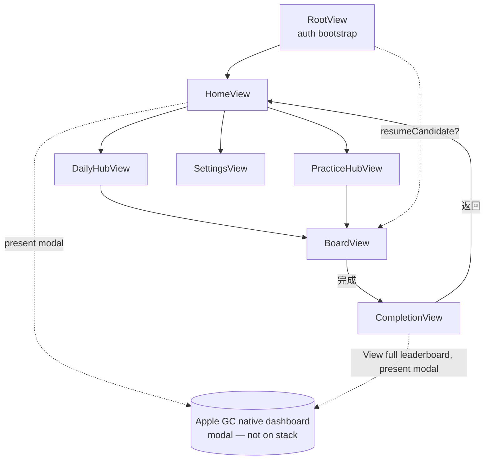

# Sudoku v1 — Design

狀態：**FINAL** — 全節已於 plan.md Phase 0–9 落地驗證（2026-05-19）。
最後更新：2026-05-19

本文件合併產品規格（§What）與技術設計（§How）。重大決策直接寫進 §Decisions；原始討論放在 `meetings/`。

---

## §What — 產品

### 產品定位

iPhone (iOS 26+) 與 Mac (macOS 26+) 雙平台 Sudoku App，以 Swift 6 + SwiftUI 單一 multiplatform target 建構（詳見 `foundations.md`）。雙重交付：**(1)** 精緻可玩的 Sudoku 體驗；**(2)** Claude agent 應用在實際 iOS 專案的可重現案例。

### 受眾

- 主要：希望在 iPhone 與 Mac 上有乾淨體驗、跨裝置接續進度的 solo 玩家。
- 次要：研讀本 repo 以理解 Claude-agent 協作流程的讀者。

### v1 功能集

1. **Daily Mode（每日 3 題）** — 每天 Easy / Medium / Hard 各 1 題，**全球玩家同題**；每題 `puzzleId = YYYY-MM-DD-{easy|medium|hard}`。**Puzzles are generated locally and deterministically** — given the same date + difficulty + generator version, every device in every region produces the bit-identical board and solution. No server-side puzzle pool. **每位玩家每題只有一次計分機會**（同 puzzleId 第二次完成不更新分數）。
2. **Practice Mode（自由模式）** — 隨意抽題、不計入排行、無 GC 提交。Random puzzles generated locally on demand. No starter bundle, no CloudKit dependency.
3. **輸入品質** — 鉛筆筆記（每格候選數字）、Undo / Redo（上限 20 步）、與題目儲存解答比對的錯誤即時高亮。
4. **存檔與個人紀錄** — 離開 App 不會丟失進度；個人紀錄分軌：Daily（每難度最佳時間、完成題數）、Practice（每難度完成題數、平均時間）。
5. **跨裝置同步** — 同一 iCloud 帳號下，iPhone 與 Mac 的存檔與個人紀錄互通（CloudKit 私人 DB）。
6. **Game Center 整合** — 3 條 **recurring daily leaderboards**（Easy / Medium / Hard 各一），每日 **UTC 00:00** 自動翻新；當日 occurrence 即代表「今天那一題」的世界與朋友圈排名。成就跨模式設計（如「完成 100 題 Practice」、「Daily 連續 7 天 streak」等，細項在 §How.3）。
7. **多語介面** — 支援 7 個 locale：繁體中文（zh-TW）、英文（en）、日文（ja）、簡體中文（zh-CN）、西班牙文（es）、泰文（th）、韓文（ko）。翻譯交由 AI agent 流程處理（細節在 `plan.md`），同一份流程涵蓋 App 字串、Game Center 成就名稱、App Store metadata、Privacy Manifest 描述。

### v1 商業模式

**免費、無 IAP、無廣告**。廣告策略保留在 backlog（見下方）等 v2 評估。

### v1 成功標準

- 玩家可下載、開始今日 Daily 題、完成它，並在當日 Daily Leaderboard 看到自己的時間 — 在 iPhone 與 Mac 同一 iCloud 帳號下表現一致。
- 玩家可進入 Practice Mode、抽到隨機產生的題目、自由練習而不影響排行。
- Daily 與 Practice 題目皆**本機產生**；同一 `(date, difficulty)` 在所有裝置與 iCloud 帳號下產生相同題目，生成完全離線執行。
- 除了 CloudKit + Game Center + Xcode Cloud + App Store Connect Analytics + MetricKit 之外，**我方不維運任何後端服務、不引第三方 SDK**。（v2 起 AdMob 為受控例外，見 `foundations.md §9.1` 與 `docs/v2/design.md`；本 v1 criterion 仍以 v1 build 為準。）
- 7 個 locale 的 App 字串、metadata、Game Center 名稱齊備並通過 App Store 審核。

---

## §How — 架構

### §How.1 模組與資料流

#### 靜態依賴（依 `foundations.md §2`）

```
SudokuEngine  ←  GameState
                 ↑
                PuzzleStore, Persistence, GameCenterClient, Telemetry
                 ↑
                SudokuUI
                 ↑
                App target (DI composition root)
```

依賴只向上、不能向下。`SudokuEngine` 純 Swift；上層注入 protocol，runtime 才由 App target 接具體實作。

#### 動態資料流（四個典型場景）

**A — 玩家進入一道新題**

```
App launch
  → App composition root 注入具體實作 → SudokuUI
  → HomeView 顯示難度選擇 → 玩家選 Easy
  → SudokuUI 經 PuzzleProviderProtocol 請一題
  → PuzzleStore 委派 SudokuEngine.PuzzleGenerator 本機產生 → 回傳 Puzzle
  → SudokuUI 建 GameState → 進入 BoardView
  → GameState 經 PersistenceProtocol 寫入「進行中局面」→ CloudKit Private DB
```

**B — 玩家填一格 / Undo / Redo**

```
BoardView 發 Intent: .placeDigit(row, col, digit)
  → GameState
       ├─ SudokuEngine.validate 比對解答
       ├─ 更新內部局面、push 進 undo stack
       ├─ 發 TelemetryEvent.digitPlaced
       └─ Persistence.save（debounce 500ms）
  → BoardView 訂閱 GameState 變化 → 自動 redraw（含錯誤高亮）

玩家按 Undo
  → GameState pop undo stack → Persistence.save
```

**C — 玩家完成一題**

```
GameState 偵測「全格填滿且全部正確」
  → 發 TelemetryEvent.puzzleCompleted(puzzleId, difficulty, seconds)
       ├─ OSLogSink → os.Logger
       ├─ TrackingSink NoOp（v1）
       ├─ MetricKitSink（不關心此事件）
       └─ GameCenterSink（新增；接收完成事件）
            ├─ submitScore → 該題單題 leaderboard (id = puzzleId)
            ├─ submitScore → 該難度總 leaderboard
            └─ 檢查並解鎖相關 Achievement
  → Persistence 把局面從「進行中」移到「已完成」紀錄
  → SudokuUI 切換到 CompletionView，顯示世界 / 朋友圈排名
       → 從 GameCenterClient 即時拉該題 leaderboard
```

注意：`GameState` **不直接呼叫** `GameCenterClient`；完成事件透過 `Telemetry` 發散，`GameCenterSink` 是其中一個訂閱者。保持單一出口、低耦合。

**D — 跨裝置接續**

```
玩家在 iPhone 玩到一半 → Persistence.save → CloudKit Private DB 自動同步
玩家換到 Mac 打開 App
  → Persistence 拉出最新「進行中」局面
  → SudokuUI 顯示「上次玩到一半的局面，要繼續嗎？」
```

#### 持久化節流

`Persistence.save` 採 **debounce 500ms**；以下時機強制立即寫入（無 debounce）：
- View 切到背景（`scenePhase` 轉 `.background`）
- 離開 BoardView
- 完成題目（在標記為「已完成」之前）

#### DI Composition Root

App target 內：

```swift
@main
struct SudokuApp: App {
    private let composition = AppComposition.live()
    var body: some Scene {
        WindowGroup {
            SudokuUI.RootView(
                viewModel: composition.rootViewModel,
                puzzleProvider: composition.puzzleProvider,
                persistence: composition.persistence,
                gameCenter: composition.gameCenter,
                telemetry: composition.telemetry
            )
        }
    }
}

struct AppComposition: Sendable {
    let rootViewModel: RootViewModel
    let puzzleProvider: any PuzzleProviderProtocol
    let persistence: any PersistenceProtocol
    let gameCenter: any GameCenterClient
    let telemetry: Telemetry

    static func live() -> AppComposition { /* CloudKit / GameKit / OSLog 具體實作 */ }
    static func preview() -> AppComposition { /* SwiftUI Preview 用 fakes */ }
    static func tests() -> AppComposition { /* snapshot / unit test 用 fakes */ }
}
```

三入口（`live` / `preview` / `tests`）對應三種跑得起來的環境。

> 實作位置（Phase 9 落地）：`AppComposition` 為獨立 SwiftPM target（`Packages/SudokuKit/Sources/AppComposition/`），`@MainActor`-isolated；`App/SudokuApp.swift` 只 import `AppComposition` + `SudokuUI`。Persistence 的 live façade `LivePersistence` 內建於 Persistence module（`Packages/SudokuKit/Sources/Persistence/LivePersistence.swift`），不在 `App/CompositionRoot/`——因模組內 stores 為 `internal`。詳見 `meetings/2026-05-19_phase-9-app-wiring.md`。

> 下游 View+VM 構造採 **inline-in-destination-closure** 模式：`RootView` 內 `NavigationStackHost.destination` 對 `AppRoute` 做 `switch` 並就地建構對應 View + ViewModel，不引入 per-VM factory 閉包、不快取 VM 實例（每次 push 拿新的 VM，pop 後 GC 回收，符合 §How.5.4 ownership）。`.board(puzzleId)` 是唯一例外：因 `GameViewModel` 的 live ctor 需要透過 `await PersistenceProtocol.loadOrCreate` + `GameSession.restore` 取得 snapshot，無法在 `@ViewBuilder` 同步閉包內完成，遂以 `BoardLoaderView` 薄包裝（`Packages/SudokuKit/Sources/SudokuUI/Board/BoardLoaderView.swift`）做 async 載入後再 mount `BoardView`。
>
> 歷史紀錄：早期 spec 曾規劃 per-view `*ViewModelFactory` 注入，後因發現 factory 全為單一 call site 的薄包裝、徒增模組面積而於 issue #34 / PR #34 全數移除（dead-VM-factory audit）。Issue #15 / PR #33 將 `HomeView` 改為 inline 建構於 `rootContent`；issue #45 / PR #44 將同模式延伸到 destination closure 所有 case 並修補 `NavigationStack(path:)` binding，至此導航閉環完成。

### §How.2 CloudKit Schema

兩個 DB，職責不同。**跨 DB 不能用 CKReference**，所以 `SavedGame` 中對 `Puzzle` 的關聯只能存 `puzzleId` 字串。

#### Public DB — v1 無 record type

**Public DB has no record types in v1.** All puzzles are generated locally (see §How.4). The CloudKit container's Public DB scope remains provisioned for future v2 use (e.g., daily challenge overrides, event puzzles) but is not written to or read from in v1.

**Reserved for v2** — future record type `PuzzleOverride` with `recordName` pattern `override-YYYY-MM-DD-{difficulty}`; fields `(clues, solution, generatorVersionTarget, effectiveFromUTC, expiresAtUTC)`. v1 reader code does NOT query Public DB. v2 introduces an optional fetch path that, on hit, supersedes local generator output for that `puzzleId`. Naming reserved here so v1 readers never collide on the namespace.

#### Private DB — 個人資料

**Custom zone**：Private DB 預設 zone（`_defaultZone`）**不支援** `CKFetchRecordZoneChangesOperation` 與細粒度 query subscription；本 App 在首次啟動時建立單一 custom zone **`com.wei18.sudoku.userZone`** 用於下列兩個 record type。Persistence 層所有讀寫綁定此 zone。

**Record type：`SavedGame`** — 進行中或已完成的局面（位於 `com.wei18.sudoku.userZone`）

| Field | Type | Index | 說明 |
|---|---|---|---|
| `recordName` | String | Q（隱含）| UUID |
| `puzzleId` | String | Q | Generator output's stable puzzle identifier; see §How.4 (deterministic format) |
| `mode` | String | Q | `"daily"` / `"practice"` |
| `difficulty` | String | Q | 冗餘儲存 |
| `boardState` | String | — | 81 字元當下局面 |
| `notesState` | Data | — | 81 格候選數字 bitmask |
| `undoStack` | Data | — | 序列化 Move 陣列；**上限 20 步** |
| `startedAt` | Date | — | |
| `lastModifiedAt` | Date | Q + S | 用於排序「最近玩的」 |
| `elapsedSeconds` | Int(64) | — | 累積遊玩秒數（pause 不算）|
| `status` | String | Q | `"inProgress"` / `"completed"` |
| `generatorVersion` | Int(64) | Q | 產生此 puzzle 的 `GeneratorVersion` raw value（v1 = `1`），用於跨版本 transition 偵測（§How.4.5）|
| `schemaVersion` | Int(64) | — | v1 = `1` |

**Record type：`PersonalRecord`** — 各模式 × 難度個人紀錄（位於 `com.wei18.sudoku.userZone`）

| Field | Type | Index | 說明 |
|---|---|---|---|
| `recordName` | String | Q（隱含）| 固定為 `{mode}-{difficulty}`（如 `"daily-easy"`、`"practice-hard"`），確保每組合唯一 |
| `mode` | String | Q | `"daily"` / `"practice"` |
| `difficulty` | String | Q | |
| `bestTimeSeconds` | Int(64) | — | 該模式 + 難度最佳時間 |
| `totalTimeSeconds` | Int(64) | — | 累積秒數，用於算 average |
| `completedCount` | Int(64) | — | 完成題數 |
| `averageTimeSeconds` (computed) | — | — | UI 計算、不存 |
| `lastUpdatedAt` | Date | — | |
| `schemaVersion` | Int(64) | — | v1 = `1` |

每位玩家最多 **6 筆** `PersonalRecord`：`{daily, practice} × {easy, medium, hard}`。

#### Subscriptions

| 對象 | 類型 | 用途 |
|---|---|---|
| Private DB (整個 zone) | 單一 **`CKDatabaseSubscription`** | 接收 `com.wei18.sudoku.userZone` 內任何變更（SavedGame / PersonalRecord）；推播到達後執行 `CKFetchRecordZoneChangesOperation` 拉變更集 |

不採用 `CKQuerySubscription` — Apple 文件明示 Private DB 預設 zone 不支援 query subscription；改採 database + zone changes operation，是 Apple 文件對 Private DB 跨裝置同步的標準路徑。Public DB v1 無 record type、不需任何 subscription。

#### Schema 演進策略

- 每筆 record 帶 `schemaVersion`。
- Reader 永遠**向後相容**：讀到較新版本的 record 時用 conservative migration（補預設值）。
- Writer 寫入時用當前版本號。
- 重大改變（如改 field type）→ 新 record type + 雙寫過渡期 + 棄用舊 type。

#### 「同 puzzleId 不重計分」規則的落地

`puzzleId` 在 v1 是 generator 輸出的 stable identifier（`seed → puzzleId` 為純函式；見 §How.4），**不是** CloudKit Public DB record name。同一 `(date, difficulty)` 在任何裝置都對應到同一 `puzzleId`，所以「不重計分」仍可以 puzzleId 作為去重 key。

GameCenterSink 收到 `puzzleCompleted` 事件後：

```
1. 如果 event.mode == "practice" → 不提交 GC，僅更新 PersonalRecord
2. 如果 event.mode == "daily":
     a. 查 Private DB：是否存在 status=completed AND puzzleId=X AND mode=daily 的 SavedGame？
        （查詢前先看本機快取的 completedDailyPuzzleIds: Set<String>）
     b. 存在 → 跳過 GC submission（規則：第二次不更新分數）
     c. 不存在 → submit 至對應的 daily recurring leaderboard、更新 PersonalRecord、加入快取集合
```

本機快取的 `completedDailyPuzzleIds` 在 App 啟動時從 Private DB 拉一次、之後增量維護。

### §How.3 Game Center 設定

本節定義 Game Center（GC）整合的三個面向：**leaderboards**、**achievements**、**GameCenterClient API**。設計遵循「Practice mode 不提交 GC」「同 puzzleId 不重計分」兩條既有規則。

#### §How.3.1 Leaderboards

**v1 只設 3 條 recurring daily leaderboards**，不設 all-time。

| Leaderboard ID | Score Type | Sort | Recurrence | Format | Score Range |
|---|---|---|---|---|---|
| `com.wei18.sudoku.leaderboard.easy.daily.v1` | Time（百分秒）| Low to High（**ascending = better**）| Daily, **UTC 00:00 reset** | `mm:ss.SS` | `1` ~ `720_000`（2 小時上限，**v1 暫定**）|
| `com.wei18.sudoku.leaderboard.medium.daily.v1` | 同上 | 同上 | 同上 | 同上 | 同上 |
| `com.wei18.sudoku.leaderboard.hard.daily.v1` | 同上 | 同上 | 同上 | 同上 | 同上 |

**Leaderboard ID 含 generator version 後綴**（`.v1`）：題目由本機 deterministic generator 產生（§How.4），bumping `GeneratorVersion` 必開新 leaderboard family，避免新舊演算法的分數混入同一榜（§How.4.5）。

**Recurrence 設定**（App Store Connect → Game Center → Leaderboard → Recurring）：Start Date = 發版當日 UTC 00:00；Duration = 1 day；Reset Time = 每日 UTC 00:00（與 `puzzleId = YYYY-MM-DD-*` 對齊）。

**Score 提交**：`GameState.elapsedSeconds × 100` → Int64 百分秒（centiseconds）。

> **ASC API ceiling（2026-05-20，issue #17）**：Apple `ELAPSED_TIME_CENTISECOND` 是 ASC GC leaderboard 支援之最高精度 elapsed-time formatter（2 位小數）。GC 提交層做 s → centisecond 轉換；內部 `PersonalRecord` 仍以毫秒保留更高精度（無 internal 精度損失）。`formattedScore` UI 顯示 `mm:ss.SS`。

**Locale Title**（每條 leaderboard 在 App Store Connect 需各 locale 一組）：

| Locale | Daily Easy | Daily Medium | Daily Hard |
|---|---|---|---|
| `zh-TW` | 今日簡單 | 今日中等 | 今日困難 |
| `en` | Daily Easy | Daily Medium | Daily Hard |
| `ja / zh-CN / es / th / ko` | `<TRANSLATE>` | `<TRANSLATE>` | `<TRANSLATE>` |

**Reset 邊緣案例**：

| 情境 | 行為 |
|---|---|
| 玩家 23:59 UTC 開始、00:01 UTC 完成今日題（跨日完成）| **Skip GC submission**：Apple GameKit `submitScore` 永遠寫入 *當前* active occurrence、無法 retarget 已關閉 occurrence。若提交會誤排到「今天」的 leaderboard、混淆排行。Sink 偵測完成時間之 UTC 日期 ≠ `puzzleId` UTC 日期 → 跳過 GC 提交，UI 一次性 toast「此局跨日完成，未列入今日排行」。**`PersonalRecord` 仍更新**（個人最佳不分日）。|
| Reset 瞬間 GC 暫無回應 | `GameCenterClient` 內部 retry 一次（exponential backoff 250ms / 1s）；仍失敗記 log，UI 顯示「成績已記錄於本機，稍後同步」|
| 未認證 GC 但完成 daily 題 | 仍寫 `PersonalRecord` 與 `SavedGame.status = completed`；GC submission 跳過、**v1 不入離線佇列**（見 §How.3.4）|
| 玩家完成時間 > 7200 秒（2 小時上限）| 視為 **abandon**：不提交 GC、不更新 `PersonalRecord.bestTimeSeconds`；`SavedGame.status` 保持 `inProgress`（讓玩家還能繼續）；UI 顯示「此局時間已超過 2 小時上限，未列入排行」|

#### §How.3.2 Achievements

**v1 設 8 個 achievements，總點數 = 500**（GC 上限 1000；保留 **500 點** 給 v2 增量，避免「全用滿 = v2 無餘裕」反 pattern）。觸發條件必須能從 `TelemetryEvent.puzzleCompleted` 串流 + Private DB 查詢觀測得到。

> **Apple ASC 每個 achievement points 限制：0-100**（round-8 apply 回 `INVALID_POINTS_RANGE: points between 0 and 100`，發現於 2026-05-20，issue #40）。`hard.master` 由 150 降至 100，總預算 550 → 500。

| ID | Points | Trigger |
|---|---|---|
| `first_puzzle` | 10 | 任何模式首次 `puzzleCompleted` |
| `daily.complete_one` | 20 | 首次 `mode == .daily` 完成 |
| `daily.streak_3` | 50 | 連續 3 個 UTC 日各至少完成 1 道 daily（任難度）|
| `daily.streak_7` | 100 | 連續 7 天 |
| `practice.complete_10` | 30 | `mode == .practice` 累積 10 題 |
| `practice.complete_100` | 100 | 100 題 |
| `hard.master` | 100 | `difficulty == .hard` 累積 25 題（不分模式）|
| `daily.sweep` | 90 | 同一 UTC 日完成當日 3 難度全收 |

所有 ID 加前綴 `com.wei18.sudoku.achievement.`。**v2 候選**（保留點數，每項 ≤ 100）：`daily.streak_30` (100)、`practice.complete_500` (100)、另餘 300 點待後續分配，合計 500 點 v2 預算。

**Progress 回報**：量化型（complete_10/100/500、hard.master）以 percent 累進回報，GC 端取 max + dedupe。Streak 與 sweep 為二值（達成即 100、否則不 submit），計算由 `GameCenterSink.receive` 內一次 `CKQuery` 完成（過去 30 天視窗、`mode == .daily` 過濾）。

**所有 achievement v1 皆 visible**；Easter-egg / hidden 留 v2。

**Locale 文案 source-of-truth 為 App Store Connect 設定頁**；en + zh-TW 在 `plan.md` 翻譯步驟以 source 形式產生；其餘 5 locale 由翻譯 agent 流程處理。

#### §How.3.3 GameCenterClient Protocol

**設計原則**：所有方法 `async throws`、所有值型別 `Sendable + Equatable`、protocol `: Sendable`；不暴露 `GameKit` 型別（只有 `Sources/GameCenterClient/Live/*.swift` 可 `import GameKit`，per `foundations.md §2`）；失敗模式顯式 throw `GameCenterError`。

**Source of truth**：`Packages/SudokuKit/Sources/GameCenterClient/GameCenterClient.swift`。下面 shape 為該檔的鏡像；如有 drift 以 source 為準。PR 軌跡：PR #17（`mm:ss.SS` formatter）、PR #25（`recurrenceDuration` PT24H + 7200s 上限）、PR #30（ms → centisecond 提交層轉換）。

```swift
public protocol GameCenterClient: Sendable {
    /// 跑一次 GameKit auth handshake。降級狀態（unauthenticated /
    /// restricted / unavailableInRegion）回傳對應 enum；GameKit 真實錯誤 throw。
    func authenticate() async throws -> GameCenterAuthState

    /// Auth state 變更流（sign-in / sign-out / region change）。VM `.task` await。
    func authStateUpdates() async -> AsyncStream<GameCenterAuthState>

    /// 提交一筆 daily 分數。Live 實作以 `LeaderboardIDs`（Step 7.3）
    /// 將 `puzzleId` + `difficulty` + `leaderboardKind` 映射為 `.v1`-suffixed
    /// leaderboard ID — VM 端不直接組 ID。內部做 `elapsedSeconds × 100` →
    /// Int64 centisecond（per §How.3.1 ASC `ELAPSED_TIME_CENTISECOND`）。
    func submitScore(
        puzzleId: String,
        elapsedSeconds: Int,
        difficulty: String,
        leaderboardKind: LeaderboardKind
    ) async throws

    /// 回報單一 achievement 進度（0...100）。
    func reportAchievement(_ achievement: AchievementProgress) async throws

    /// 拉 leaderboard slice。`around` 為 nil → 該 scope 的 top-of-world；
    /// 帶 player ID → 以該玩家為中心 ±`limit/2` 視窗。
    ///
    /// 留用範圍（issue #49, 2026-05-20）：CompletionView 完成畫面內嵌的
    /// top-3 mini-slice 仍由本 API 供應。全版排行已改走 Apple 原生 GC UI
    /// （`GameCenterDashboard.present(leaderboardId:)`），不再有自製 SwiftUI
    /// 排行頁消費此 API。
    func fetchLeaderboardSlice(
        leaderboardId: String,
        scope: LeaderboardScope,
        around player: String?,
        limit: Int
    ) async throws -> LeaderboardSlice

    /// 朋友列表授權狀態。`friendsAllTime` 前置必查。
    func friendsAuthorizationStatus() async -> FriendsAuthStatus

    /// 觸發系統 friends prompt；回傳玩家選擇後的狀態。
    func requestFriendsAuthorization() async throws -> FriendsAuthStatus
}

// MARK: - Value types

public enum GameCenterAuthState: Sendable, Equatable, Hashable, Codable {
    case unknown
    case unauthenticated
    case authenticated(PlayerSummary)
    case restricted
    case unavailableInRegion
}

public struct PlayerSummary: Sendable, Equatable, Hashable, Codable {
    /// `GKPlayer.gamePlayerID` — 跨 alias / display-name 改變仍穩定。
    /// 公開 API 以 `teamPlayerId` 命名以避免暴露 GameKit 術語。
    public let teamPlayerId: String
    public let displayName: String
}

/// v1 leaderboard families。每一個對應一條 `.v1`-suffixed leaderboard ID
/// （由 `LeaderboardIDs` 統一組裝）。
public enum LeaderboardKind: String, Sendable, Equatable, Hashable, Codable, CaseIterable {
    case dailyEasy
    case dailyMedium
    case dailyHard
}

public enum LeaderboardScope: String, Sendable, Equatable, Hashable, Codable, CaseIterable {
    case globalAllTime
    case globalToday
    case friendsAllTime
}

public struct LeaderboardEntry: Sendable, Equatable, Hashable, Codable {
    public let rank: Int
    public let player: PlayerSummary
    /// 已耗秒數（time-based leaderboard：lower = better）。
    /// UI 端透過 §How.3.1 formatter 轉 `mm:ss.SS` 顯示。
    public let score: Int
}

public struct LeaderboardSlice: Sendable, Equatable, Hashable, Codable {
    public let leaderboardId: String
    public let scope: LeaderboardScope
    public let entries: [LeaderboardEntry]
    public let totalPlayerCount: Int
    public let fetchedAt: Date
}

public struct AchievementProgress: Sendable, Equatable, Hashable, Codable {
    /// 短 stable id（例：`"first_puzzle"`）。GameKit prefix
    /// `com.wei18.sudoku.achievement.` 由 submit 時補上。
    public let achievementId: String
    /// 0...100。
    public let percentComplete: Double
}

public enum FriendsAuthStatus: String, Sendable, Equatable, Hashable, Codable, CaseIterable {
    case notDetermined
    case restricted
    case denied
    case authorized
}

public enum GameCenterError: Error, Sendable, Equatable {
    case notAuthenticated
    case cancelled
    case restricted
    case unavailableInRegion
    case friendsAccessDenied
    case scoreSubmitFailed(reason: String)
    case achievementReportFailed(reason: String)
    /// GKError 的內容打平為純值（domain / code / description），protocol 端不 import GameKit。
    case underlying(domain: String, code: Int, description: String)
}
```

**設計筆記**：
- `authenticate()` 是 `async throws -> GameCenterAuthState`（不是 `async -> AuthState`）— throw 讓 live 實作能把真實 GameKit 錯誤帶上來；降級狀態（`.unauthenticated` / `.restricted` / `.unavailableInRegion`）仍以 enum 表達。
- `submitScore` 接 `puzzleId` + `difficulty` + `LeaderboardKind`、不接組好的 leaderboard ID — `.v1` suffix 邏輯收斂在 `LeaderboardIDs`，避免 VM 重複組 ID。
- `PlayerSummary.teamPlayerId` 對應 `GKPlayer.gamePlayerID`；命名上去除 GameKit 字眼。
- `LeaderboardEntry.score` 為「已耗秒數」（lower = better）；UI 顯示用的 `mm:ss.SS` 字串由 §How.3.1 formatter 在呈現層生成（不污染 transport 型別）。
- `LeaderboardScope` 只有 3 個 case；「我的鄰近」窗格透過 `fetchLeaderboardSlice` 的 `around player:` 參數表達，而非獨立 scope（§How.3.5 三種視圖共用底層 API）。

**Sink 使用模式**：

```
case .puzzleCompleted(puzzleId, mode, difficulty, seconds):
  // (1) Achievement evaluation 永遠執行，與 mode / Daily-only score 規則正交。
  //     evaluateAndReportAchievements 從 Persistence 計數（completedCount 等）出發，
  //     避免「離線時錯過事件」— 連線時呼叫即重新計算當前進度。
  if currentAuthState.isAuthenticated {
      try? await evaluateAndReportAchievements()
  }
  // (2) Score submission 僅 Daily 模式 + 同 puzzleId 首次完成。
  guard mode == .daily,
        !completedDailyPuzzleIds.contains(puzzleId) else { return }
  // 跨日完成檢查（§How.3.1 reset 邊緣案例）：完成時間之 UTC 日 ≠ puzzleId UTC 日 → 跳過。
  guard isSameUTCDate(completedAt: Date(), puzzleId: puzzleId) else {
      // toast「此局跨日完成，未列入今日排行」；仍寫 PersonalRecord
      return
  }
  // 2 小時上限保護（§How.3.1）：超過視為 abandon，不提交 GC。
  guard seconds <= 7200 else { return }
  try await client.submitScore(
      puzzleId: puzzleId,
      elapsedSeconds: seconds,
      difficulty: difficulty.rawValue,
      leaderboardKind: leaderboardKind(for: difficulty)
  )
  // seconds → centisecond Int64 的轉換在 live 實作內完成（per §How.3.1 L267）。
  completedDailyPuzzleIds.insert(puzzleId)
```

#### §How.3.4 認證流程

**觸發時機**：`RootView` 的 `.task` modifier 內 `await client.authenticate()`（SwiftUI 標準 seam：first appear 後執行、disappear 自動取消）。不在 `init` 內做、不用 timer。

**各狀態行為**：

| AuthState | Daily Mode | Practice Mode | Apple 原生 GC dashboard |
|---|---|---|---|
| `.authenticated` | 完整 | 完整 | 正常開啟（Apple UI） |
| `.unauthenticated` | 降級（可玩、可完成、寫 Private DB；CompletionView 顯示「登入 Game Center 以加入今日排行」CTA；不入離線佇列）| 不受影響 | Apple 原生 dashboard 自有 sign-in affordance |
| `.restricted` / `.unavailableInRegion` | 同 unauthenticated，但 CTA 改為「此地區或裝置不支援 Game Center」、無「登入」按鈕 | 不受影響 | Home / Mac sidebar 仍可點，由 Apple GC UI 處理拒絕 |
| `.failed` | 同 unauthenticated，CTA 顯示「重試」呼叫 `authenticate()` 一次 | 不受影響 | 同上 |

**v1 不做離線提交佇列**：GC daily occurrence 跨日後可能關閉，佇列在隔日送會 silently 失敗或送錯 occurrence；資料完整性已由 CloudKit `PersonalRecord` + `SavedGame` 保證，GC 排行只是「炫耀面」非「資料面」。v2 評估。

**macOS 區域限制**：live 實作將 `GKError.Code` 在特定情境結合 `Locale.current.region` 啟發式判斷後映射為 `.unavailableInRegion`；具體 code 映射在 `plan.md` 落地時驗證。

#### §How.3.5 朋友圈排名

**v1 三種視圖**：

| 視圖 | scope | 顯示位置 | top N |
|---|---|---|---|
| 全時段世界 Top | `.globalAllTime` | CompletionView 內嵌 mini-slice | 3 |
| 我的鄰近 ±N | `.globalAllTime` + `around player:` | （v1 不使用；保留 API 形狀供 v2） | — |
| 朋友圈 | `.friendsAllTime` | 由 Apple 原生 GC dashboard 提供 scope 切換 | Apple 控制 |

**資料來源**：mini-slice 走 `GKLeaderboard.loadEntries(for: .global, ...)` + `entryRange`；朋友圈 scope 切換不再由 App SwiftUI 自製，改由 Apple 原生 GC dashboard 處理（issue #49, 2026-05-20）。`friendsAuthorizationStatus()` / `requestFriendsAuthorization()` 仍保留 protocol method，供 v2 或 backlog 需要顯式預檢的情境。**macOS friends API 平台支援以官方文件為準**（plan.md 落地時驗證）。

**快取**：CompletionView 進場拉一次、不即時刷新；手動下拉 refresh 才重拉。失敗時顯示「目前無法載入」+ 重試按鈕、不擋完成流程。

#### §How.3.6 與既有規則的對齊

| 規則來源 | 在本節的落地 |
|---|---|
| §What 同 puzzleId 不重計分 | §How.3.3 Sink `completedDailyPuzzleIds.contains` 短路；§How.2 本機快取為 source |
| §What Practice 不入 GC | §How.3.3 Sink `guard mode == .daily` |
| §How.1 GameState 不直呼 GC | 完成事件 → Telemetry → GameCenterSink |
| `foundations.md §2` 框架 import 限制 | §How.3.3 protocol 不暴露 GameKit |
| `[[swift6-concurrency]]` Sendable | 所有 protocol method `async throws`、所有 value type `Sendable` |

#### §How.3.7 GC Sandbox vs Production 切換

GC 在 Debug build / TestFlight build / App Store build 走不同 environment（Sandbox vs Production）；玩家 ID、leaderboard occurrence、achievement 進度**完全獨立**。

- 開發機跑 Debug build 與 TestFlight 都走 Sandbox；上架後走 Production。
- live `GameCenterClient` 不主動切換 — 由 GameKit framework 依 build provenance 自動判斷。
- `OSLogSink` 啟動時 log 一次 `gamePlayerID` 前 6 碼 + environment 標識（debug only），方便除錯。
- Snapshot / unit test 完全用 fake `GameCenterClient`，永不真實連線。
- 跨 environment 的成就 / 排行**不可遷移**；玩家若在 TestFlight 累積進度，正式版需重新開始 — 文案中需於 onboarding 提及（plan.md 落地）。

### §How.4 Deterministic Local Generator

**Status: FINAL** — all 3 prerequisites Resolved 2026-05-17 (see `meetings/2026-05-17_phase0-gates.md`).

對齊 §What v1（Daily / Practice 全部本機產生、無 server-side puzzle pool）、§How.2（v1 Public DB 無 record type；`puzzleId` 由 generator 輸出）、`foundations.md §1`（Swift 6 strict concurrency；macOS 26 基線僅 Apple Silicon arm64）、`foundations.md §3`（snapshot test 鎖跨架構輸出）。

#### §How.4.1 目標與不變式

| 項目 | 規格 |
|---|---|
| Single source of truth | `seed → puzzle` 為**純函式**；跨所有 build / 裝置 / iCloud 帳號輸出 bit-identical |
| Seed 推導 | `seed = stableHash(generatorVersion, dateUTC, difficulty)`（Daily）；`seed = stableHash(generatorVersion, randomSalt, difficulty)`（Practice）|

| 目標架構 | iPhone arm64、Mac arm64（macOS 26 基線；Mac x86 不在 §1 部署目標內，本節不保證 x86 輸出一致性，雖 SplitMix64 純整數演算法理論上也跨架構穩定）|
| 效能上限 | Hard 題在 iPhone 15 級裝置上 worst-case ≤ 300 ms |
| 不變式 | (a) 同 seed → bit-identical puzzle；(b) 每筆通過 `UniquenessValidator.unique`；(c) 不通過則重試到上限 N 後 throw `GeneratorError.exhausted`，絕不出貨非唯一解題目 |

**Practice salt sourcing**：`randomSalt` 由注入的 `RandomNumberGenerator` protocol 抽取一個 `UInt64`（live = `SystemRandomNumberGenerator`，test = `SeededRNG`，與 §How.7.8 cross-cutting 注入 seam 共用）。**Option (b) 採非持久化 system entropy**，而非單機單調遞增計數器 — 因為計數器在 App 重裝 / iCloud 換機後會重啟順序、可能讓 Practice 抽題序列在不同裝置間意外可預測重放；非持久 system entropy 則保證每次抽題在所有裝置 / reinstall 後皆無關。Practice 模式本身不上 GC 排行（§How.3.1），所以 salt 隨機性僅影響「玩家體驗多樣性」而非競技公平性。`PuzzleStore.fetchPracticePool` 在抽到 salt 後以 `OSLog .public` 落地 salt 值（不含 PII，方便玩家回報「我剛抽到那題真難」時除錯重現）。

#### §How.4.2 RNG choice

**SplitMix64** 為預設 RNG —— 純整數演算法（64-bit 加法、右移、XOR、常數乘法），**不**使用 `Float` / `Double`、**不**使用 `SystemRandomNumberGenerator`（Swift 標準函式庫明示後者輸出不保證跨平台一致 / 不保證 release-to-release 穩定）。SplitMix64 同時亦為 xoshiro 系列建議的 seed-mixing 函式（the Vigna paper），未來若改採 xoshiro256** 仍可保留同一份 seed-derivation 程式碼。

```swift
public protocol DeterministicRNG: Sendable {
    mutating func next() -> UInt64
}

public struct SplitMix64: DeterministicRNG {
    private var state: UInt64
    public init(seed: UInt64) { self.state = seed }
    public mutating func next() -> UInt64 {
        state &+= 0x9E3779B97F4A7C15
        var z = state
        z = (z ^ (z &>> 30)) &* 0xBF58476D1CE4E5B9
        z = (z ^ (z &>> 27)) &* 0x94D049BB133111EB
        return z ^ (z &>> 31)
    }
}
```

`DeterministicRNG` 為 `Sendable` protocol，住 `SudokuEngine` target；test 可注入 `ScriptedRNG`（feed 固定序列）。

#### §How.4.3 Generator algorithm

High-level flow：

```
seed
  → init SplitMix64
  → 填滿一個合法 9×9 grid（Latin-square + box constraint，採 randomized backtracking）
  → 依 difficulty 目標 clueCount 隨機 mask 格子
  → SudokuEngine.UniquenessValidator.validate(clues:)
       ├── .unique(solution) → 通過、回傳 Puzzle
       └── .multiple / .unsolvable → 將 seed 加 1 重試（bounded retries，上限 N=32）
  → 連續 N 次失敗 → throw GeneratorError.exhausted
```

Public API（住 `SudokuEngine`）：

```swift
public enum GeneratorVersion: Int, Sendable, Equatable, Codable, CaseIterable {
    case v1 = 1
}

public protocol PuzzleGenerator: Sendable {
    /// 純數學介面：給 seed 與 difficulty / version，回傳 bit-identical Puzzle。
    /// 不接觸 Date、字串 ID、格式化等產品層概念。
    func generate(seed: UInt64, difficulty: Difficulty, version: GeneratorVersion) throws -> Puzzle
}

public struct Puzzle: Sendable, Equatable, Codable {
    public let difficulty: Difficulty
    public let clues: String            // 81 chars
    public let solution: String         // 81 chars
    public let generatorVersion: GeneratorVersion
    public let seed: UInt64
}
```

**Identity 組裝住 `PuzzleStore` 層**（產品層職責，非 generator 職責）：

```swift
// 住 PuzzleStore target
public enum PuzzleKind: Sendable, Equatable {
    case daily(dateUTC: Date)
    case practice(salt: UInt64)
}

public struct PuzzleIdentity: Sendable, Equatable {
    public let puzzleId: String     // Daily: "YYYY-MM-DD-{difficulty}"; Practice: "practice-{base32(seed)}"
    public let kind: PuzzleKind
}

public struct PuzzleEnvelope: Sendable, Equatable {
    public let puzzle: Puzzle
    public let identity: PuzzleIdentity
}
```

`PuzzleProviderProtocol.fetchDailyTrio(date:)` live 實作：(a) 由 `(generatorVersion, dateUTC, difficulty)` 推導 seed；(b) 呼叫 `PuzzleGenerator.generate(seed:difficulty:version:)`；(c) 在 store 層格式化 `puzzleId = "YYYY-MM-DD-{difficulty}"`；(d) 包成 `PuzzleEnvelope` 回傳。`fetchPracticePool` 同理但用 `(generatorVersion, salt, difficulty)` 推導 seed、`puzzleId = "practice-{base32(seed)}"`。

**Trade-off**：SudokuEngine 完全不知 Date / 字串格式 / "daily" 與 "practice" 之分 — 它只是 deterministic puzzle 數學引擎。PuzzleStore 承擔產品層的 identity 組裝與分支。便於未來把 SudokuEngine 移植到 Android / 其他前端（見 `foundations.md §2` backlog）— 該前端的 identity policy 可能完全不同。

**Single retry loop**：每次 retry iteration 跑「generate candidate → uniqueness check → calibrator check」三步，**三者皆通過**才回傳。N=32 retry budget 覆蓋所有 rejection 原因（uniqueness 失敗 / calibrator 失敗 / 任一 invariant 違反）的總和，不分別計數。Worst-case CPU = 32 × (validator + 3-layer propagation solver)。

`Puzzle` 值型別住 `SudokuEngine` target；`PuzzleIdentity` / `PuzzleEnvelope` / `PuzzleKind` 住 `PuzzleStore` target。`PuzzleStore` 收斂為「抽 / 快取 / identity 組裝 / 對外 protocol」薄層，不再持有 puzzle 數學資料型別。

#### §How.4.4 難度校準 — 沿用 v1-descope calibrator

沿用原 §How.4.3 的 calibrator 設計（**不**實作完整 human-technique solver；v2 再評估）：

| 元件 | 規格 |
|---|---|
| Solver | `nakedSingle` + `hiddenSingle` + `nakedPair` 三層 constraint propagation + DFS uniqueness |
| `clueCount` 帶 | Easy `[32, 50]`、Medium `[28, 38]`、Hard `[22, 32]` |
| Easy 額外條件 | Propagation-only solver（不含 DFS）必須能解出（即 Easy 題不需猜測）|
| `branchingFactor` | DFS solver 不靠進階技巧時首次需猜測的次數；> 3 警示但不阻擋 |

校準流程嵌入 §How.4.3 retry 迴圈：產出候選 puzzle → calibrator 評定 → 不符當前 difficulty → seed 加 1 重試 → N 次失敗 throw `GeneratorError.exhausted`。`exhausted` 視為**defect**、非預期 runtime 路徑（§How.6）。

#### §How.4.5 Versioning & leaderboard split

| 規則 | 說明 |
|---|---|
| **GeneratorVersion bump 條件** | 任何會改變 `seed → puzzle` 輸出的演算法異動（含 bug fix）均須 bump |
| **Frozen-once-shipped** | 任一 `GeneratorVersion` 一旦隨 App 上架，**永遠不可再改變該版本的輸出**。bug fix 一律走 bump 新版本路徑 |
| **Leaderboard family 切分** | Leaderboard ID 內嵌 version：`com.wei18.sudoku.leaderboard.{difficulty}.daily.v{N}`（§How.3.1）。v2 generator → 開新 leaderboard family，舊榜凍結、無跨版本分數污染 |
| **Achievement 不分版** | Achievement ID 不嵌版本；新舊版題目皆計入同一條 achievement（完成題數類成就 cross-version 累積）|

App 端只支援**單一**最新 `GeneratorVersion`；舊 build 的玩家若已完成過某 `puzzleId` 而新 build 該日期改用新版產生不同 puzzle，視為兩個獨立 puzzle（不同 `puzzleId`）— 不重計分規則在新 puzzleId 上重新生效。

**Cross-version transition runtime** — 即便 `GeneratorVersion` 承諾 frozen-once-shipped，若 v2 確實上線：App 啟動時掃描 Private DB 內所有 `SavedGame`，凡 `generatorVersion < currentGeneratorVersion` 的進行中存檔標記為 `abandoned`；一次性 UI 顯示「此局為舊版 generator 產生的題目，今日題已不同。要重新開始嗎？」確認後刪除舊 SavedGame、進入今日新版 puzzle。v1 leaderboard family 在 v2 build 仍可**讀**（玩家可瀏覽歷史排名），但不再有 v2 build 的新 submission 寫入；v2 一律寫入 v2 family。Achievement 不分版、跨版累計（§How.4.5 表）。

#### §How.4.6 Cross-architecture determinism guarantee

- **純整數運算**：所有 RNG / generator / calibrator code 不使用 `Float` / `Double`；不使用 `Set<UInt64>` / `Dictionary` iteration order 作為決策（HashTable iteration order 不保證跨版本穩定）— 改用 sorted array 或 deterministic linear scan。
- **無平台相依 API**：generator 純 Swift、不 import 任何 OS framework；可直接 build on Linux / Android Swift toolchain（與 `foundations.md §2` backlog 對齊）。
- **Snapshot tests in `SudokuEngineTests`**：對 `GeneratorVersion.v1` 凍結前 5 個 seed × 3 difficulty = 15 條 expected `(clues, solution)` 字串斷言；任何輸出 drift（Xcode major 升級、Swift toolchain 升級、平台差異）即被 CI 攔下。Snapshot 圖檔以 plain text 字串呈現，比對精度為 exact match。

#### §How.4.7 Performance budget

| 模式 | 目標 | UI 行為 |
|---|---|---|
| Daily `fetchDailyTrio` | App 冷啟動時於 background task 預先產三題、in-memory cache 整日；玩家進 DailyHubView 已是 cache hit | 玩家**永不感知** generation latency |
| Practice `fetchPracticePool` | 即時產一題；目標 < 100 ms typical、< 300 ms p95 Hard | 若超過 100 ms 顯示短暫 shimmer placeholder |
| 上限 | Hard 題 p95 < 500 ms、p99 < 1 s | p99 > 1 s 視為 MetricKit hang → `OSLog .fault` |

**Worst-case 包含 retry overhead**：表中 300 ms / 500 ms 目標皆指「含 §How.4.3 retry 迴圈最壞情況」的端到端 latency，不只 happy-path 的單次 generate + validate。

**v1 enforcement**：手動量測，於 plan.md Phase 0 + 每次主要 release 前各跑一次（iPhone 15 級裝置 + Mac arm64）。**CI 不 gate** 任何效能 threshold（避免 synthetic benchmark 與真實裝置差異造成 false fail）。Production regression 透過 MetricKit `MXMetricPayload` 的 `applicationLaunchMetrics` / `cpuMetrics` 在實機聚合下浮現，而非靠 CI 攔截。

效能基線於 plan.md Phase 0 prototype 驗證（§How.4.9）。

#### §How.4.8 No CloudKit fallback (route A confirmed)

- **v1 不提供** server-side puzzle override mechanism。
- 若 `GeneratorVersion.v1` 在某日期 + 難度組合產生有 defect 的 puzzle（罕見但不可排除），該題就以該狀態出貨當日；不可動態 hotfix。
- 此風險換取：(a) **完全離線可玩**（Daily + Practice 皆不需網路）；(b) **零 server-to-server secret 管理面**（CloudKit server key、`ci_scripts/upload_puzzles.sh` 等全部移除）；(c) **一條 CI workflow 消失**（§foundations.md §4 由 4 條縮為 3 條）。
- **v2 backlog**：若 production 出現 generator defect 或 curation 需求，再導入 `PuzzleOverride` CloudKit Public DB record（見 §不在 v1 範圍 backlog）。

#### §How.4.9 Open items（Prerequisite checklist — 落地 plan.md 第一階段驗證）

- [x] ~~**SplitMix64 跨架構 bit-identical 驗證**~~ — **Resolved**（Phase 0, 2026-05-17）。macOS arm64 與 iPhone 16 Pro simulator arm64 對 seed=0 / seed=0x2A 各跑 16 次輸出 byte-identical 一致；驗值對齊 Vigna canonical 參考。Plan.md §0.1 seed=42 reference 同時修正（原值錯誤）。Evidence: `meetings/2026-05-17_phase0-gates.md`.
- [x] ~~**Performance baseline**~~ — **Resolved**（Phase 0, 2026-05-17）。30-run Hard sample 在 macOS arm64 上 **p95 = 2.23 ms**（預算 500 ms，~224× 餘裕）；p50 = 0.30 ms / p99 = max = 2.31 ms。Caveat: baseline 用固定 solved grid + 自動同構變換，比 production §How.4.3 從空盤 randomized backtracking 便宜；Phase 2.7 必須 shadow-validate 不得回歸超過 500 ms。Evidence 同上。
- [x] ~~**App Store policy spot-check**~~ — **Resolved**（Phase 0, 2026-05-17）。App Review Guidelines 2026-05-17 抓取版 §1.1 / §1.2 / §4.0 / §5.1.1 / §5.3 全文閱讀；無任何規則阻擋「Game Center leaderboard with locally-generated deterministic puzzle content」。2026 版 AI 揭露條款僅涵蓋 ML / generative AI，v1 演算法生成非屬其中。Evidence 同上。

以上 3 條全部驗證通過，§How.4 升級為 FINAL。

### §How.5 主要 View / state flow

對齊 §What v1（Daily 3 題 + Practice + 7 locale + GC 整合）、§How.1（DI composition、Telemetry fan-out）、§How.2（CloudKit schema、`SavedGame.status`）、§How.3（GameCenterClient API、AuthState 降級）、`foundations.md §2`（SudokuUI 不 import CloudKit / GameKit）、`foundations.md §3`（snapshot 由主畫面起步）。

#### §How.5.1 View map（v1 全螢幕清單）

**決策**：v1 共 7 個 top-level View（Root + Home + Daily + Practice + Board + Completion + Settings）；UI 層只持有 protocol，**不** import `CloudKit`；`GameKit` 僅 `GameCenterDashboard.swift` 一處例外（issue #49, 2026-05-20 — Apple 原生 dashboard 入口別無 protocol seam，見 §How.5.2 footnote）。

`PuzzleProviderProtocol.fetchDailyTrio(date:)` / `fetchPracticePool(difficulty:)` API 名稱不變；**backing implementation in v1 is local deterministic generation, not CloudKit Public DB fetch**（見 §How.4）。`PuzzleStore` live impl 內部委派給 `SudokuEngine.PuzzleGenerator`。

| View | 父層 | 觸發的 CloudKit / GC 操作 | 主要狀態 |
|---|---|---|---|
| `RootView` | — | 於 `.task` modifier 內呼叫 `GameCenterClient.authenticate()`（首次 appear 後執行、disappear 自動取消，無 timer）；訂閱 `Persistence` 拉「最近未完成局」 | `composition`、`authState`、`resumeCandidate` |
| `HomeView` | Root | 無 | 模式選擇（Daily / Practice / Leaderboard / Settings） |
| `DailyHubView` | Home | `PuzzleStore.fetchDailyTrio(date:)`、`Persistence.fetchCompletedDailyIds(date:)` | 今日 3 題卡片 + 完成狀態 |
| `PracticeHubView` | Home | `PuzzleStore.fetchPracticePool(difficulty:)`（即時本機 generator 抽題） | 難度切換 + 抽題 |
| `BoardView` | DailyHub / PracticeHub | `Persistence.loadOrCreate`、`Persistence.save` (debounce 500ms)、scenePhase 強制 flush | 單局狀態機（§How.5.3） |
| `CompletionView` | BoardView（modal）| `GameCenterClient.fetchLeaderboardSlice(.globalAllTime, limit: 3)`（僅 daily + `.authenticated`）；`Persistence` 狀態轉換 | top-3 mini-slice + 個人紀錄 delta + 「View full leaderboard」CTA → Apple 原生 GC dashboard |
| `SettingsView` | Home | `GameCenterClient.currentAuthState`、`Persistence.totalCompletedCount`（只讀）| GC 狀態、locale、版本、清快取 |

v1 共 **7 個 top-level Views**（含 Root）。Issue #49（2026-05-20）將自製 `LeaderboardView` 退役，全版排行瀏覽改由 Apple 原生 Game Center UI 承載；entry points：
- Home tab "Leaderboard" 卡 → `GameCenterDashboard.present(leaderboardId: nil)`（全榜列表）
- Mac sidebar "Leaderboard" row → 同上
- CompletionView "View full leaderboard" 按鈕 → `GameCenterDashboard.present(leaderboardId: viewModel.leaderboardId)`（聚焦該局難度）

**Liquid Glass 採用**：HomeView 模式卡片、DailyHubView 卡片、CompletionView hero 區用 `.glassEffect()`；BoardView 棋盤本體**不**用（強對比與錯誤高亮辨識考量）；Mac 視窗用系統預設 chrome。

#### §How.5.2 Navigation 結構

**決策**：
- iPhone（compact）：`NavigationStack` + CompletionView 用 `.fullScreenCover`
- Mac / iPad（regular）：`NavigationSplitView` 雙欄；sidebar 為模式清單；CompletionView 用 `.sheet`
- 平台差異以 `@Environment(\.horizontalSizeClass)` 切換**單一 `RootView` 內條件邏輯**



**Navigation surface**：所有 stack 上的 push 透過 `NavigationPath` + `AppRoute` enum。Source of truth：`Packages/SudokuKit/Sources/SudokuUI/Navigation/AppRoute.swift`。

```swift
public enum AppRoute: Hashable, Sendable, Codable {
    case home
    case daily
    case practice
    case board(puzzleId: String)
    case completion(puzzleId: String, elapsedSeconds: Int)
    case settings
}
```

每個 case 對應 §How.5.1 的一個 View（Root 為 container；Home / Daily / Practice / Board / Completion / Settings 上 stack）。`daily` / `practice` / `home` / `settings` 不帶參數（hub 本身管理當下狀態）；`board` 帶 `puzzleId`；`completion` 帶 `puzzleId` + `elapsedSeconds`。

> **Native GC dashboard** 不是 `AppRoute` 的一員 — 它是 modal side-effect，由 `GameCenterDashboard.present(leaderboardId:)`（位於 `Packages/SudokuKit/Sources/SudokuUI/Leaderboard/GameCenterDashboard.swift`）觸發；nil 走 `GKAccessPoint.shared.trigger(state: .leaderboards)`，帶 ID 走 `GKGameCenterViewController(leaderboardID:playerScope:timeScope:)` 模態呈現。Issue #49（2026-05-20）落地，舊 `.leaderboard(leaderboardId:)` case 已刪除。
>
> **Foundations.md §2 例外**：SudokuUI 原則不直接 `import GameKit`；`GameCenterDashboard.swift` 為唯一例外，因為 Apple 原生 dashboard 入口必須 reach `GKAccessPoint` / `GKGameCenterViewController` 的 UIKit / AppKit 表面，無 protocol-injectable seam 可走。檔案層級的局部 import 不污染整個 SudokuUI 模組的 UI/邏輯層測試性（其餘 View 仍透過 `GameCenterClient` protocol 注入）。

#### §How.5.3 單局狀態機

**決策**：`GameSession.Status`（在 `GameState` target 內），封閉集合；UI 不平行維護。

```
idle ──start──▶ playing ──pause──▶ paused
                  ▲                   │
                  └────── resume ─────┘
                  │
                  ├── complete ──▶ completed (terminal)
                  └── abandon ───▶ abandoned (terminal)
```

| State | 觸發者 | 可呼叫 transition | `SavedGame.status` |
|---|---|---|---|
| `idle` | VM init | `start` | — |
| `playing` | `start()` | `pause`、`complete`、`abandon` | `"inProgress"` |
| `paused` | UI / scenePhase | `resume`、`abandon` | `"inProgress"` |
| `completed` | `GameSession` 偵測 | — | `"completed"` |
| `abandoned` | UI 明示 / 覆寫前 | — | record 刪除 |

`elapsedSeconds` 僅 `playing` 計時；`pause` / `complete` 強制 flush。

#### §How.5.4 ViewModel pattern

**決策**：所有 VM 採 Swift 6 `@Observable` + `@MainActor`；所有外部 protocol 顯式宣告 `: Sendable`（否則 existential `any P` 無法跨 actor 傳遞）；Protocol 方法 `nonisolated async`。

```swift
// 所有 protocol 顯式 Sendable
public protocol PuzzleProviderProtocol: Sendable { /* ... */ }
public protocol PersistenceProtocol: Sendable {
    func latestInProgress() async throws -> SavedGameSummary?
    func loadOrCreate(puzzleId: String, mode: GameMode, difficulty: Difficulty) async throws -> GameSessionSnapshot
    func save(_ snapshot: GameSessionSnapshot) async throws
    func markCompleted(_ summary: SavedGameSummary) async throws
    func deleteAbandoned(recordName: String) async throws
    func fetchCompletedDailyIds(for date: Date) async throws -> Set<String>
    func fetchPersonalRecord(mode: GameMode, difficulty: Difficulty) async throws -> PersonalRecord
}
public protocol GameCenterClient: Sendable { /* §How.3.3 */ }

public struct SavedGameSummary: Sendable, Equatable, Identifiable {
    public let id: String          // SavedGame.recordName
    public let puzzleId: String
    public let mode: GameMode
    public let difficulty: Difficulty
    public let lastModifiedAt: Date
    public let elapsedSeconds: Int
}

@MainActor
@Observable
public final class GameViewModel {
    public private(set) var session: GameSession
    public private(set) var status: GameSession.Status
    public private(set) var elapsed: Int = 0

    private let persistence: any PersistenceProtocol
    private let telemetry: Telemetry
    private var saveTask: Task<Void, Never>?
    private var tickTask: Task<Void, Never>?

    public func placeDigit(row: Int, col: Int, digit: Int) {
        session.placeDigit(row: row, col: col, digit: digit)
        scheduleSave()
        if case .completed = session.status { handleCompletion() }
    }

    public func pause() async { session.pause(); await flush() }
    public func resume() { session.resume(); startTicking() }
    public func abandon() async { session.abandon(); await flushAndDelete() }

    private func scheduleSave() {
        saveTask?.cancel()
        let snapshot = session.snapshot()             // Sendable value type
        saveTask = Task { [persistence] in
            try? await Task.sleep(for: .milliseconds(500))
            if Task.isCancelled { return }
            try? await persistence.save(snapshot)
        }
    }

    /// async：caller 必須 await，確保 View dismiss 前真正寫入完成。
    public func flush() async {
        saveTask?.cancel()
        let snapshot = session.snapshot()
        try? await persistence.save(snapshot)
    }
}
```

**VM 擁有關係**：

| VM | 擁有 | 委派 |
|---|---|---|
| `RootViewModel` | authState、resumeCandidate、path | `GameCenterClient`、`Persistence` |
| `DailyHubViewModel` | 今日 3 題卡片 model、完成旗標 | `PuzzleStore`、`Persistence` |
| `PracticeHubViewModel` | 難度選擇、上次抽到 puzzleId | `PuzzleStore` |
| `GameViewModel` | `GameSession`（真實局面） | `Persistence`、`Telemetry` |
| `CompletionViewModel` | 排行 mini-slice 快取、紀錄 delta | `GameCenterClient`、`Persistence` |
| `SettingsViewModel` | 顯示用 snapshot | `GameCenterClient`、`Persistence`、`Bundle` |

#### §How.5.5 Debounce 500ms 落點

**決策**：debounce token 住 **VM 層**（`GameViewModel.saveTask`）。Persistence 為純 protocol，多實作不重複造輪子；View 消失中途由 VM 決定 flush 時機。

**View 消失中途**：
```swift
.task(id: scenePhase) {
    if scenePhase == .background { await vm.pause() }     // 內含 flush；只在 background 暫停
    // .inactive（Control Center pull-down、來電遮蔽等）不觸發 pause、不擾保進度
}
.task(id: shouldFlushOnDisappear) { await vm.flush() }    // 由 .onDisappear 切 flag
// 回到 .active 時 **不** auto-resume — 改顯示 "Tap to resume" 覆蓋層
// 避免從背景回來自動恢復計時、與玩家「我有意暫停」意圖衝突
```

`flush()` 現為 `async`，呼叫端 `await` 確保 View dismiss / 進背景前真正寫入完成。Persistence 內 actor 序列化 + `Task.isCancelled` 短路 pending debounce Task，避免並發競爭。狀態機 `paused → active` 只能由 UI 明示 Tap 觸發 `vm.resume()`。

#### §How.5.6 L10n hooks

**決策**：
1. `String(localized:)` + `Localizable.xcstrings`（Xcode 15+ 格式），不用 `.strings`
2. 格式化：`Duration.formatted(.time(pattern: .minuteSecond))`、`IntegerFormatStyle(locale:)`、`Date.FormatStyle`；由 SwiftUI `\.locale` 環境注入
3. 7 locale catalog build-time 由翻譯 agent 填入（`plan.md` L10n 步驟）；runtime 不從 CloudKit 拉字串
4. GC achievement / leaderboard 名稱存 App Store Connect 後台，不走 catalog

Snapshot 跨 locale 透過 `.environment(\.locale, ...)` 切換。

#### §How.5.7 Accessibility baseline

App Store 提交前最低門檻。

**VoiceOver**：
- 棋盤 cell：`.accessibilityLabel("第 R 列第 C 欄，\(stateDescription)")`
- 棋盤整體：`.accessibilityCustomActions` 提供「下一個錯誤格」「下一個空格」
- CompletionView 排行：每筆一個 element，label 含「名次、玩家名、時間」

**Dynamic Type**：semantic font (`.body` / `.title2`) + `@ScaledMetric` 同步 padding；棋盤格內數字綁 cell 尺寸縮放，**不**綁 Dynamic Type（避免爆界）

**色盲安全錯誤高亮**：紅色背景 + 左上角小三角圖示**雙重編碼**；題目格背景紋理 vs 既填格純色區分；`prefersIncreasedContrast` 加深邊框

**Mac 鍵盤導覽**：方向鍵切 cell；`1-9` 填入；`0`/`delete` 清空；`p` 切鉛筆；`⌘Z`/`⌘⇧Z` undo/redo；Full Keyboard Access 相容；iPad 外接鍵盤共用。

**實作 seam**：`BoardView` 透過 `.focusable()` + `@FocusState` 取得 focus；按鍵以 `.onKeyPress(phases: .down) { keyPress in ... return .handled / .ignored }`（iOS 17+ / macOS 14+ API）處理；`⌘Z` / `⌘⇧Z` 以 `Menu` commands + `.keyboardShortcut("z", modifiers: .command)` / `.keyboardShortcut("z", modifiers: [.command, .shift])` 註冊於 Mac App menu（iPad 外接鍵盤自動繼承）。

#### §How.5.8 v1 Snapshot 覆蓋集

**決策**：v1 鎖定 **25 張**（基底矩陣 21 張 + RootView/HomeView 4 張，於 plan.md §8.11 鎖定）。

| View | 變體軸 | 張數 |
|---|---|---|
| `BoardView` | {iPhone, Mac} × {light, dark} × {空棋盤, 進行中含錯誤, 完成前一刻} | 12 |
| `DailyHubView` | iPhone light × {未完成, 完成 Easy, 完成全部} | 3 |
| `PracticeHubView` | iPhone light × {idle, drawing-shimmer, drawn} | 3 |
| `CompletionView` | iPhone light × {authenticated 含排行, unauthenticated CTA, leaderboard fetch failed} | 3 |
| `RootView` | iPhone light × {bootstrap, resume pill 顯示} | 2 |
| `HomeView` | iPhone light × {default, 4 mode cards Liquid Glass} | 2 |

L10n 軸：BoardView 12 張中至少 1 張 ja（寬字 / 字形）+ 1 張 ko（連字），其餘 en；CompletionView 3 張含 1 張 zh-TW（hero 長文案）。新 View 入 v1 前 PR 補對應 snapshot。

注：PracticeHubView 的 `drawing-shimmer` 變體源自 §How.4.7 性能預算 (>100ms 顯示 shimmer placeholder)；本機 generator 模式特有狀態。

#### §How.5.9 與既有規則對齊

| 規則來源 | 在本節落地 |
|---|---|
| §What v1.4 離開不丟進度 | `pause` 與 `onDisappear` 強制 flush |
| §What v1.5 跨裝置同步 | `RootViewModel.bootstrap()` 拉 `latestInProgress` → resume bar |
| §How.1 GameState 不直呼 GC | CompletionView 透過 VM 直接呼 GC **讀取** API；**寫入**仍走 Telemetry → GameCenterSink |
| §How.2 SavedGame.status | 狀態機映射如 §How.5.3 |
| §How.3.4 AuthState 降級 | CompletionView 顯示對應 CTA；全版排行由 Apple 原生 GC dashboard 自有 sign-in affordance 處理 |
| `foundations.md §2` SudokuUI import 限制 | VM 只持 protocol；不 import CloudKit / GameKit |
| `foundations.md §3` snapshot 由主畫面起步 | §How.5.8 明列 25 張 |
| `[[swift6-concurrency]]` Sendable | VM `@MainActor`、跨 actor 傳 Sendable value type |
| `[[ai-translated-localization]]` L10n | `String(localized:)` + xcstrings catalog；7 locale |

### §How.6 錯誤狀態與離線行為

對齊 §What v1.4（離開不丟進度）、§How.2（schemaVersion）、§How.3.4（v1 無離線提交佇列）、§How.4（generator → `GeneratorError.exhausted`）、§How.5.5（debounce flush）、`foundations.md §5/§6`。

#### §How.6.1 設計原則

1. **進度不可丟** — 任何錯誤都不得讓玩家失去當前局面。`SavedGame` 本機快取為 source-of-truth、CloudKit 為同步通道。
2. **錯誤分級而非錯誤代碼** — UI 一律呈現「下一步可採取行動」；錯誤碼僅進 `OSLog` 供工程診斷。
3. **無第三方 crash 通報** — 仰賴 MetricKit（`MXCrashDiagnostic` / `MXHangDiagnostic`）+ TestFlight 內建崩潰報告。
4. **v1 無重試佇列** — 與 §How.3.4 一致；失敗即失敗、寫 log、UI 顯示「稍後再試」。
5. **錯誤即遙測事件** — 所有 user-facing 錯誤經 `Telemetry.observe(.errorOccurred(...))` 走 §How.1 fan-out。

#### §How.6.2 Error taxonomy

6 個錯誤型別，全部 `Sendable + Equatable + Error`，住 `Telemetry` target。

```swift
public enum NetworkError: Error, Sendable, Equatable {
    case offline
    case timeout
    case intermittent(underlyingDescription: String)
}

public enum AccountError: Error, Sendable, Equatable {
    case iCloudNotSignedIn
    case iCloudSignedOutDuringSession
    case iCloudAccountChanged(previous: String, current: String)
    case iCloudRestricted
}

public enum CloudKitOpError: Error, Sendable, Equatable {
    case quotaExceeded
    case serverError(retriable: Bool)
    case throttled(retryAfterSeconds: Int)
    case syncConflict(recordName: String)
    case zoneNotFound
    case underlying(description: String)
}

public enum PersistenceError: Error, Sendable, Equatable {
    case localCacheCorrupt(recordName: String)
    case diskFull
    case schemaVersionTooNew(expected: Int, found: Int)
    case schemaVersionTooOld(expected: Int, found: Int)
}

public enum GeneratorError: Error, Sendable, Equatable {
    case exhausted(reason: String)        // retry budget hit; treated as defect (.fault)
    case cancelled
}

// GameCenterError 已於 §How.3.3 定義；本節引用。
```

#### §How.6.3 Per-source error matrix

| 錯誤源 | Case | Detection | UI | Telemetry | Recovery |
|---|---|---|---|---|---|
| Network | `.offline` | `NWPathMonitor` `.unsatisfied`；CK op throw | Banner（hub）；inline empty（leaderboard / completion）| `OSLog .info` | 自動：連線恢復後 view re-fetch |
| Network | `.timeout` | 10s 無回應 | Toast | `OSLog .info` | 使用者觸發：下拉刷新 |
| Network | `.intermittent` | 連續 2 次 retry 失敗 | 同 offline | `OSLog .notice` | 自動：背景下次 op 再試 |
| Account | `.iCloudNotSignedIn` | `CKContainer.accountStatus` | Full-screen empty state；Settings 內常駐提示 | `OSLog .info` | 使用者觸發：開系統設定 (`UIApplication.openSettingsURLString` / macOS `x-apple.systempreferences:com.apple.preferences.AppleIDPrefPane`) |
| Account | `.iCloudSignedOutDuringSession` | `CKAccountChanged` notification + `CKContainer.accountStatus == .noAccount` | Alert「iCloud 已登出。已將進度保留在本機，重新登入後會繼續同步」；**不**清本機 | `OSLog .notice` | 使用者觸發 |
| Account | `.iCloudAccountChanged` | `CKAccountChanged` notification + `CKContainer.fetchUserRecordID(...)` 與上次比對不同 | Alert（confirm）「將清除本機快取以隔離資料」 | `OSLog .notice` | 使用者觸發；確認後 wipe（見 §How.6.5） |
| Account | `.iCloudRestricted` | `accountStatus == .restricted` | 同 NotSignedIn，CTA 改純文字、無深連結 | `OSLog .info` | 無 |
| CloudKit | `.quotaExceeded` | `CKError.quotaExceeded` | Banner「同步暫停：iCloud 空間不足」；遊戲仍可玩 | `OSLog .error` | 使用者觸發：點 banner 開系統設定 |
| CloudKit | `.serverError(retriable: true)` | `CKError` 5xx | Toast；第二次起靜默 | `OSLog .error` | 自動：next op |
| CloudKit | `.serverError(retriable: false)` | 持續 4xx | Banner | `OSLog .fault` | 使用者觸發 |
| CloudKit | `.throttled` | `CKError.requestRateLimited` | 靜默 | `OSLog .notice` | 自動：等過 `retryAfterSeconds` |
| CloudKit | `.syncConflict` | `CKError.serverRecordChanged` | 靜默（policy 見 §How.6.7）| `OSLog .notice` | 自動：last-writer-wins per field |
| Game Center | 全部 | 見 §How.3.3 | 見 §How.3.4 表 | OSLog `.gameCenter` | 見 §How.3.4 |
| Persistence | `.localCacheCorrupt` | decode throw / 校驗和不符 | Alert「本機資料異常，將從 iCloud 重新同步」 | `OSLog .fault` | 自動：刪本機 cache、重拉 CloudKit |
| Persistence | `.diskFull` | `NSFileWriteOutOfSpaceError` | Alert | `OSLog .error` | 使用者觸發 |
| Persistence | `.schemaVersionTooNew` | 讀到 `schemaVersion > 1` | Banner「App 版本過舊，請更新」+ 跳 App Store | `OSLog .fault` | 使用者觸發 |
| Persistence | `.schemaVersionTooOld` | 讀到 `schemaVersion < 1` | 靜默 + 補預設 | `OSLog .info` | 自動：conservative migration |
| Generator | `.exhausted` | retry 上限 N=32 內無 calibrator-accepted 唯一解 puzzle（極罕見、視為 defect）| Alert「Today's puzzle hit a generation defect — please try a different difficulty or come back tomorrow」| `OSLog .fault` + MetricKit；OSLog 包含 `seed`、`difficulty`、`generatorVersion`（皆 `.public` — 非 PII，方便 issue tracker 上重現） | 使用者觸發：切換難度 |
| Generator | `.cancelled` | Task 被取消（如 View dismiss 中途）| 靜默 | `OSLog .info` | 自動：下次進畫面重試 |

OSLog level 對應：`.info`（可觀察）/ `.notice`（值得注意）/ `.error`（操作失敗）/ `.fault`（資料完整性風險）。**MetricKit 採集邏輯為自動**（`MXCrashDiagnostic` / `MXHangDiagnostic` / `MXMetricPayload`）；我方不顯式 forward 任何錯誤到 MetricKit，僅在 `MetricKitSink.didReceive(_:)` 內把採到的 payload 落地為 OSLog（§How.1 C 場景）。

#### §How.6.4 離線模式定義

| 功能 | 離線可用 | 需曾連線一次 | 須連線中 |
|---|---|---|---|
| Practice 模式（任難度） | ✓（本機 generator 直接產） |  |  |
| Daily 模式（今日題） | ✓（本機 generator 直接產，seed 由 `(date, difficulty)` 決定） |  |  |
| 進行中存檔（讀）| ✓ |  |  |
| 進行中存檔（寫）| ✓（寫本機；CK op 失敗不擋遊玩）|  |  |
| Personal Records 讀 | ✓ |  |  |
| Personal Records 寫 CloudKit |  | 自動：連線恢復下次 op；無 explicit queue |  |
| Leaderboard 讀 |  | 5 分鐘快取內可顯示舊資料 + timestamp | ✓ |
| Leaderboard score submit |  |  | ✓（§How.3.4 不入離線佇列）|
| Achievement unlock |  |  | ✓（離線時觸發條件待連線後重新評估）|
| GC 認證 |  |  | ✓ |

**Leaderboard 5 分鐘快取**：`LeaderboardSlice.fetchedAt` > 5 分鐘且離線 → 顯示舊資料 + 灰色「資料於 HH:mm 取得，目前離線」；< 5 分鐘 → 無提示。

**Puzzle 來源說明**：v1 所有 `Puzzle` 由本機 `SudokuEngine.PuzzleGenerator` 產生，**完全無 CloudKit query 路徑**；`PuzzleStore` 內 in-memory cache 僅作為「同一 App session 內不重產」的最佳化，App 重啟後重新生成（相同 seed → 相同 puzzle）。

#### §How.6.5 iCloud 帳號邊緣案例

**Case A — 從未登入 iCloud**：同步 / Leaderboard 降級；**Daily 與 Practice 題目本身完全可用**（本機 generator 產生、無 iCloud 相依）；HomeView 常駐 banner + 「開啟設定」按鈕；不擋啟動。

**Case B — Session 中登出 iCloud**：
1. 立即 flush `GameViewModel`（同 §How.5.5 `pause()` flush）至本機
2. 本機 `SavedGame` cache **保留**
3. Alert：「iCloud 已登出。進度已保留在本機，登入後將繼續同步。」
4. 進入「無帳號模式」（同 Case A UI）
5. CloudKit op 全部 throw `AccountError.iCloudSignedOutDuringSession`

**Case C — 換 iCloud 帳號**：
1. 偵測：`CKAccountChanged` notification 觸發後呼叫 `CKContainer.default().fetchUserRecordID(...)`，與本機保存的 last-known userRecordID hash 比對；不同 → 走 Case C；nil（登出）→ 走 Case B。**不再使用 `NSUbiquityIdentityDidChange`**（後者是 iCloud Drive identity，非 CloudKit account 信號；有用戶停用 Drive 但啟用 Sync 的 edge case 會誤判）。
2. Flush 當前局面，但**不**寫 CloudKit（已是新帳號）
3. Alert（confirm）：「偵測到不同 iCloud 帳號。將清除本機快取以隔離資料，繼續？」
4. 確認後**必須清** `SavedGame` / `PersonalRecord` / Leaderboard cache；本機 Puzzle in-memory cache 與帳號無關，可保留或重產（皆為純函式輸出）
5. 拒絕清除 → 強制進入「未登入」狀態直到換回原帳號或同意清除
6. 不允許跨帳號保留本機進度（會導致 GC submit / `PersonalRecord` 寫錯帳號、違反 CloudKit Private DB 帳號隔離）

#### §How.6.6 ~~「今天沒有 Daily 題」情境~~ (removed)

本節在 v1 不再適用 — 題目改由本機 deterministic generator 產生（§How.4），不存在 server-side 投放失敗導致「今天沒題」的路徑。Generator 唯一可能的失敗為 `GeneratorError.exhausted`（§How.6.3），屬 defect 級事件、走 alert + MetricKit。

#### §How.6.7 CloudKit 同步衝突解決

**Policy — Per-field last-writer-wins by `lastModifiedAt`**：

| Field | 衝突解法 |
|---|---|
| `boardState` / `notesState` / `undoStack` | 取 `lastModifiedAt` 較新者**整組**（三欄綁，不分拆）|
| `elapsedSeconds` | `max(local, server)`（避免低估）|
| `status` | `"completed"` 永遠勝過 `"inProgress"`；皆 inProgress 走 `lastModifiedAt` |
| `lastModifiedAt` | 較新者 |

落地：`Persistence` 內 `CKModifyRecordsOperation` `.changedKeys` save policy；fetch `serverRecord` → actor 內合成新 record → 重發 modify。最多 retry 2 次，第 3 次仍衝突 → throw `CloudKitOpError.syncConflict`、UI 走靜默 + OSLog。

`PersonalRecord` 衝突：`bestTimeSeconds` → `min`；`totalTimeSeconds` / `completedCount` → 較大整組（保守 over-count 避免 under-count；衝突極罕見）。**初次 create race**（兩裝置首次完成同 `{mode}-{difficulty}` 而同時 create `PersonalRecord/daily-easy`）：採 `saveAndFetchPolicy: .ifServerRecordUnchanged` 並依 server tag 重發 modify；recordName 為 deterministic，第二裝置的 create 自動降級為 update。

#### §How.6.8 Schema version mismatch

| 情境 | Reader | Writer | UI |
|---|---|---|---|
| Read `schemaVersion == 1` | 正常 | 正常 | — |
| Read `> 1`（未來版本寫的）| **Read-only**：可顯示已知欄位、不解未知欄位 | **拒絕寫**（throw `schemaVersionTooNew`）| Banner「App 版本過舊」+ 跳 App Store |
| Read `< 1` | Conservative migration：補預設 | 寫 v1 | 靜默 |

v1 預先定義 reader 行為使 v2 可安全升 schema：v1 App 自動退場、不誤寫壞 v2 資料。

#### §How.6.9 Error UI vocabulary

四種統一 presentation。

| Pattern | 用途 | 範例 | 文案準則 |
|---|---|---|---|
| **Inline Banner**（hub 頂部 thin bar）| 持續性降級錯誤，不擋操作 | iCloud 未登入、quota、schema too new | 1 行 + 1 個 action button |
| **Full-Screen Empty State** | View 主要資料完全不可用 | Leaderboard 未認證 / 朋友圈未授權 | icon + 標題 + 1–2 行說明 + 1–2 個 CTA |
| **Toast**（2s 自動消失） | 暫態可重試 | 網路慢、save retry pending、score 已記錄於本機 | ≤ 12 字；不含 action |
| **Alert**（modal + confirm） | 需明示同意或牽涉資料移除 | 帳號切換、cache corrupt 清除、disk full | 標題 + 1 段說明 + 至少一個非破壞性選項 |

**禁止**：同畫面 banner + alert 同主題；同 hub ≥ 2 條 banner（依優先序顯示一條：`schemaVersionTooNew` > `iCloudNotSignedIn` > `quotaExceeded` > `network.offline`）。

**所有文案**走 `String(localized:)` + `Localizable.xcstrings`，key 命名 `error.<source>.<case>.{title|body|action}`。CTA 永遠是動作（「開啟設定」/「更新 App」/「再試一次」/「先去 Practice」），不是「OK」。

#### §How.6.10 與既有規則對齊

| 規則來源 | 在本節落地 |
|---|---|
| §What v1.4 離開不丟進度 | §How.6.1 原則 1；§How.6.5 Case B/C flush；§How.6.7 last-writer-wins |
| §What v1.5 跨裝置同步 | §How.6.7 衝突；§How.6.5 帳號切換 |
| §How.2 schemaVersion | §How.6.8 reader 向後相容 |
| §How.3.4 GC 無離線佇列 | §How.6.4 leaderboard 寫=連線中；§How.6.3 GC 列引用 §How.3.4 |
| §How.4 generator | §How.6.3 `GeneratorError.exhausted` 列；屬 defect 級事件 |
| §How.5.5 debounce flush | §How.6.5 Case B 立即 flush |
| `foundations.md §5` OSLog | §How.6.3 telemetry 欄；錯誤 description 不含 PII 故可 `.public` |
| `foundations.md §6` 無第三方 crash | §How.6.1 原則 3；MetricKit 自動採集，不上傳外部 |
| `[[swift6-concurrency]]` Sendable | §How.6.2 所有 error 型別 `Sendable + Equatable` |
| `[[ai-translated-localization]]` L10n | §How.6.9 文案 key 規則、7 locale |

### §How.7 TDD 測試金字塔（逐模組）

對齊 `foundations.md §3 §4`、`methodology.md` TDD 強制原則、`[[swift-testing-baseline]]`、§How.1–§How.6 protocol 與 invariant。

```
        ┌──────────────────────────────┐
        │  Snapshot (UI)               │  SudokuUITests，§How.5.8 鎖定 25 張
        ├──────────────────────────────┤
        │  Integration (with fakes)    │  PuzzleStoreTests / PersistenceTests /
        │                              │  GameCenterClientTests / TelemetryTests
        ├──────────────────────────────┤
        │  Unit (pure logic)           │  SudokuEngineTests / GameStateTests
        └──────────────────────────────┘
```

**TDD-first 對 protocol 的依賴**：每一個 Integration / Snapshot 測試類別都應在 production 實作存在前先寫完——只要對應的 protocol 與 fake 已先定義。下列每個小節的 Sample @Test signatures 都是 protocol 已存、實作未開始狀態下可先落地的測項。

#### §How.7.1 `SudokuEngineTests`

| 欄位 | 內容 |
|---|---|
| Pyramid layer | **Unit**（純邏輯、無相依、無時間 / 隨機注入需求）|
| Coverage target | **≥ 95%**。Must-cover：`Board.validate` 所有規則路徑、`UniquenessValidator` 三種 `ValidationResult`、`PuzzleCalibrator` 三層 propagation (`nakedSingle` / `hiddenSingle` / `nakedPair`) + `branchingFactor` 計算、Verifier 對 calibrator 拒收條件（§How.4.4）、`Move` apply/unapply 對稱性、**`DeterministicRNG` (SplitMix64) frozen-seed 序列**、**`PuzzleGenerator` 跨架構 bit-identical snapshot**、**`GeneratorVersion.v1` frozen 輸出**、**retry budget 與 `GeneratorError.exhausted`** |

**Critical test categories**：
- Board 規則驗證 / UniquenessValidator 三分支 + short-circuit
- PuzzleCalibrator 三層 propagation 偵測（每條 propagation rule 3 個棋盤：hit / near-miss / non-applicable）/ branchingFactor 計算 / Verifier 拒收邊界（Easy clueCount < 32 或 > 50、propagation-only 無法解出 → 拒收；Medium / Hard 邊界 clueCount）
- Move-Undo 對稱性與 20 步上限 / 編碼解碼 / 90 筆 < 30 秒效能 smoke
- **`DeterministicRNG`**：固定 seed 0x9E3779B97F4A7C15、前 10 次 `next()` 與手算 expected 序列完全一致；ScriptedRNG 注入序列後 generator 行為可預測
- **`PuzzleGenerator` snapshot test**：對 `GeneratorVersion.v1`、前 5 個 daily seeds × 3 difficulty = 15 條 frozen `(clues, solution)` 字串斷言（exact match）；任一 Xcode major 升級或平台差異導致 drift 即攔下
- **Retry budget**：給定一個 calibrator 拒收的 seed，斷言 generator 在 N=32 次內找到合格 puzzle；構造一個 pathological scenario 強迫 exhaust → `GeneratorError.exhausted`
- **`GeneratorVersion` 凍結**：序列化 `.v1` 並 round-trip 還原；版本 raw value 不可改

**Fakes / fixtures**：無外部相依；固定字串棋盤 fixture 集中於 `SudokuEngineTests/Fixtures/Boards.swift`（`BoardFixtures`）。

```swift
@Suite("Board validation")
struct BoardValidationSuite {
    @Test("Row conflict detected when same digit appears twice in a row")
    func rowConflict() { /* fixture → validate → .conflict(.row(0)) */ }

    @Test("Clue cells cannot be overwritten", arguments: [1, 5, 9])
    func clueImmutable(digit: Int) { /* parameterized */ }
}

@Suite("UniquenessValidator")
struct UniquenessSuite {
    @Test("Short-circuits on second solution")
    func shortCircuit() throws { /* multipleSolutionsBoard → .multiple(count: 2, …) */ }
}

@Suite("PuzzleCalibrator (v1 三層 propagation)")
struct CalibratorSuite {
    @Test("Easy verifier rejects when propagation-only solver cannot solve without guessing")
    func easyVerifierGuessing() { /* 故意給 nakedPair-required 棋盤 + humanLabel=easy → 拒收 */ }

    @Test("Easy verifier rejects clueCount outside [32, 50]")
    func easyClueCountBoundary() { /* clueCount = 31 → reject; 32 → accept; 50 → accept; 51 → reject */ }
}
```

#### §How.7.2 `GameStateTests`

| 欄位 | 內容 |
|---|---|
| Pyramid layer | **Unit**（依 SudokuEngine；需注入 Clock）|
| Coverage target | **≥ 90%**。Must-cover：§How.5.3 五狀態 / 五轉換、`placeDigit`/`note`/`undo`/`redo` happy + 非法呼叫、`elapsedSeconds` 僅 playing 計時、完成偵測、snapshot 序列化對稱 |

**Critical test categories**：State machine transitions / Elapsed time semantics / pause-complete flush 不變式 / Undo-Redo 對稱與 20 步上限 / 完成偵測 / Telemetry 透過 `SpyTelemetry` 驗證 fan-out（GameState **不**直呼 GC）/ snapshot ↔ SavedGame 欄位映射。

**Fakes / fixtures**：`FakeClock`（`actor`，住 `SudokuKit/Sources/GameState/Testing/`，internal）/ `SpyTelemetry`（住 tests）/ `BoardFixtures` reused（抽到 `SudokuKitTesting`）。

```swift
@Test("Pause from playing freezes elapsedSeconds")
func pauseFreezesClock() async {
    var session = GameSession.start(puzzle: .easy, clock: FakeClock(at: .epoch))
    await fakeClock.advance(by: .seconds(30))
    session.pause()
    await fakeClock.advance(by: .seconds(60))
    #expect(session.snapshot().elapsedSeconds == 30)
}

@Test("Undo stack capped at 20 moves")
func undoCap() { /* push 25 moves, oldest 5 dropped */ }

@Test("Completion fires telemetry.puzzleCompleted exactly once")
func completionEventOnce() async {
    let spy = SpyTelemetry()
    var session = GameSession.start(puzzle: .almostComplete, telemetry: spy)
    session.placeDigit(/* 最後一格 */)
    await #expect(spy.events.count(of: .puzzleCompleted) == 1)
}
```

#### §How.7.3 `PuzzleStoreTests`

| 欄位 | 內容 |
|---|---|
| Pyramid layer | **Integration with fakes**（`PuzzleProviderProtocol` 抽象 `GeneratorProtocol`；live impl wraps `SudokuEngine.PuzzleGenerator`）|
| Coverage target | **≥ 85%**。Must-cover：`fetchDailyTrio` 同 date 兩次呼叫產出 identical Puzzle（generator 純函式特性）、`fetchPracticePool` 每次抽題不重複（random salt 路徑）、in-memory cache 命中、`GeneratorError.exhausted` 對外傳遞為相應 UI error、不存在 CloudKit fetch 路徑 |

**Fakes / fixtures**：`FakeGenerator`（actor，住 `SudokuKit/Sources/PuzzleStore/Testing/`，internal；可 scripted 回傳指定 Puzzle 或 throw）/ `PuzzleFixtures`（少量 known-good Puzzle）。

```swift
@Test("fetchDailyTrio returns identical puzzles on repeated calls for the same date")
func deterministicDaily() async throws {
    let gen = FakeGenerator(passthrough: .liveSplitMix64)   // 或注入 live PuzzleGenerator
    let store = PuzzleStore(generator: gen)
    let a = try await store.fetchDailyTrio(date: .iso("2026-06-01"))
    let b = try await store.fetchDailyTrio(date: .iso("2026-06-01"))
    #expect(a == b)
}

@Test("fetchPracticePool draws distinct puzzles on consecutive calls")
func practiceDraws() async throws { /* salt 路徑：不同 salt → 不同 puzzleId */ }

@Test("Generator exhaustion surfaces to caller")
func exhaustionPropagates() async throws {
    let gen = FakeGenerator(error: .exhausted(reason: "test"))
    await #expect(throws: GeneratorError.self) {
        try await PuzzleStore(generator: gen).fetchDailyTrio(date: .iso("2026-06-01"))
    }
}
```

**v2 / 已移除測試**：`starterPackBundleImport` / `schemaTooNewSkipped` / `noDailyForToday` 等 CloudKit / Starter Pack 路徑測試在 v1 不再存在（無對應 production 路徑）。

#### §How.7.4 `PersistenceTests`

| 欄位 | 內容 |
|---|---|
| Pyramid layer | **Integration with fakes**（CloudKit Private DB 抽象為 `PersistenceProtocol` + 內部 `PrivateCKGateway`）|
| Coverage target | **≥ 85%**。Must-cover：`save` / `loadOrCreate`、debounce 500ms、強制 flush 條件、衝突 per-field LWW（§How.6.7）、retry 上限 3 次、status transition、`PersonalRecord` 衝突合併 |

**Critical test categories**：Force flush（onDisappear / scenePhase=background / complete 觸發底層 save，**不含 debounce coalescing** — 該行為由 VM 層 `GameViewModel.saveTask` 控制，測試在 §How.7.5b `GameViewModelTests` 內）/ Sync conflict per-field（boardState+notes+undo 綁、elapsedSeconds max、status completed wins）/ Retry 上限 / `PersonalRecord` merge / 「同 puzzleId 不重計分」/ Schema version / iCloud account change flow（§How.6.5）。

**Fakes / fixtures**：`FakePrivateCKGateway`（actor）/ `FakeClock` reused / `SavedGameFixtures`。

```swift
@Test("flush writes immediately, no debounce at this layer")
func persistenceWritesEagerly() async { /* fakeClock advance 0ms, expect gw.writeCount == 1 */ }

@Test("elapsedSeconds takes max(local, server)")
func elapsedMax() async { /* local 30, server 45 → resolved 45 */ }

@Test("status completed wins over inProgress")
func completedWins() async { /* … */ }

@Test("Three consecutive conflicts throw syncConflict")
func retryLimit() async { /* … */ }

@Test("Re-completing same puzzleId does not bump PersonalRecord")
func noDoubleScoring() async { /* §How.2 末段 */ }
```

#### §How.7.4b `GameViewModelTests`

| 欄位 | 內容 |
|---|---|
| Pyramid layer | **Unit**（VM 為 `@MainActor` + `@Observable`；測試於 main actor 上跑）|
| Coverage target | **≥ 85%**。Must-cover：debounce 500ms coalescing 在**此層**驗證、`flush()` async 等到真正寫入完成、`scheduleSave()` cancellation 行為、`pause()` / `resume()` / `abandon()` 與底層 Persistence 的互動、scenePhase `.background` 觸發 pause（`.inactive` 不觸發）、`.active` **不**自動 resume |

**Critical test categories**：

1. **Debounce coalescing**：500ms 內 N 次 `placeDigit` → fake Persistence 只看到 1 次 `save`；超過 500ms → 兩次寫入
2. **`flush()` 等待語意**：`await vm.flush()` 完成時，fake Persistence 確實已收到該次 `save`（不只 schedule 而已）
3. **`pause()` 強制 flush**：`await vm.pause()` 後 fake Persistence 看到至少一次 write、且 status 為 `paused`
4. **scenePhase `.background` 觸發 pause；`.inactive` 不觸發**：透過 `vm.handleScenePhase(_:)` seam 直接驅動
5. **回到 `.active` 不 auto-resume**：呼叫 `vm.handleScenePhase(.active)` 後 `status` 仍為 `paused`，等待玩家明示 `resume()`

**Fakes / fixtures**：`FakePersistence`（行為極簡：actor 內 `var writeCount`、`var lastSnapshot`）/ `FakeClock` reused / `FakeTelemetry` reused。

```swift
@Test("Five rapid placeDigit within 500ms coalesce into one save")
func vmDebounceCoalesces() async {
    let clock = FakeClock(at: .epoch)
    let persistence = FakePersistence()
    let vm = await GameViewModel.fixture(persistence: persistence, clock: clock)
    for d in 1...5 { await vm.placeDigit(row: 0, col: 0, digit: d) }
    await clock.advance(by: .milliseconds(600))
    await #expect(persistence.writeCount == 1)
}

@Test("flush() awaits actual write completion")
func vmFlushAwaits() async { /* … */ }

@Test("scenePhase .inactive does not pause the session")
func vmInactiveNoOp() async { /* … */ }

@Test("Returning to .active does not auto-resume")
func vmActiveNoAutoResume() async { /* … */ }
```

#### §How.7.5 `GameCenterClientTests`

| 欄位 | 內容 |
|---|---|
| Pyramid layer | **Integration with fakes**（live `GKLocalPlayer` 實作**不**在 CI 測）|
| Coverage target | **≥ 80%**（不含 live 實作）。Must-cover：`AuthState` 全部 transition、`submitScore` 對單題 + 難度總 fan-out、Achievement 解鎖去重、`fetchLeaderboardSlice` 三 scope、未認證無離線佇列、`GameCenterSink` 路由 |

**Fakes / fixtures**：`FakeGameCenterClient`（actor）— `scriptedAuthState`、`submittedScores`、`unlockedAchievements`、`seededLeaderboards`。Live 實作的少量驗證走開發機 manual checklist。

```swift
@Test("submitScore in .unauthenticated is a no-op")
func unauthenticatedNoQueue() async {
    let gc = FakeGameCenterClient(scriptedAuthState: .unauthenticated)
    await gc.submitScore(180, leaderboardID: .easyOverall)
    #expect(gc.submittedScores.isEmpty)
}

@Test("Completing a daily submits to both per-puzzle and per-difficulty leaderboards")
func dualSubmission() async { /* … */ }

@Test("Same achievement triggered twice unlocks once")
func achievementIdempotent() async { /* … */ }

@Test("puzzleCompleted event triggers submitScore + checkAchievements")
func sinkFanOut() async { /* … */ }
```

#### §How.7.6 `TelemetryTests`

| 欄位 | 內容 |
|---|---|
| Pyramid layer | **Unit**（fan-out 邏輯）+ 少量 **Integration**（MetricKitSink 用 fake payload seam）|
| Coverage target | **≥ 90%**。Must-cover：fan-out 順序與隔離（一 sink throw 不影響其他）、`NoOpTrackingSink`、`OSLogSink` 對 LoggerProtocol seam 的 category / privacy 設定、`MetricKitSink` 把 payload 轉成 `metricKitReport` event、`TelemetryEvent` 全部 case Sendable + Equatable |

**Fakes / fixtures**：`SpyTelemetrySink` reused / `ThrowingSink` / `FakeOSLogger`（要求 production wrap `os.Logger` 為可注入 seam）/ `MetricPayloadFixtures`。

```swift
@Test("All sinks receive the same event")
func fanOutAll() async { /* … */ }

@Test("Throwing sink does not block other sinks")
func sinkIsolation() async { /* … */ }

@Test("OSLogSink uses module name as category")
func osLogCategory() async { /* assert FakeOSLogger.category == "GameState" */ }

@Test("MetricKitSink converts payload to metricKitReport event")
func metricKitConversion() async { /* … */ }
```

#### §How.7.7 `SudokuUITests`

| 欄位 | 內容 |
|---|---|
| Pyramid layer | **Snapshot**（pointfreeco/swift-snapshot-testing + swift-testing 適配層）；**無 XCUITest** |
| Coverage target | 行覆蓋不適用；以 **§How.5.8 的 25 張 baseline 全部存在且通過** 為 must-cover（基底矩陣 21 張 + RootView/HomeView 4 張，於 plan.md §8.11 鎖定）。新 View 入 v1 前 PR 必須補對應 snapshot |

**Snapshot 軸線**（對齊 §How.5.8）：BoardView 12 張（iPhone/Mac × light/dark × {empty, in-progress with errors, just-before-complete}）/ DailyHubView 3 張 / CompletionView 3 張；L10n 軸至少含 1 張 ja（寬字）、1 張 ko（連字）、1 張 zh-TW（hero 長文案）。

**A11y smoke（非 snapshot）**：對 BoardView 啟用 `AccessibilityHierarchy` dump，斷言 cell label 結構符合 §How.5.7。

**Liquid Glass 渲染**：HomeView / DailyHubView / CompletionView 含 `.glassEffect()`；BoardView **不**含——以 view inspection 斷言。

**Fakes / fixtures**：`AppComposition.tests()`（§How.1）/ `SnapshotEnvironment`（固定 Date、UTC、locale）；圖檔路徑 `__Snapshots__/<TestSuite>/...`，**進 git**。

```swift
@Suite("BoardView snapshots", .snapshots(diffTool: .ksdiff))
struct BoardViewSnapshots {
    @Test("iPhone light, empty board, en", .device(.iPhone16Pro), .locale("en"))
    func iPhoneEmptyLight() {
        let view = BoardView(vm: .fixture(state: .empty)).environment(\.colorScheme, .light)
        assertSnapshot(of: view, as: .image)
    }
}

@Test("BoardView accessibility labels follow §How.5.7")
func boardA11yLabels() {
    let dump = BoardView(vm: .fixture(state: .inProgress)).accessibilityHierarchy()
    #expect(dump.cells[0].label.contains("第 1 列第 1 欄"))
}
```

#### §How.7.8 Cross-cutting 測試基礎建設

1. **Fakes 存放位置**：每個 production target 內附 `Testing/` 子資料夾（`internal`，*Tests 可 `@testable import` 取用）。當任一 fake 需多個 *Tests target 共用（`FakeClock` / `BoardFixtures` / `SpyTelemetrySink`），抽到單一共用 target **`SudokuKitTesting`**（library，僅相依 Engine + Telemetry 抽象介面）。不每個 module 都開 `<Module>Testing` target，避免 target 爆炸。
   **Parallel execution 警示**：swift-testing 預設將同 `@Suite` 內 `@Test` parallel 跑。**若 Suite 共享一個 mutable fake**（例：static 或 suite-level 屬性），須加 `.serialized` trait（`@Suite("...", .serialized)`）。預設模式：每個 `@Test` 自建 fake instance，避免共享狀態；只在 fake 建構成本高時才共享 + `.serialized`。
2. **時間注入**：production code **絕不**寫 `Date()` 或 `Date.now`；一律從注入的 `Clock`（Swift 6 標準 `Clock` protocol）取。Live 用 `ContinuousClock` / `SuspendingClock`；test 用 `FakeClock`（actor，提供 `advance(by:)`）。Persistence debounce / GameState elapsed / Telemetry timestamp 共用同一 seam。
3. **隨機 / UUID 注入**：`RandomNumberGenerator` 由 protocol 注入（live = `SystemRandomNumberGenerator`、test = `SeededRNG`）；`UUID` 透過 `UUIDProvider` protocol（live `= { UUID() }`、test = 序列化遞增）。
4. **Snapshot 命名與圖檔位置**：`<SuiteName>.<TestName>.<deviceTrait>-<locale>-<colorScheme>.png`；位置 `Tests/<TestTarget>/__Snapshots__/<TestSuite>/...`，**進 git**。比對 `perceptualPrecision` 預設 0.98；BoardView 因錯誤紅色高亮放寬至 0.95。
5. **Sendable / actor**：所有 spy / fake 內部累積狀態以 `actor` 包；fixture 一律 `Sendable`，避免 swift-testing parallel execution 下資料競爭。

#### §How.7.9 CI 整合

| 項目 | 規格 |
|---|---|
| **跑時機** | PR CI（pre-merged base）跑全部 unit + integration + snapshot；Main CI 不重跑 |
| **平行度** | swift-testing 預設 parallel；測試間透過 actor / 不可變 fixture 保證隔離 |
| **Snapshot baseline** | 鎖 Xcode 26.5；升 Xcode 由集中 PR 一次更新所有 `__Snapshots__` |
| **CloudKit / Game Center** | CI 關閉 iCloud / GC 登入；全走 fake；任何不小心 `import CloudKit` / `import GameKit` 的測試檔 → swift-package rule + lint script 攔截 |
| **Secrets** | 測試**不**需任何 secret；無 CloudKit key / PEM / PAT |
| **時間預算** | 全套 PR CI < 5 分鐘（含 build）；Snapshot 階段 < 90 秒 |
| **覆蓋率** | 附 `*.xcresult`；coverage threshold v1 不自動 enforce，改以本節 must-cover 條目於 PR review 中目視確認 |

#### §How.7.10 v1 **不**做的測試

明示排除（Karpathy §2）：

1. End-to-end UI 測試（XCUITest）
2. Live CloudKit **Private DB** 整合測試（改用開發機 manual rehearsal）
3. Live CloudKit **Public DB** 整合測試 — v1 完全無 Public DB 使用，無對應 production 路徑可測
4. Live Game Center 整合測試（§How.3.7 sandbox / production 切換亦走 manual）
5. 效能基準：v1 僅保留一條 launch-time `OSSignposter`，CI 不 enforce 數值；不引 XCTest performance
6. Solver stress test：正確性由 `UniquenessValidator` 表驅動單元測試保證
7. Snapshot diff 自動審批：snapshot 變更必須 PR review 目視通過
8. Telemetry e2e 上傳測試：v1 `TrackingSink = NoOp`，無外部端點

回收任一項到 v1 範圍時，必先更新本章。


---

## §Decisions

針對未來貢獻者影響最大的決策清單。每條一行：what + why + trail（meeting log / PR / issue）。完整脈絡見對應的 meeting log。

- **OS floor = iOS 26 / macOS 26**：放棄 iOS 18 / macOS 15 基線，全採 Apple Silicon-only。理由：Liquid Glass / `@Observable` / 跨 arch 純整數 RNG 等都受惠；deviation 紀錄 in `foundations.md §1`（2026-05-15 kickoff，`meetings/2026-05-15_kickoff-brainstorming.md`）。
- **單一 repo（Sudoku-spec/）**：放棄原本「sibling `Sudoku/` impl repo + `Sudoku-spec/` 規格 repo」雙 repo 結構，所有產出統一在本 repo。理由：複本 / sync 成本與單人專案規模不成比例（2026-05-17，README.md L8）。
- **Deterministic local generator（no server）**：放棄 CloudKit-served puzzle pool（route C）+ hybrid override（route B），改為純本機 `SplitMix64` deterministic 產題。理由：v1 portfolio scope 內最低複雜度、零 secret 表面、可離線（2026-05-16，`meetings/2026-05-16_local-generator-pivot.md`；詳 §How.4）。
- **`GeneratorVersion` post-ship frozen**：v1 演算法凍結；改算法必 bump version + 開新 leaderboard family（`.v1` → `.v2`）。理由：分數可比性必須伴隨確定性題目（§How.4.5；同 2026-05-16 pivot）。
- **CloudKit Private-only in v1**：Public DB scope 保留（container 已建）但 v1 完全不寫；只用 Private DB `com.wei18.sudoku.userZone` 存 `SavedGame` + `PersonalRecord`。`PuzzleOverride` record type 留 v2（§How.2、§Backlog；2026-05-16 pivot）。
- **Score precision = centisecond（`mm:ss.SS`）**：GC submission 走 ASC `ELAPSED_TIME_CENTISECOND` formatter（Apple 上限精度，2 位小數）；內部 `PersonalRecord` 仍以毫秒保留更高精度（無 internal 精度損失）。PR #17 引入 formatter、PR #30 加入 s → centisecond 提交層轉換（§How.3.1 L269）。
- **Leaderboard `recurrenceDuration` = `PT24H`**（不是 `P1D`）：ASC API 拒絕 `P1D`，必須用 ISO 8601 PT24H 表達。發現於 ASCRegister CLI round（`meetings/2026-05-20_asc-recurrence-duration-pt24h.impl-notes.md`、issue #24 / PR #25）。
- **Daily 上限 7200 秒（2 小時）**：超過即視為 abandon，不提交 GC、不更新 `PersonalRecord.bestTimeSeconds`、`SavedGame` 維持 `inProgress`。Score range 設 `1` ~ `720_000` centisecond（§How.3.1）。
- **8 個 achievements / 總點 500**：每 achievement points 上限 100（ASC `INVALID_POINTS_RANGE`），`hard.master` 由 150 → 100；總預算保留 500 給 v2 增量（§How.3.2；issue #40，2026-05-20）。
- **v1 不做 GC 離線提交佇列**：daily occurrence 跨日後關閉、佇列在隔日送會 silently 失敗或送錯 occurrence。資料完整性由 CloudKit `PersonalRecord` + `SavedGame` 擔保；GC 排行只是「炫耀面」（§How.3.4，design.md 2026-05-15）。
- **Practice mode 不入 GC leaderboard**：但 achievement 評估仍跨模式（`practice.complete_10/100`、`hard.master` 不分模式累積）。Sink 以 `guard mode == .daily` 短路 score 提交（§How.3.1 / §How.3.3）。
- **跨日完成不提交 GC**：玩家 23:59 UTC 開始、00:01 UTC 完成 → Sink 偵測完成時間 UTC 日 ≠ `puzzleId` UTC 日，跳過 GC submission 並 toast，仍寫 `PersonalRecord`。理由：GameKit `submitScore` 永遠寫入當前 active occurrence，無法 retarget 已關閉 occurrence（§How.3.1 reset 邊緣案例）。
- **AppRoute 6 case 結構**：`home` / `daily` / `practice` / `board` / `completion` / `settings`，僅 `board` / `completion` 帶參數（§How.5.2）。`completion` 不帶 difficulty / mode 為已知限制 — 詳 §Backlog "Completion 攜帶 difficulty / mode" 條（issue #45）。原 `.leaderboard(leaderboardId:)` case 已於 issue #49（2026-05-20）刪除，全版排行改由 Apple 原生 GC dashboard 承載。
- **L10n = 7 locale**：zh-TW、en、ja、zh-Hans、es、th、ko；用 `Localizable.xcstrings` + AI translation flow，源語 zh-TW + en 手寫，其餘由 agent 翻譯。擴充候選（fr / de / pt-BR）入 §Backlog（`ai-translated-localization` skill、2026-05-15）。
- **Native GameCenter UI switch（landed 2026-05-20，issue #49）**：自製 `LeaderboardView` + `LeaderboardViewModel` 退役（~400 行 production + tests 刪除），全版排行改由 Apple 原生 dashboard 承載；entry seam `GameCenterDashboard.present(leaderboardId:)`（`Packages/SudokuKit/Sources/SudokuUI/Leaderboard/GameCenterDashboard.swift`，`nil` 走 `GKAccessPoint.shared.trigger(state: .leaderboards)`，帶 ID 走 `GKGameCenterViewController(leaderboardID:playerScope:timeScope:)` 模態呈現）。AppRoute `.leaderboard(leaderboardId:)` case 移除；CompletionView 仍保留 top-3 mini-slice（post-solve 即時排名感受），其資料源 `GameCenterClient.fetchLeaderboardSlice` 同步保留。impl-notes：`meetings/2026-05-20_native-gamecenter-switch.impl-notes.md`。

---

## §不在 v1 範圍（backlog）

### 題目來源 / 投放
- **CloudKit `PuzzleOverride` server-side override**：針對特定日期的 daily 題進行修補或策展曲。新增 Public DB record type、App 端優先查詢路徑、server-to-server PEM 與 Xcode Cloud 排程 workflow。只在 v1 generator defect 或策展需求於 production 浮現時導入。
- **Server-side curated event puzzles**：為 App Store feature / launch event 提供手工題目。與 `PuzzleOverride` 共用 record type / fetch path。

### 玩法
- 提示 / 下一步引導、in-app 解題器
- 規則變體（killer、diagonal、sandwich 等）
- 難度層加入 Expert / Evil
- 教學流（給完全沒玩過數獨的人）
- Human-technique solver（xWing / swordfish / xyWing 等）與進階難度校準（「v2 difficulty engine」子專案，含 technique tag 系統）

### 平台與輸入
- iPad-specific 排版、Apple Pencil 特化
- Apple Watch、visionOS
- **Android App via Swift SDK for Android**（2026-05-20）：使用 swift.org 官方 Swift SDK for Android cross-compile `SudokuEngine` / `GameState` / `PuzzleStore` 等純 Swift module 為 Android shared library，再用 Kotlin/Jetpack Compose 撰寫 UI 層、透過 JNI 呼叫共享 core。Game Center / CloudKit 不可用，需替代方案（Google Play Games Services + Firestore 或自架 backend）。雙平台後 §How.4 deterministic generator 仍能跨 OS 產出同題（純 Swift + FNV-1a seed derivation 不依賴 Apple 框架），daily leaderboard 改走中立 backend 才能跨平台同榜。先驗證 swift-android-sdk 在 SudokuEngine target 的可編譯性 + JNI 邊界開銷，再決定 SudokuUI 是否也共享（多半否，UI 各平台 idiomatic）。

### 商業模式
- **v2 廣告投放 + IAP — promoted from backlog 2026-05-20**：詳細決策見 [`docs/v2/design.md`](v2/design.md)。鎖定要點：AdMob + StoreKit2 IAP「Remove Ads」$2.99；廣告頻率 = 7-day grace + 1/day max + dismissed-skip；Banner（非 interstitial）插入 Home/Board view；frequency state 走 CloudKit Private `MonetizationState`；Apple-only impl。舊 backlog 提到的「每 14 天一次」被「7-day grace + 1/day max」取代（更貼近 calm brand）；「動態頻率依 CloudKit cost 反推」defer 到 v2.1+ 等 telemetry pipeline 跟上。
- IAP 進階方案（subscription / pro tier / tip jar / premium puzzle pack）— v3+，需要先有 pro 內容可賣或 brand 接受度

### 通知與留存
- **本機通知提醒（Local Notification for daily reminder）**：使用 `UNUserNotificationCenter` 排程每日提醒，引導玩家完成當天的 daily 題。需設計：權限請求時機（不在 onboarding 第一步，避免 prompt fatigue）、預設時間（玩家可在 §Settings 自訂）、跨日 reset 與 timezone 處理、靜音時段、未完成 daily 才提醒的條件邏輯。entitlements 不需要新增，但 `Info.plist` 與 §How.3 / §Settings 介面需擴充。一定要考慮玩家連續錯過時的 escalation/de-escalation 策略，避免變成騷擾（2026-05-20）。

### 在地化
- **`gc.leaderboard.*` xcstrings 清理（issue #49 收尾，2026-05-20）**：自製 `LeaderboardView` 退役後，`Localizable.xcstrings` 內 `gc.leaderboard.*` 鍵（scope picker labels / 空狀態 / sign-in CTA 等）已無 consumer — Apple 原生 GC dashboard 自有 localizations 處理畫面 chrome，App 只需 ASC metadata 上傳 achievement / leaderboard **名稱** 的各 locale（透過 `ASCRegister` CLI）。下次 L10n pass 確認未被消費後，可從 catalog 移除。暫不在 issue #49 PR 內動，避免擾動翻譯 agent 流程。
- **L10n 擴充至 10 個語言**：目前 v1 為 7 個 locale（zh-TW、en、ja、zh-Hans、es、th、ko，見 `ai-translated-localization` skill 預設）。候選擴充：法語（fr）、德語（de）、葡萄牙語巴西（pt-BR）。觸發條件以 App Store 後台市場分析（特定 storefront 安裝量 / 留存）為主，每加一個 locale 需執行一次完整 AI translation pass、新增 ASC metadata locale、Game Center leaderboard / achievement title 新增 locale，與 PrivacyInfo 對應 App Store 隱私政策頁同步翻譯。`gc-strings.xcstrings.patch` 與 `ASCRegister` CLI 已可自動處理新 locale 的 GC 註冊。建議分批 — 先加 1-2 個觀察後續 ARPU 與翻譯維護成本，再決定是否補到 10（2026-05-20）。

### 導航
- **`AppRoute.completion` 攜帶 difficulty / mode 以便正確路由到 leaderboard**：目前 `case .completion(puzzleId, elapsedSeconds)` 不帶 difficulty 或 mode，所以從 Completion → Leaderboard 的 `viewLeaderboardTapped()` 與 RootView destination 內的 `CompletionViewModel.leaderboardId` 都得使用固定 placeholder `LeaderboardIDs.id(for: .dailyEasy)`，把所有 medium / hard 完成事件全部錯誤指向 easy 排行。應擴充 case 為 `.completion(puzzleId, elapsedSeconds, difficulty, mode)`（或注入 `LeaderboardKind`），同步更新 `HomeMode.leaderboard.appRoute`、`RootView.destinationView(for:)` 的 `.completion` 分支、`CompletionViewModel.viewLeaderboardTapped`、以及所有測試 fixture（2026-05-20，從 issue #45 PROPOSAL 浮現）。

### 動畫與微互動
- **Lottie 整合（[`airbnb/lottie-ios`](https://github.com/airbnb/lottie-ios)）**：自製 Lottie JSON 動畫接入 App，候選使用點：(1) Completion 完成題目時播 `.sweep` / `.streak` 等里程碑慶祝動畫；(2) Practice 抽題 shimmer 升級為更個性的等待動畫；(3) Daily Hub 連續達成 7 天時的低調慶祝；(4) Game Center 解鎖 achievement 時 App 內 toast 動畫。仍與 brand essence 「不喧鬧」相容 — 動畫須是 calm/quick 風格，避免迪士尼級 confetti。先導入 `lottie-ios` SwiftPM dep，再用 Bodymovin / LottieFiles 自製 1-2 個動畫 trial run；若 binary size + runtime cost 可接受，再擴充。注意：AdMob 已於 v2.0 起為第一個第三方 SDK；若引入 Lottie 將為**第二個**第三方 dep，仍會擴大破例範圍 — 加入前需按 `foundations.md §9` §9.2 程序補充「為什麼再次破例」的決策紀錄（2026-05-20）。

