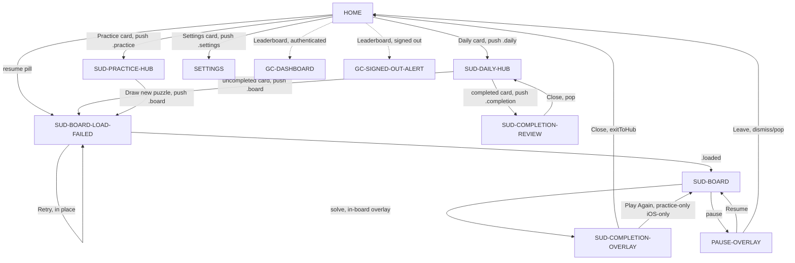
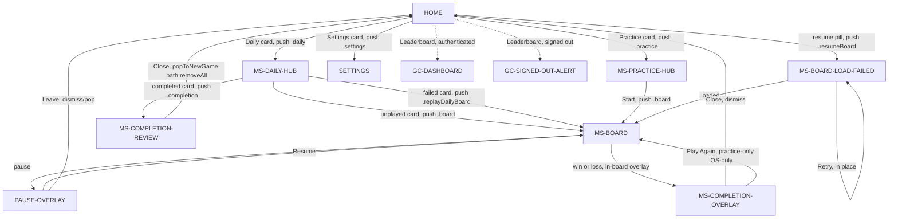

# Navigation Flows — Sudoku & Minesweeper (AS-BUILT)

**Status:** AS-BUILT · **Date:** 2026-07-05 · **main @** `9d6bf71`

**Scope:** iOS iPhone (board = `fullScreenCover` modal; everything else =
`NavigationStack` push) and macOS (everything, including the board, is a
`NavigationStack` push). iPad regular size class uses the same route table
via `NavigationSplitView` — see `GameShellUI/NavigationStackHost.swift`; it is
not a third contract.

**This doc supersedes the flow claims in** `docs/v1/design.md` §How.5 and
`docs/designs/01-root.md` … `08-settings.md` (a scoped AS-BUILT-UPDATE banner
was added to each rather than rewriting the frozen v1 content — see those
files for the pointer back here).

Per-screen detail (element inventories, exact copy, a11y ids, covering
behavior, state variants) lives in **`docs/screen-contracts.md`**; this doc
holds the navigation **model** and the **chains** between screens (§3) plus
the **negative flows** (§4). Screen IDs (`HOME`, `SUD-BOARD`, `MS-DAILY-HUB`,
…) are defined there and referenced here without re-deriving them.

DEBUG-only hooks (`-uitest-*` launch-arg routes, `UITestRouteModifier`,
`UITestLaunchArg`) are excluded from every flow below — they exist only to
seed E2E fixture state (see `Packages/GameAppKit/Sources/GameAppKit/
UITestLaunchArg.swift` / `UITestRouteModifier.swift`) and have no product
entry point.

---

## 1. Route enums (source of truth)

**Sudoku** (`SudokuUI/Navigation/AppRoute.swift`) — `Codable` for deep-link
round-tripping:

```swift
public enum AppRoute: Hashable, Sendable, Codable {
    case home
    case daily
    case practice
    case board(puzzleId: String)
    case completion(puzzleId: String, elapsedSeconds: Int, mistakeCount: Int)
    case settings
}
```

**Minesweeper** (`MinesweeperUI/AppRoute.swift`) — not `Codable` (no MS
deep-link spec yet); one extra case per Epic 8 (SDD-003) daily-failure UX and
one for resume:

```swift
public enum AppRoute: Hashable, Sendable {
    case board(difficulty: Difficulty, seed: UInt64, mode: GameMode)
    case replayDailyBoard(difficulty: Difficulty, seed: UInt64)   // unscored free replay of a failed daily
    case completion(difficulty: Difficulty, mode: GameMode)        // re-view a solved daily (#386)
    case resumeBoard(recordName: String, mode: GameMode)           // #455 resume from CloudKit save
    case daily
    case practice
    case settings
}
```

Neither enum has a `.home` case that is ever pushed in Minesweeper, and
Sudoku's `.home` is likewise never pushed (`LiveRouteFactory.view(for:.home)`
returns `EmptyView()` — root content renders `HOME` directly). Neither enum
has a `.leaderboard` case — full leaderboard browsing is a Game Center modal
side-effect, not a route (issue #49, 2026-05-20; see `GC-DASHBOARD` in
`screen-contracts.md`).

---

## 2. Shared navigation model

**Two presentation contexts, one route table:**

- **iOS (compact):** hubs (`HOME`/`SUD-DAILY-HUB`/`MS-DAILY-HUB`/etc.) push
  routes onto a `NavigationStack`. Board routes are intercepted by
  `GameBoardRedirect` (`GameAppKit/GameBoardRedirect.swift`): the redirect
  view pops itself off the stack in `.onAppear` and instead calls
  `GameRootViewModel.presentGame(route:)`, which flips `activeGameRoute` +
  `isGamePresented` → `GameRoot` renders the board inside a
  `.fullScreenCover`. The decision is centralized in the shared
  `boardDestination(route:path:onPresentBoard:buildInline:)` helper so every
  game's `LiveRouteFactory` shares one two-context contract instead of
  re-deriving it.
- **macOS:** `onPresentBoard` is wired to `nil` (`#if os(iOS) … #else nil
  #endif` at both apps' `Live.swift`), so `boardDestination` always falls
  through to `buildInline()` — every route, including the board, is a plain
  `NavigationStack` push. There is no macOS `fullScreenCover` path at all
  (SwiftUI's `.fullScreenCover` is iOS-only).

**The unified pause menu** (`PauseOverlayView`, shared component, #660): a
full-screen `.ultraThinMaterial` mask + centred card with Resume (primary)
and Leave (destructive, when wired — both boards always wire it). Leave calls
the SwiftUI `dismiss()` environment action directly, which pops a push OR
collapses a `fullScreenCover` depending on context — **no branching code is
needed at the call site** because `dismiss()` is context-polymorphic. See
`PAUSE-OVERLAY` in `screen-contracts.md`.

**The in-board `CompletionOverlayScaffold` is the ONE terminal completion
surface** (#669) on every platform. Prior to #667 the macOS push path pushed
a *separate* `.completion` route whose Close only popped that one route,
stranding the player on the solved board underneath (audit P1). Since #667,
`BoardView+Completion.exitToHub(dismiss:)` picks `dismiss()` (iOS modal) vs.
one `path` pop (macOS push) so Close always lands back on the hub that
pushed the board, on both platforms. The pushed `.completion` route still
exists in both apps' `AppRoute`, but it now serves ONLY the daily re-view
flow (Sudoku #379, MS #386) — see `SUD-COMPLETION-REVIEW` /
`MS-COMPLETION-REVIEW` in `screen-contracts.md`; it is never reachable from a
live board solve.

**Resume-pill refresh triggers (#679):** `GameRootViewModel.bootstrap()`
fetches the resume candidate exactly once per launch (idempotent gate), so a
game ending and returning to `HOME` needs an explicit re-fetch to clear a
stale pill:
- `dismissGame()` (iOS modal collapse) always calls
  `refreshResumeCandidate()`.
- `GameRoot.shellContent`'s `path` setter treats any **shrink** of the push
  path (macOS pop, of any depth, board or not) as "a route just went away"
  and refreshes too — one cheap CK query, harmless to run for non-board pops.

---

## 3. Flow chains

### 3.1 Sudoku



| # | Chain | Notes |
|---|---|---|
| S1 | `HOME → SUD-DAILY-HUB → SUD-BOARD-LOAD-FAILED(.loaded) → SUD-BOARD → SUD-COMPLETION-OVERLAY → Close → SUD-DAILY-HUB` | `exitToHub` pops one push entry on macOS; dismisses the cover on iOS — both land the player back on the hub, never the solved board (#667). |
| S2 | `HOME → SUD-PRACTICE-HUB → (draw+play in one tap) → SUD-BOARD-LOAD-FAILED → SUD-BOARD → SUD-COMPLETION-OVERLAY → Play Again → new SUD-BOARD` | Play Again only exists when `onPresentBoard` is wired (iOS only); macOS Practice completion is Close-only. |
| S3 | `HOME(resume pill) → SUD-BOARD-LOAD-FAILED → SUD-BOARD` | Same loader as S1/S2 — the resume pill routes to `.board(puzzleId:)`, not a distinct resume route. |
| S4 | `SUD-DAILY-HUB(completed card) → SUD-COMPLETION-REVIEW → Close → SUD-DAILY-HUB` | #379. Pop, not dismiss — this is always a push (never modal) since it targets the hub's own stack. |
| S5 | `HOME(Leaderboard, authenticated) → GC-DASHBOARD(external)` / `HOME(Leaderboard, signed out) → GC-SIGNED-OUT-ALERT → OK → HOME` | Side-effect, never a route. |
| S6 | reminder notification tap → `.daily` pushed (if not already on top) → `SUD-DAILY-HUB` | `Live.swift` `reminderTapRoute`; Sudoku only (see §4 negative flows for the MS gap). |
| S7 | `SETTINGS` + sheets — see `screen-contracts.md` `REMINDER-PRIMER` / `REMINDER-DENIED` / `CLEAR-CACHE-DIALOG` / acknowledgements deep-link | All hang off `SETTINGS`; none is a pushed `AppRoute`. |

### 3.2 Minesweeper



| # | Chain | Notes |
|---|---|---|
| M1 | `HOME → MS-DAILY-HUB → MS-BOARD → MS-COMPLETION-OVERLAY → Close → dismiss()` | MS's board overlay Close always calls `dismiss()` — never branches on `path` (unlike Sudoku's `exitToHub`), because `dismiss()` is already context-polymorphic (push pop OR cover collapse). |
| M2 | `HOME → MS-PRACTICE-HUB → (Start, synchronous, no draw step) → MS-BOARD → MS-COMPLETION-OVERLAY → Play Again → new MS-BOARD (fresh random seed)` | No shimmer/draw state exists in MS Practice — CODE CONTRADICTED vs. a naive Sudoku-mirror assumption (see `screen-contracts.md` `MS-PRACTICE-HUB`). |
| M3 | `HOME(resume pill) → MS-BOARD-LOAD-FAILED(.resumeBoard) → MS-BOARD` | Only `.resumeBoard` uses the async loader; fresh `.board`/`.replayDailyBoard` mount `MS-BOARD` inline (no persistence fetch needed). |
| M4 | `MS-DAILY-HUB(failed card) → MS-BOARD(.replayDailyBoard, unscored)` | Epic 8 (SDD-003). No persistence, no GC submit; the original Failed record is untouched. |
| M5 | `MS-DAILY-HUB(completed card) → MS-COMPLETION-REVIEW → Close → HOME` | **#386. Close pops the WHOLE path (`popToNewGame` = `path.removeAll()`), landing on `HOME`, not back on `MS-DAILY-HUB`** — this is a genuine cross-app asymmetry with Sudoku's S4 (which pops one entry back to the hub). Verify before assuming parity. |
| M6 | `HOME(Leaderboard, authenticated) → GC-DASHBOARD(external)` / signed-out → alert | Same shared mechanism as Sudoku S5. |
| M7 | reminder notification tap → **no-op** | MS's `GameConfig.reminderTapRoute` is `nil` (`MinesweeperAppComposition/Live.swift` passes no `reminderTapRoute:` argument) — a tapped MS daily-ready notification does nothing beyond the OS launching the app to `HOME`. CODE CONTRADICTED vs. the mirror-principle assumption that this exists on both apps; tracked as a gap, not fixed by this doc. |
| M8 | `SETTINGS` + sheets | Same shared components as Sudoku §3.1 S7. |

---

## 4. Negative flows

Every exit / cancel / error / degraded path, both apps unless noted.

| # | Flow | Behavior | Code anchor |
|---|---|---|---|
| N1 | Board load failure (fresh `.board`) | `BoardLoaderView`/`MinesweeperBoardLoaderView` → `.failed(UserFacingError)` block with Retry (re-runs `load()` in place, no navigation) | `SudokuUI/Board/BoardLoaderView.swift:129-150`, `MinesweeperUI/MinesweeperBoardLoaderView.swift:93-112` |
| N2 | Resume load failure (`.resumeBoard`) | MS only reachable this way; missing record → **honest `.failed(.unknown)`**, never a silent fresh board | `MinesweeperUI/MinesweeperBoardLoaderView.swift:114-123` |
| N3 | Sudoku Practice draw failure | `.failed(reason)` inline caption on `SUD-PRACTICE-HUB`; CTA re-enabled, no navigation | `SudokuUI/Practice/PracticeHubViewModel.swift:82-88` |
| N4 | Sudoku Daily `.exhausted` (generator defect) | `Color.clear` backdrop + floating `.alert` "Couldn't generate today's puzzle" / "Try a different difficulty, or come back tomorrow." | `SudokuUI/Daily/DailyHubView.swift` `.alert(...)`; `DailyHubViewModel.swift:100-104` |
| N5 | Sudoku Daily `.failed` (fetch error, not exhaustion) | Inline warning icon + `reason` text, no alert | `GameShellUI/DailyHubShellView.swift` `.failed` branch |
| N6 | MS Daily has no `.empty`/`.failed` state | `dailyTrio(date:)` is synchronous, non-throwing — this failure class is structurally unreachable in MS | `MinesweeperDailyHubViewModel.swift:109` `onPhase1Error` comment: "unreachable" |
| N7 | CK signed-out / offline degradation | Resume pill silently absent (`fetchResume` throws or returns nil → `resumeCandidate = nil`); Daily hubs' phase-2 completion/failure overlay fetch degrades to "no cards marked" without blocking phase-1 render; GC surfaces degrade to `GC-SIGNED-OUT-ALERT` path | `GameRootViewModel.swift:118-132`, `DailyHubViewModel.swift:125-142`, `MinesweeperDailyHubViewModel.swift:122-155` |
| N8 | Pause mask-tap | Tapping anywhere on the blur (not just the card) resumes — same as tapping Resume | `GameShellUI/PauseOverlayView.swift:51` `.onTapGesture { onResume() }` |
| N9 | Pause → Leave | `dismiss()` — iOS collapses the `fullScreenCover` back to whatever hub presented the board; macOS pops one `NavigationStack` entry back to that hub. Same call, both contexts. | `SudokuUI/Board/BoardView.swift:90-95`, `MinesweeperUI/MinesweeperBoardView.swift:205-210` |
| N10 | Completion Close — Sudoku | `exitToHub(dismiss:)`: iOS `dismiss()`, macOS pops exactly one `path` entry (the board itself — there is no separate `.completion` push to pop post-#667) | `SudokuUI/Board/BoardView+Completion.swift:162-169` |
| N11 | Completion Close — MS (in-board overlay) | Always `dismiss()`, no `path` branch at all (MS's board never receives a `path` parameter — the board is either modally presented or pushed inline, and `dismiss()` covers both) | `MinesweeperUI/MinesweeperBoardView.swift:657-661` |
| N12 | Completion Close — re-view route, Sudoku | One `path` pop → back to `SUD-DAILY-HUB` | `SudokuAppComposition/LiveRouteFactory.swift:226` |
| N13 | Completion Close — re-view route, MS | `popToNewGame` → `path.removeAll()` → **HOME**, not `MS-DAILY-HUB` — asymmetric with N12 | `MinesweeperAppComposition/LiveRouteFactory.swift:278`, `LiveRouteFactory+Helpers.swift:87-93` |
| N14 | GC signed-out alert | `.alert` OK → dismiss, HOME unchanged | `GameAppKit/MakeGameApp+Modifiers.swift:30-40` |
| N15 | ATT primer decline | "Not now" → dismiss sheet, latched for the session (no re-offer), no system prompt fired; Home unaffected throughout | `AppMonetizationKit/ATTPrimerCoordinator.swift:79-81` |
| N16 | UMP/ATT boot sequence | Runs concurrently with first-frame render (`.onAppear { Task {…} }`), **never gates Home interaction**; a failing step does not skip later steps (every step attempted, outcome logged) | `GameAppKit/MakeGameApp+Helpers.swift:16-42`, `MonetizationBootCoordinator` header comment |
| N17 | AdMob banner unresolved / degraded | Banner slot degrades to a `.failed` placeholder rather than blocking its host screen (Home / Daily / Practice / Board all keep working) | referenced by `MonetizationBootCoordinator` contract note; `BannerSlotView` |
| N18 | Reminder tap deep-link — MS gap | No-op (see M7 above) — repeated here because it is functionally a negative flow (an omission), not just a chain footnote | `MinesweeperAppComposition/Live.swift` (no `reminderTapRoute:` argument passed) |
| N19 | Clear-cache Cancel + failure | Cancel → dialog dismisses, no-op. Failure: MS shows "Couldn't clear cache" failure toast; **Sudoku shows the success toast unconditionally — bug #687** (row to be re-verified once fixed) | `MinesweeperAppComposition/LiveRouteFactory+Helpers.swift:52-85`, `SudokuUI/Settings/SettingsViewModel.swift:74-94` |
| N20 | GC signed-out — Completion entry point | Completion VMs compute `.unauthenticated` but the call sites hard-code `state: .hidden`, so the user gets ZERO feedback (worse than N14's alert path) — tracked in #685 (scope) + #468 (dormant slice) | `SudokuUI/Completion/CompletionViewModel.swift:89-101`, `MinesweeperUI/Completion/MinesweeperCompletionViewModel.swift:73-93` |
| N21 | ATT system-level denied | `ATTPresenter.requestIfNeeded()` result (`.denied/.authorized/.restricted`) is discarded — no branch changes ad behavior on denial; AdMob serves non-personalized per its own SDK handling. Distinct from N15 (primer-stage "Not now") | `GameAppKit/MakeGameApp.swift:203-206` (result `_ =` discarded) |
| N22 | IAP purchase cancel / fail / pending | Each has an explicit branch: cancel → no toast, no state change; fail → failure toast; pending → no entitlement until transaction resolves via `purchaseUpdates()` | `AppMonetizationKit/.../LiveStoreKit2IAPClient.swift:77-113`, `MonetizationUI/MonetizationStateController.swift:181-213` |
| N23 | Restore Purchases — empty result | "Purchases restored" success toast even when nothing was restorable — no dedicated "nothing to restore" message (UX gap, unfiled; note for a future polish pass) | `LiveStoreKit2IAPClient.swift:122`, `MonetizationStateController.swift:216-227` |
